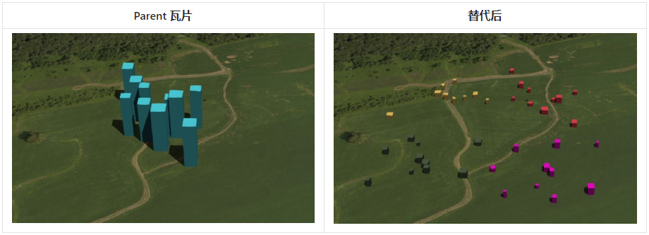
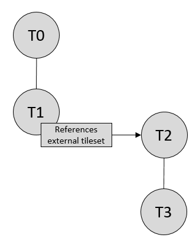
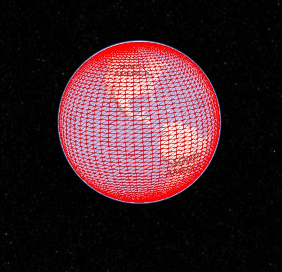
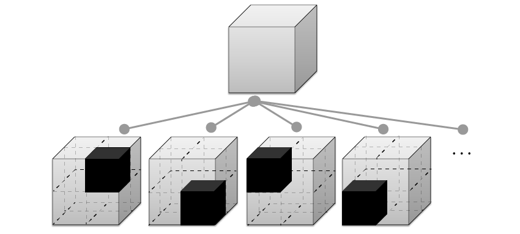

废话不多说，跳过开头直接开始。

[TOC]

# 1 扩展名和MIME类型

瓦片数据集用`.json`后缀名，使用`application/json`MIME类型。

瓦片文件使用二进制文件，可以没有扩展名。

瓦片数据集样式文件使用`.json`后缀名，使用`application/json`MIME类型。

# 2 JSON编码

使用没有BOM的UTF-8编码，所有在规范中定义的字符串，都使用ASCII编码，JSON的键名必须唯一。

# 3 URIs

外部引用的资源使用规范`RFC 3986`，对于嵌入的二进制资源使用`RFC 2397`规范。

当资源是相对的时候，总是相对瓦片数据集文件。

# 4 计量单位

线性距离都是米。所有的角度单位是弧度制。

# 5 坐标系统

使用右手笛卡尔坐标系，即z轴朝上。

在GIS方面，使用WGS84椭球体，对应的坐标系的EPSG为4978，但是这并不是必须的。有些模型使用它自己的模型坐标系。

可以使用瓦片数据集的`transform`属性来应用一个从局部坐标系到全局坐标系的转换。

边界范围使用EPSG：4979这个地理坐标系来限定。

## 5.1 EPSG4979和4978

来看看他们的OGC WKT

``` bash
GEOCCS["WGS 84",
    DATUM["World Geodetic System 1984",
        SPHEROID["WGS 84",6378137.0,298.257223563,
            AUTHORITY["EPSG","7030"]],
        AUTHORITY["EPSG","6326"]],
    PRIMEM["Greenwich",0.0,
        AUTHORITY["EPSG","8901"]],
    UNIT["m",1.0],
    AXIS["Geocentric X",OTHER],
    AXIS["Geocentric Y",EAST],
    AXIS["Geocentric Z",NORTH],
    AUTHORITY["EPSG","4978"]]
```

``` BASH
GEOGCS["WGS 84",
    DATUM["World Geodetic System 1984",
        SPHEROID["WGS 84",6378137.0,298.257223563,
            AUTHORITY["EPSG","7030"]],
        AUTHORITY["EPSG","6326"]],
    PRIMEM["Greenwich",0.0,
        AUTHORITY["EPSG","8901"]],
    UNIT["degree",0.017453292519943295],
    AXIS["Geodetic latitude",NORTH],
    AXIS["Geodetic longitude",EAST],
    AXIS["Ellipsoidal height",UP],
    AUTHORITY["EPSG","4979"]]
```

除了三个轴、单位还有EPSG编号外，这两个坐标系没有什么定义上的不同，椭球体均采用的是WGS84椭球。

4979坐标系使用的是十进制度数，规定经度轴是南北朝向（北为正方向），规定纬度轴是东西朝向（东为正方向），规定相对于椭球表面的高度为上方向。

4978坐标系使用的是米为单位，规定南北方向是Z轴，规定东西方向是Y轴，其他方向是X轴。（这一段不太理解，需要找更多资料学习）

# 6 概念定义

## 6.1 瓦片

瓦片其实是一个数组，由用于确定是否渲染该瓦片的元数据，对瓦片数据内容的引用，以及子瓦片组成。

### 6.1.1 几何误差

瓦片构造为HLOD的树结构，以便在运行时，客户端判断瓦片是否足够精细来决定进行渲染，以及是否应使用更高层级的瓦片来替代渲染以提高显示效果。有一种实现利用了最大*屏幕空间误差（SSE）*，该误差利用像素来量算。

瓦片的几何误差定义了该瓦片被选择性。其值是一个以米为单位的非负数，它指定了瓦片的几何图形的简化程度。root 瓦片的几何误差最大，所以其几何图形最简。

规定每个瓦片的几何误差比子瓦片的几何误差大，叶子瓦片的几何误差为0或接近0。

在代码实现渲染时，几何误差与其他指标（例如，瓦片到相机的距离，屏幕大小，分辨率）共同起作用，以计算屏幕空间误差。如果屏幕空间误差超过了最大值，瓦片将被干掉，其子瓦片将被渲染。

几何误差是根据度量标准制定的，例如点密度，以米为单位的瓦片大小或该瓦片特有的其他因素。通常，几何误差大则这个瓦片更有可能在渲染时被干掉，其子瓦片才能更快被渲染。

### 6.1.2 细化（Refinement）

细化属性，决定了当前是子瓦片的分辨率时，父级瓦片的显示还是隐藏。

细化的属性有两种，为替换（"REPLACE"）和附加（"ADD"）。如果瓦片的细化用的是"REPLACE"，则将渲染子瓦片代替父瓦片，即不再渲染父瓦片。

瓦片数据集中所有的瓦片可以只使用"REPLACE"和"ADD"的一种，也可以任意组合。

瓦片数据集的root瓦片的Refinement是必须指定的，对于其他的瓦片是可选的。如果子瓦片的Refinement没有指定，则继承父级瓦片的属性值。

#### ① 替换

如果一个瓦片使用"替换（REPLACE）"作为细化规则，则会使用其子瓦片来替代它来进行渲染。



#### ② 附加

与“替换”不同，如果瓦片的细化规则使用了"附加（ADD）"，则细化时会同时渲染自身及其子代。


### 6.1.3 边界框（boundingVolume）

边界框定义了某个瓦片的空间范围。

为了使得不同数据能够在空间上连续排布，边界框有三种：定向边界盒子（Box），边界球（Sphere）和范围（Region）。


#### ①范围（Region）

`boundingVolume.region`属性是一个由六个数字组成的数组，这些数字用纬度，经度和高度坐标定义了地理区域，其坐标顺序为$[west，south，east，north，minHeight，maxHeight]$。

其中，东西南北这4个值EPSG 4979有定义，以弧度表示。

高度相对于WGS84椭球表面定义，以米为单位。

```json
"boundingVolume": {
  "region": [
    -1.3197004795898053,
    0.6988582109,
    -1.3196595204101946,
    0.6988897891,
    0,
    20
  ]
}
```

#### ②盒子（box）

`boundingVolume.box`属性是一个由12个数字组成的数组，在右手空间直角坐标系中定义了一个长方体。

1~3号数字定义框中心坐标。

4\~6号数字定义x轴方向和半长；7\~9号数字定义y轴方向和半长；10\~12号数字定义z轴方向和半长。

例如，例子里的4~6号数字，[100, 0, 0]代表x方向的长度为2*100（100是半长）。

```JSON
"boundingVolume": {
  "box": [
    0,   0,   10, // 中心坐标 [0, 0, 10]
    100, 0,   0,
    0,   100, 0,
    0,   0,   10
  ]
}
```

#### ③球体（Sphere）

`boundingVolume.sphere`属性是由四个数字组成的数组，这定义了一个球。分别是中心坐标、半径。

```JSON
"boundingVolume": {
  "sphere": [
    0,
    0,
    10,
    141.4214 // 米为单位
  ]
}
```

### 6.1.4 观察可视区域（Viewer request volume）

瓦片的`viewerRequestVolume`可以用于组合不同的瓦片数据，甚至可以组合外部瓦片数据集。

下面的例子，有两个瓦片，一个是b3dm类型的，一个是pnts类型的。pnts类型的边界框是球体，半径是1.25，但是它具有一个`viewerRequestVolume`属性，是一个半径为15的更大的球体，当`geometricError`是0时，当摄像机位于这个由`viewerRequestVolume`定义的更大的球体内时，pnts瓦片总会被渲染。

```JSON
{
  "children": [{
    "transform": [
      4.843178171884396,   1.2424271388626869, 0,                  0,
      -0.7993325488216595,  3.1159251367235608, 3.8278032889280675, 0,
      0.9511533376784163, -3.7077466670407433, 3.2168186118075526, 0,
      1215001.7612985559, -4736269.697480114,  4081650.708604793,  1
    ],
    "boundingVolume": {
      "box": [
        0,     0,    6.701,
        3.738, 0,    0,
        0,     3.72, 0,
        0,     0,    13.402
      ]
    },
    "geometricError": 32,
    "content": {
      "uri": "building.b3dm"
    }
  }, {
    "transform": [
      0.968635634376879,    0.24848542777253732, 0,                  0,
      -0.15986650990768783,  0.6231850279035362,  0.7655606573007809, 0,
      0.19023066741520941, -0.7415493329385225,  0.6433637229384295, 0,
      1215002.0371330238,  -4736270.772726648,   4081651.6414821907, 1
    ],
    "viewerRequestVolume": {
      "sphere": [0, 0, 0, 15]
    },
    "boundingVolume": {
      "sphere": [0, 0, 0, 1.25]
    },
    "geometricError": 0,
    "content": {
      "uri": "points.pnts"
    }
  }]
}
```

### 6.1.5 转换（Transforms）

#### ①瓦片转换

为了支持局部坐标系，每个图块都具有可选的转换（`transform`）属性。

`transform`属性是一个4x4仿射变换矩阵，按列优先顺序存储（即1~4号数字是矩阵的第一列）。该矩阵表达了当前瓦片的所有坐标经过此矩阵仿射变换后，可从瓦片的局部坐标转换到父瓦片的坐标。

`transform`属性适用于：

- `tile.content`
    - 每个要素的位置
    - 每个要素的法线由`transform`矩阵左上角的3x3矩阵进行转换，以适应合适的比例
    - `content.boundingVolume`属性。但是`content.boundingVolume.region`如果定义了，转换就无效，因为区域（region）是定义在EPSG:4979上的。
- `tile.boundingVolume`，除非`tileboundingVolume.region`定义了。
- `tile.viewerRequestVolume`，除非`tile.viewerRequestVolume.region`定义了。

`transform`属性不适用于geometryError，也就是说，`transform`定义的比例变换，并不会影响几何误差，几何误差始终以米为单位。

如果`transform`没有定义，则默认使用单位矩阵：

```JSON
[
1.0, 0.0, 0.0, 0.0,
0.0, 1.0, 0.0, 0.0,
0.0, 0.0, 1.0, 0.0,
0.0, 0.0, 0.0, 1.0
]
```

从每个瓦片的局部坐标到瓦片数据集的全局坐标的变换，是通过链式求矩阵的点积实现的。即从子瓦片到最顶层瓦片的所有转换矩阵的乘积。

#### ②glTF转换

b3dm和i3dm瓦片文件都内嵌了glTF，它自己有自己的node结构，并使用y向上坐标系。理解glTF的转换后，特定瓦片的`tile.transform`属性的转换就不难了。

##### glTF 节点树状结构

看glTF文档即可。

##### 交换y朝上至z朝上

因为glTF是y轴朝上，3dtiles是z轴朝上，必须将glTF的坐标进行转换。只需把glTF模型绕x轴旋转90度即可。对应的矩阵变换是：
$$
M=\left[ \begin{matrix} 
1&0&0&0\\
0&0&1&0\\
0&-1&0&0\\
0&0&0&1
\end{matrix} \right]
$$
使用JSON数组即为：

```
[
    1.0, 0.0,  0.0, 0.0,
    0.0, 0.0, -1.0, 0.0,
    0.0, 1.0,  0.0, 0.0,
    0.0, 0.0,  0.0, 1.0
]
```

广义地，从gltf模型到3dtiles模型的坐标转换，经历了以下步骤：

1. glTF节点层级之间的转换
2. glTF的y轴转z轴，即绕x轴旋转90度。
3. 瓦片内部的转换
    - b3dm的要素表可能定义了`RTC_CENTER`属性，则需要用这个相对中心坐标进行转换顶点坐标值。
    - i3dm的要素表定义了每个instance的坐标、法线、缩放比例，这3个属性应用于每个instance的4x4仿射变换矩阵。
4. 瓦片对于上一级瓦片的转换

> 程序实现注意：
>
> 当使用本质上为z-up的源数据（例如WGS 84坐标或本地z-up坐标系中的数据）时，常见的工作流程是：

#### 例子


每个瓦片的转换矩阵是：

- T0：$[T0]$
- T1：$[T0][T1]$
- T2：$[T0][T2]$
- T3：$[T0][T1][T3]$
- T4：$[T0][T1][T4]$

在瓦片进行转换前，瓦片文件中的位置、法线或许有自己的转换信息。例如：

- b3dm和i3dm瓦片均内嵌glTF，glTF自己定义了节点层级关系和坐标系。`tile.transform`得在glTF这些转换结束后才能进行转换。
- i3dm的要素表定义了每个instance的位置、法线和缩放比例，这3个属性会创建一个4x4的仿射变换矩阵，等这个仿射变换完成后，才能进行`tile.transform`转换。
- 被数据压缩的属性，例如i3dm和pnts瓦片中要素表中的`POSITION_QUANTIZED`属性，以及pnts的`NORMAL_OCT16P`属性，必须先解压缩再进行转换计算。

因此，以上示例的完整转换计算过程为：

- T0: `[T0]`
- T1: `[T0][T1]`
- T2: `[T0][T2][pnts内部转换，RTC_CENTER(如果定义了)]`
- T3: `[T0][T1][T3][b3dm内部转换, 包括RTC_CENTER(如果定义了), 坐标系转换, glTF节点层级转换]`
- T4: `[T0][T1][T4][i3dm内部转换, 包括每个instance的转换, 坐标系转换, glTF节点层级转换]`

#### 代码实现案例（并不是规范内容）

以下JavaScript代码显示了如何使用Cesium的Matrix4和Matrix3类型进行计算。

```JS
// tileset：Cesium3DTileset类型
function computeTransforms(tileset) {
    const tile = tileset.root;
    const transformToRoot = defined(t.transform) ? Matrix4.fromArray(t.transform) : Matrix4.IDENTITY;
	// 如果有定义transform就用transform创建一个Matrix4，否则用单位矩阵
    computeTransform(tile, transformToRoot);
}

function computeTransform(tile, transformToRoot) {
    // 将每个瓦片的位置、边界框转换到root瓦片的坐标

    // 先转置
    const inverseTransform = Matrix4.inverse(transformToRoot, new Matrix4());
	// 单位化
    const normalTransform = Matrix4.getRotation(inverseTransform, new Matrix3());
    normalTransform = Matrix3.transpose(normalTransform, normalTransform);

    const children = tile.children;
    const length = children.length;
    for (var i = 0; i < length; ++i) {
        let child = children[i];
        let childToRoot = defined(child.transform) ? Matrix4.fromArray(child.transform) : Matrix4.clone(Matrix4.IDENTITY);
        childToRoot = Matrix4.multiplyTransformation(transformToRoot, childToRoot, childToRoot);
        // 套娃
        computeTransform(child, childToRoot);
    }
}
```

### 6.1.6 独立的瓦片JSON文件

瓦片如果是引用一个JSON文件，那么这个表示某某瓦片的JSON文件应该由以下属性构成：


以下示例显示了一个非叶子瓦片的JSON。

```JSON
{
  "boundingVolume": {
    "region": [
      -1.2419052957251926,
      0.7395016240301894,
      -1.2415404171917719,
      0.7396563300150859,
      0,
      20.4
    ]
  },
  "geometricError": 43.88464075650763,
  "refine" : "ADD",
  "content": {
    "boundingVolume": {
      "region": [
        -1.2418882438584018,
        0.7395016240301894,
        -1.2415422846940714,
        0.7396461198389616,
        0,
        19.4
      ]
    },
    "uri": "2/0/0.b3dm"
  },
  "children": [...]
}
```

很多属性上文都提过了，特别提几个。

`content.boundingVolume`和顶级的`boundingVolume`很像，但是不同的是，`content.boundingVolume`相当于HTML中的`padding`，与数据内容完全紧密贴合的一个范围框，而外部的`boundingVolume`相当于HTML中的`margin`，保证与兄弟瓦片在空间上连续。

`boundingVolume`支持视锥剔除，如果不在视锥范围内，那就不渲染。

如果没有定义`content.boundingVolume`，则顶级的`boundingVolume`依旧支持视锥剔除。

下面的截图显示了某个数据root 瓦片的边界框。


红色线框表示`boundingVolume`，蓝色线框表示`content.boundingVolume`。

关于某个瓦片的JSON文件完整定义，见[tile.schema.json](https://github.com/CesiumGS/3d-tiles/blob/master/specification/schema/tile.schema.json)

## 6.2 瓦片数据集的JSON文件：tileset.json

3D Tiles使用一个主tileset.json文件作为瓦片数据集的入口点。

以下是一个略有精简的tileset.json文件

```JSON
{
  "asset" : {
    "version": "1.0",
    "tilesetVersion": "e575c6f1-a45b-420a-b172-6449fa6e0a59",
  },
  "properties": {
    "Height": {
      "minimum": 1,
      "maximum": 241.6
    }
  },
  "geometricError": 494.50961650991815,
  "root": {
    "boundingVolume": {
      "region": [
        -0.0005682966577418737,
        0.8987233516605286,
        0.00011646582098558159,
        0.8990603398325034,
        0,
        241.6
      ]
    },
    "geometricError": 268.37878244706053,
    "refine": "ADD",
    "content": {
      "uri": "0/0/0.b3dm",
      "boundingVolume": {
        "region": [
          -0.0004001690908972599,
          0.8988700116775743,
          0.00010096729722787196,
          0.8989625664878067,
          0,
          241.6
        ]
      }
    },
    "children": [..]
  }
}
```

tileset.json具有四个顶级属性：asset，properties，geometricError和root。

`asset`是一个包含有关整个瓦片数据集的元数据的对象。

asset.version属性是一个字符串，用于定义3D Tiles版本，该版本指定tileet的JSON模式和基本的tile格式集。

asset.tilesetVersion属性是一个可选字符串，用于定义特定于应用程序的瓦片数据集版本，例如，用于更新现有瓦片数据集的时间。

`properties`是一个对象，包含每个要素的属性的描述信息。properties中每个对象的名称与每个要素的属性的名称匹配，并且带有其最小和最大值，这对于符号化很有用。

`geometricError`是一个非负数，它定义了误差（以米为单位）。它用于确定是否渲染瓦片。在运行时，几何误差用于计算屏幕空间误差（SSE），即以像素为单位的误差。如果SSE不大于给定的最小值，则不应该渲染瓦片数据集，包括它每一个瓦片。

`root`是一个对象，该对象使用上一节中介绍的图块JSON定义根图块。`root.geometricError`与瓦片数据集的顶级`geometricError`不同。顶级的`geometricError`在程序运行时用于确定tileset的root瓦片呈现的SSE；`root.geometricError`在程序运行时用于确定呈现根图块的子瓦片的SSE。

### 6.2.1 外部的瓦片数据集：引用别的tileset.json

要创建一棵树，瓦片的`content.uri`可以指向外部瓦片数据集（另一个瓦片JSON文件的uri）。例如，这可以将每个城市存储在一个3dtileset中，然后把它们集中到一个全局的瓦片数据集中。


当瓦片指向外部3dtileset时，这个瓦片：

- 不能有children属性；tile.children必须未定义或为空数组。
- 不能搞自我引用，即uri不能引用自己，或者其引用的外部瓦片数据集又引用自己。
- 将同时通过瓦片的transform和root瓦片的变换进行变换。例如，在以下引用外部瓦片的瓦片中，对于T3瓦片，转换矩阵为$[T0] [T1] [T2] [T3]$。



### 6.2.2 边界框的空间连续性

如上所述，瓦片数据集的树状结构具有空间连贯性。每个瓦片都有一个完全包围其数据的边界框，子瓦片的**内容**完全在父瓦片的边界框内。

但是，这并不意味着子瓦片的**边界框**完全在其父瓦片的边界框之内。例如：



地形瓦片的球状边界框。


四个子瓦片的边界球。

子瓦片的**数据内容**完全在父瓦片的边界框之内，但是子瓦片的**边界框**并不紧密结合，因为球体肯定会存在间隙。

### 6.2.3 空间数据结构：树结构

3DTiles使用了HLOD的概念，呈现空间数据很棒。

瓦片数据集对瓦片的组织是树结构，树有很多种。

渲染引擎是通用的，与树的结构无关，对于不同的瓦片格式和细化规则的组合，可以达到瓦片数据集的最佳效果。

下面包括对3D Tile如何表示各种空间数据结构的简要说明。

#### ①四叉树

当每个瓦片具有四个统一细分的子级（例如，使用中心纬度和经度）时，就会创建四叉树，类似于典型的2D地理空间切片方案。空的子瓦片可以省略。


上图这个是传统四叉树。

3dTiles支持变种四叉树，例如在切分空间上的非均匀性，以及边界框的紧凑型（紧紧包围当前节点的数据，而不是充满整个节点空间）。若使用四叉树进行拆分空间，每个节点占父级瓦片的25%的空间，对于稀疏数据集来说会造成数据冗余。


节点边界框是紧包围型的四叉树。

如下数据集，注意左下角的节点，它的边界框并不包括水域范围，因为水上没有建筑物。


除此之外，还支持其他四叉树变体，例如松散四叉树。松散四叉树的瓦片允许出现空间上的重叠，但是仍然保持空间连续。这个四叉树对避免切割某些三维模型很有用。


下列数据集中，绿色的建筑模型在左子瓦片（子节点），紫色的建筑在右子瓦片，但是两个瓦片是有部分重叠的，即中部有两个绿色建筑物和一个紫色建筑物没有分开。


#### ②k-d 树

如果一个瓦片有两个子节点，这两个子节点是由一个平行于x或y或z轴的平面分割的，那么就能创建一个k-d树。随着kd树的层级越来越深，x、y、z轴依次循环作为切割轴来分割空间，分割平面可以用中位数分割法、表面积启发法或者其他。

> 译者注
>
> 感觉官方的表述有问题，平面和轴平行感觉很奇怪。我简单做解释。
>
> kd树，即k维树。假设某个三维空间内，第一层先平行于xy平面切分空间，这个平面不一定和xy平面完全相同，得到上下两个子空间，此时平面的表达式为z=$z_0$。然后接着对子空间进行分割，选择yz平面分割，即分割平面的表达式为$x=x_0$和$x=x_1$，各得到2个子空间，继续选择xz平面平行的平面分割...如此循环这个顺序即可。而分割平面的选择方法就有很多了。


kd树不像传统2d的地图切片方案一样，每一级切分都是均匀的，像上图是允许不均匀的，这与切割平面有关（假定是切割三维空间），因此，可以为非均匀分布的数据集创建更平衡的树。

3dTiles的kd树并不是二叉树，允许一个节点有n个切割子节点。

#### ③八叉树

八叉树用三个互相垂直的平面拆分空间。与四叉树类似，允许八叉树进行不均匀的拆分、紧密包围等变种。



经典八叉树。


#### ④网格结构

3dtiles支持任意网格划分的子瓦片组合。例如下图所示：


3dtiles可以利用那种有边界框但是没有数据空瓦片。空瓦片在不具备HLOD的八叉树或者四叉树上可以用来顶位置。

## 6.3 指定扩展和附加功能

### 6.3.1 extensions

extensions属性貌似能扩展3dtiles数据

### 6.3.2 extras

extras是一些补充信息，例如name等。

# 7 瓦片文件规范

略

# 8 声明式样式规范

略

# 9 tileset.json属性参考

- Tileset
    - Asset
    - Bounding Volume
    - Extension
    - Extras
    - Properties
    - Tile
        - Content

---

## ① Tileset（tileset.json的定义）

瓦片数据集。除了以下列举的属性外，其他属性均不允许。（译者注：不知道是程序不识别还是读取失败？）

| 属性名            | 数据类型   | 描述                                                         | 是否可选 |
| ----------------- | ---------- | ------------------------------------------------------------ | -------- |
| asset             | object     | 该瓦片数据集的元数据。                                       | ✅必选    |
| properties        | any        | 每个要素的元数据。                                           | 可选     |
| geometricError    | number     | 使用单位为米的值来标定此瓦片数据集是否渲染。在运行时，几何误差用于计算屏幕空间误差（SSE），即以像素为单位的误差。要求值≥0。 | ✅必选    |
| root              | object     | 瓦片数据集中的顶层瓦片。                                     | ✅必选    |
| extensionUsed     | 字符串数组 | 此瓦片数据集中的扩展数据可能在别的地方用到的数据的名称列表。 | 可选     |
| extensionRequired | 字符串数组 | 瓦片数据集中用于辅助加载扩展数据的名称列表。                 | 可选     |
| extensions        | object     | 特殊扩展所需数据。                                           | 可选     |
| extras            | any        | 与应用程序有关的数据                                         | 可选     |

## ② Asset（顶级）

'asset'属性是瓦片数据集（tileset.json）中的顶层属性。指示瓦片数据集的元数据。

| 子属性             | 数据类型 | 描述                                       | 是否可选 |
| ------------------ | -------- | ------------------------------------------ | -------- |
| **version**        | `string` | 3dtiles的版本。目前是"1.0"比较多。         | ✅ 必选   |
| **tilesetVersion** | `string` | 这个瓦片数据集的用户版本，可以自己随便写。 | 可选     |
| **extensions**     | `object` | 扩展数据。                                 | 可选     |
| **extras**         | `any`    | 补充数据。                                 | 可选     |

举例：

``` JSON
"asset": {
    "version": "1.0"
}
```

## ③ Bounding Volume

'boundingVolume'属性即边界框，在box、region、sphere里三选一即可。

boundingVolume属性存在于root属性、content属性下。

| 子属性         | 数据类型        | 描述       | 是否必选 |
| -------------- | --------------- | ---------- | -------- |
| **box**        | `number` `[12]` | 见6.1.3    | No       |
| **region**     | `number` `[6]`  | 见6.1.3    | No       |
| **sphere**     | `number` `[4]`  | 见6.1.3    | No       |
| **extensions** | `object`        | 扩展数据。 | No       |
| **extras**     | `any`           | 补充数据。 | No       |

举例：

``` JSON
"root": {
    ...,
    "boundingVolume": {
        "region": [
            -1.3197004795898053,
            0.6988582109,
            -1.3196595204101946,
            0.6988897891,
            0,
            20
        ]
    },
    ...
}
```


## ④ Extension

略

## ⑤ Extras

略

## ⑥ Properties（顶级）

tileset.json的顶级属性。记录每个要素的属性信息。

| 子属性         | 数据类型 | 描述           | 是否必选 |
| -------------- | -------- | -------------- | -------- |
| **maximum**    | `number` | 要素的最大值   | ✅ Yes    |
| **minimum**    | `number` | 要素的最小值。 | ✅ Yes    |
| **extensions** | `object` | 扩展数据。     | No       |
| **extras**     | `any`    | 补充数据。     | No       |

举例：

``` JSON
"properties": {
    "id": {
        "minimum": 0,
        "maximum": 9
    },
    "Longitude": {
        "minimum": -1.3196959060375169,
        "maximum": -1.3196607462778132
    },
    "Latitude": {
        "minimum": 0.6988590050687061,
        "maximum": 0.6988864387845588
    },
    "Height": {
        "minimum": 6.1022464875131845,
        "maximum": 13.410263679921627
    }
}
```

## ⑦ Tile

瓦片。

| 子属性                  | 数据类型        | 描述                 | 是否必选                                                     |
| ----------------------- | --------------- | -------------------- | ------------------------------------------------------------ |
| **boundingVolume**      | `object`        | 见6.1.3              | ✅ 必选                                                       |
| **viewerRequestVolume** | `object`        | 见6.1.4              | 可选                                                         |
| **geometricError**      | `number`        | 几何误差。           | ✅ 必选                                                       |
| **refine**              | `string`        | 见6.1.2              | No                                                           |
| **transform**           | `number` `[16]` | 当前瓦片的转换矩阵。 | 可选。默认值是单位矩阵： `[1,0,0,0,0,1,0,0,0,0,1,0,0,0,0,1]` |
| **content**             | `object`        | 数据内容。           | No                                                           |
| **children**            | `array[]`       | 子瓦片。             | No                                                           |
| **extensions**          | `object`        | 扩展数据。           | No                                                           |
| **extras**              | `any`           | 补充信息。           | No                                                           |

其实顶级的`root`也是一个Tile。

举例：

``` JSON
"root": {
    "refine": "ADD",
    "boundingVolume": {
        "region": [
            -1.3197004795898053,
            0.6988582109,
            -1.3196595204101946,
            0.6988897891,
            0,
            30
        ]
    },
    "geometricError": 0,
    "content": {
        "uri": "composite.cmpt"
    }
}
```


## ⑧ Tile Content

即tile中的content属性，记录瓦片真正的数据的元数据。

| 子属性             | 数据类型 | 描述                                                     | 是否必须 |
| ------------------ | -------- | -------------------------------------------------------- | -------- |
| **boundingVolume** | `object` | 见6.1.3                                                  | 可选     |
| **uri**            | `string` | 指向当前瓦片的数据。如果是相对引用，则相对于tileset.json | ✅ 必选   |
| **extensions**     | `object` | 扩展数据。                                               | 可选     |
| **extras**         | `any`    | 补充信息。                                               | 可选     |

举例：

``` JSON
"content": {
    "uri": "batchedWithBatchTable.b3dm"
}
```

# 10 许可

略。