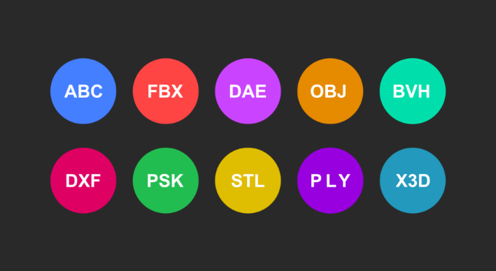

# web中的三维

html5和webgl技术使得浏览器三维变成了可能。

巧妇难为无米之炊，三维数据（三维模型）是三维可视化重要的一环，事实上就是：三维数据众多，行业跨界广。

参考资料：http://www.bgteach.com/article/132

three.js的各种加载器实现了大部分通用三维格式的加载，屏蔽了格式不同的数据结构差异。

[图]

然而，这样还是不能满足日益增长的效果需求，比如场景一大，模型文件体积变大，解析所耗费的时间越来越长。

webgl，包括所有gpu有关的图形编程，几乎只认这样的三维数据：顶点、顶点颜色、顶点法线、着色语言...

[图]

所以，三维图形界的通用格式：glTF应运而生，它面向终点，它按照图形编程所需的格式来存储数据，借以二进制编码提高传输速度。

[图]

它不再使用面向对象的思维存储三维模型、贴图纹理，而是按显卡的思维存储，存的是顶点、法线、顶点颜色等最基础的信息，只不过组织结构上进行了精心的设计。

它面向终点，就意味着可编辑性差，因为渲染性能的提高牺牲了可编辑性，它不再像3ds、dae甚至是max、skp一样容易编辑和转换。

事实上，大多数三维软件提供了glTF格式的转换，或多一步，或一步到位。

# 地理真三维

早年，地理的三维还处于地形三维上，即数字高程模型（DEM）提供地表的高度拉伸。栅格高程数据、等高线、不规则三角网等均是数字高程模型的具体案例。

[早期图]

随着学科的融合、计算机技术和硬件的更新换代，使得有模型、有细节的真三维融入到GIS中成为了可能，或者说，计算机技术和硬件的升级，给GIS以更广阔的视角观察世界。

cesium号称是webgl封装的三维地理库，是支持gltf模型的加载的。

[图，api]

面对大规模精细三维数据的加载，还要照顾到GIS的各种坐标系统、分析计算，gltf这种单个模型的方案显得力不从心。

[图，曼哈顿街区的白膜]

2016年，cesium团队的前身AGI，在分治思想的指导下，借鉴传统2DGIS的地图规范——WMTS，借鉴图形学中的层次细节模型，打造出大规模的三维数据标准——3dTiles，中文译名：三维瓦片数据标准。

它利用gltf的高性能，对大规模的三维数据进行空间拆分重构层次细节，对各种三维模型格式进行转换。

# 3dTiles的设计思想

3dTiles继承了gltf的优点：面向终点，讨GPU喜爱，webgl对其内部三维数据不需要转换，可以直接渲染。

可以说gltf模型是以glb这种变种格式嵌入在3dTiles数据集中的。

> 我们区分一组概念：规范和数据。

3dTiles是一种规范没有错，但是它的数据形式是一堆有组织的文件，有二进制文件，有json文件，只不过在规范的指导下，它们是有逻辑关系的。

gltf也是一种规范，它的数据文件不一定就是后缀名为`.gltf`的文件，也不一定只有一个文件，在本文，更多时候在强调数据规范，如果我说的是“XXX文件”，那才是真正的数据文件。

3dTiles还有一个特点：那就是不记录模型数据，只记录各级“Tile”的逻辑关系，以及“Tile”自己的属性信息。所谓的模型数据，是指三维模型的顶点、贴图材质、法线、颜色等信息。逻辑关系是指，各级Tile是如何在空间中保持连续的，LOD是如何组织的。属性信息就很简单啦，门有门的生产商，窗户有窗户的使用年限等，往大了说，建筑还有它自己的寿命、法人、施工单位等属性信息。

3dTiles的特点总结如下：

- 嵌入gltf规范，继承它的渲染高性能
- 除了嵌入的gltf，3dTiles自己只记录各级Tile的空间逻辑关系（如何构成整个3dtiles）和属性信息

我觉得你还是云里雾里的，下一节将展示3dTiles具体数据，说说3dTiles的组织结构，说说3dTiles中的"Tile"，也就是“三维瓦片数据”中的“瓦片”是什么。