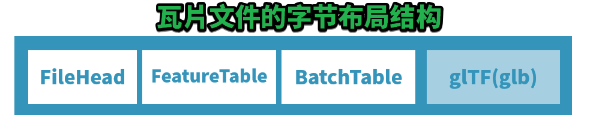

# 零、本篇前言

说实话，我很纠结是先介绍瓦片的二进制数据文件结构，还是先介绍这两个重要的表。思前想后，我决定还是先介绍这两个数据表。

因为这两个表不先给读者灌输，那么介绍到瓦片的二进制数据文件结构时，就满嘴“晦涩难懂”啦。

## 数据与模型

上文介绍到，瓦片的三维模型实际上是由gltf承担起来的（作为glb格式嵌入到瓦片二进制文件中），那么，除了模型数据，肯定模型自己本身也有属性数据的。

就比如，门有长宽高、密度、生产日期等信息，楼栋模型有建筑面积、楼层数等信息。

所以，“属性数据” 和 “模型” 是如何产生联系的呢？


早在我的博客《[聊聊GIS数据的四个分层与GIS服务]()》中有提及，只需把模型的几何数据作为一个属性，写入属性数据中，即把属性数据和几何数据并列，就可以了。

但是，在3dTiles中，模型数据是以glb的形式嵌入在瓦片文件中的（点云直接就写xyz和颜色信息了），模糊了二维中“要素”的概念，而且gltf规范看起来并没有所谓的“要素”的概念，仅仅是对GPU友好的vertex、normal、texture等信息。

**如何让gltf模型的每一个模型，甚至每一个三角面，甚至每一个顶点打上“我属于哪个模型”的印记呢？**我们本篇稍稍晚一些介绍。

再回忆一个重要的 3dTiles 理念：

> 3dTiles 规范本身不包含模型数据的定义，它仅仅记录模型变成瓦片后的空间组织关系、模型与其属性数据之间的关系。

所以，3dTiles 规范在瓦片二进制数据文件中，使用了两个重要的表来记录这种 ”模型与属性“ 的联系：

- FeatureTable（要素表）
- BatchTable（批量表）

## 瓦片二进制数据文件的大致字节布局结构



上一篇简单提过，瓦片引用的二进制文件有4种，即：b3dm、i3dm、pnts、cmpt。

除去cmpt这个复合类型不谈，前三种的大致布局见上图。

> **每一种瓦片二进制数据文件都有一个记录该瓦片的文件头信息，文件头包括若干个因瓦片不同而不太一致的数据信息，紧随其后的是两大数据表：FeatureTable（我翻译其为：要素表）、BatchTable（我翻译其为：批量表）。**

这两个表既然是二进制的数据，尽管它名字里带“表”，但是却不是二维表格，它更多的是一些 **键值** 信息。

关于不同瓦片二进制文件的这两个表的结构，在后续博文会详细介绍。

# 一、记录渲染相关的数据：FeatureTable，要素表

在 b3dm 瓦片中，要素表记录这个批量模型瓦片中模型的个数，这个模型单体在人类逻辑上不可再分。

（在房屋级别来看，房子并不是单体，构造它的门、门把、窗户、屋顶、墙等才是模型单体；但是在模型壳子的普通表面建模数据中，房子就是一个简单的模型）

要素表还可以记录当前瓦片的中心坐标，以便gltf使用相对坐标，压缩顶点坐标数字的数据量。

官方给的定义是：

> 要素表记录的是与渲染有关的数据。

直球！听不懂！

我来“翻译”一下好了：

> 要素表，记录的是整个瓦片渲染相关的数据，而不是渲染所需的数据。
>
> 渲染相关，即有多少个模型，坐标是相对的话相对于哪个中心，如果是点云的话颜色信息是什么以及坐标如何等；
>
> 渲染所需，例如顶点信息、法线贴图材质信息均有glb部分完成。

我们以pnts（点云瓦片）举例，它的要素表允许有两大类数据（看不懂没关系，之后的博客还会继续介绍四种瓦片文件的结构）：

- *点属性：记录每个点云点的信息*

| 属性名             | 数据类型                  | 描述                                   | 是否必须               |
| ------------------ | ------------------------- | -------------------------------------- | ---------------------- |
| POSITION           | float32 * 3               | 直角坐标的点                           | 是，除非下面的属性存在 |
| POSITION_QUANTIZED | uint16 * 3                | 量化的直角坐标点                       | 是，除非上面的属性存在 |
| RGBA               | uint8 * 4                 | 四通道颜色                             |                        |
| RGB                | uint8 * 3                 | RGB颜色                                | /                      |
| RGB565             | uint16                    | 有损压缩颜色，红5绿6蓝5，即65536种颜色 | /                      |
| NORMAL             | float32 *3                | 法线                                   | /                      |
| NORMAL_OCT16P      | uint8 * 2                 | 点的法线，10进制单位向量，有16bit精度  | /                      |
| BATCH_ID           | uint8/uint16(默认)/uint32 | 从BatchTable种检索元数据的id           | /                      |

- *全局属性：记录整个点云瓦片的信息*

| 属性名                  | 数据类型    | 描述                                                         | 是否必须                         |
| ----------------------- | ----------- | ------------------------------------------------------------ | -------------------------------- |
| POINTS_LENGTH           | uint32      | 瓦片中点的数量。所有的点属性的长度必须与这个一样。           | 是                               |
| RTC_CENTER              | float32 * 3 | 如果所有点是相对于某个点定位的，那么这个属性就是这个相对的点的坐标。 | /                                |
| QUANTIZED_VOLUME_OFFSET | float32 * 3 | 量化偏移值（不知道是什么）                                   | 与下面的属性必须同时存在         |
| QUANTIZED_VOLUME_SCALE  | float32 * 3 | 量化缩放比例（不知道是什么）                                 | 与上面的属性必须同时存在         |
| CONSTANT_RGBA           | uint8 * 4   | 为所有点定义同一个颜色                                       | /                                |
| BATCH_LENGTH            | uint32      | BATCH_ID的个数                                               | 与点属性中的BATCH_ID必须同时存在 |

简略一瞥，可以看出点云因为没有使用gltf模型（也没必要），把点云要渲染到屏幕上所需的坐标、法线、颜色等信息写在了要素表中。

如果还是不能理解何为“渲染相关”，那么请阅读后续四种瓦片文件格式的详细介绍，相信你会有所收获——有可能是我表达比较菜。

要说明一个“业界黑话”：

> 在一个瓦片中，一个三维**要素**（GIS中的通常叫法）= 一个**模型**（图形学、工业建模叫法） = 一个**BATCH**（3dtiles叫法）

然后，我向读者隆重介绍要素表的简单结构，因为要素表、批量表都是以 **二进制** 形式存储，所以了解每一种瓦片的二进制数据布局十分重要。

## 要素表的结构：JSON描述信息+要素表数据体

要素表紧随在若干个字节的文件头后，它本身还可以再分为 `二进制的JSON文本头`  + `二进制的数据体`。

如下图所示：


有迫不及待的读者希望更进一步了解要素表了，不要急，后续篇章一定展开，例如如何读取要素表和其中的数据等。

接下来，是另一个数据表：批量表。


# 二、记录属性数据：BatchTable，批量表

如果把批量表删除，那么3dTiles数据还能正常渲染。

是的，批量表就是所谓的模型属性表，批量表中每个属性数组的个数，就等于模型的个数，因为有多少个模型就对应多少个属性嘛！

（嘿嘿，其实也有例外的情况，我们到后续聊3dtiles数据规范的扩展能力时，再把这个坑填上，不然怎么说3dtiles很灵 [keng] 活 [die] 呢）

批量表相对比较自由，只要能与模型对得上号，想写啥就写啥。

## 批量表中的属性数据 ↔ 模型的关联

假定读者在阅读此 3dtiles 博客之前，已经对 gltf 数据规范有一定的了解。

gltf 数据有三层逻辑：Node ← Mesh ← Primitive。

其中，Primitive 即 gltf 数据规范中最小的图形单位，其顶点定义由其下的 `attributes` 对象下 `POSITION` 属性来寻找访问器（`Accessor`），从而获取到数据。

``` JSON
{
    ...
    "meshes": [
       {
           "primitives": [
               {
                   "attributes": {
                       "POSITION": 0,
                       "TEXTURE_0": 2
                       ...
                   },
                   "indices": 1,
                   "mode": 4,
                   "material": 0
               }
           ]
       } 
    ],
    ...
}
```

获取到 `POSITION` 、`indices` 对应的访问器、缓存视图、缓存文件后，即可获取 gltf 模型的所有顶点，即几何模型，即三维要素的几何数据。

现在问题来了，如何将这些顶点 “打” 上一个印记呢？就像检疫的猪肉一样，打个印记，说明猪是健康的。

Cesium团队在设计 3dtiles 规范的时候充分利用了 gltf 规范的特点：开源。因此，每一个 `primitive` 被在其 `attributes` 中添加了额外的访问器：`_BATCHID`。

``` JSON
"primitives": [
    {
        "attributes": {
            "POSITION": 0,
            "_BATCHID": 3,
            "TEXTURE_0": 2
            ...
        },
        "indices": 1,
        "mode": 4,
        "material": 0
    }
]
```

它与 `POSITION` 等没什么两样，同样会占用一部分数据。聪明的读者应该能想到了，如果每一个顶点都有一个所谓的 `_BATCHID` 对应，那么我随便给个点，我不就知道这个点的 `_BATCHID`，从而就知道这个点属于哪一个 `BATCH` 了吗？

翻翻前面的 “黑话”，GIS的读者更容易关联起来：

一个 `BATCH` （即三维要素）用自己的 `BATCHID` 与几何数据一一对应，属性数据也与这个 `BATCHID` 一一对应，由传递关系，那么三维的几何数据 (gltf) 也就能和 属性数据 (批量表) 一一对应了。

> 不过遗憾的是，并不是所有的瓦片都有 gltf 模型，例如pnts瓦片。
>
> 所以这个 几何 与 属性 两大数据如何关联，在之后的博文再具体问题具体分析。

*关于这个模型和属性的关联，在b3dm瓦片的博文中要重点介绍。*

## 批量表的结构：JSON描述信息+批量表数据本体

与 要素表 很像，批量表也是由： `二进制的JSON文本头`  + `二进制的数据体` 构成的。如下图所示：


关于两个表的更深层次的数据内容，例如如何承载模型与模型之间的逻辑关系，如何记录使用 Google 压缩算法的模型数据，那就是后续文章的内容了。

# 三、结语

本篇没有特定的数据作为说明，写得不太好，因为是第一次尝试用自己的语言表达这两大数据表，谋篇布局能力不太行，还请读者包涵。

这两个数据表真正的内容，还要等到接下来的四篇对瓦片二进制文件的重点介绍中，才能细细讲完，本篇仅仅作为接下来四篇博客的 “总结”，也可以说是 “介绍”。

## 附：CesiumJS API 如何查询瓦片的批量表

我们通常在Cesium中使用 点击 事件，来获取一个 `BATCH`，即三维要素。在Cesium API中，这个被叫做：Cesium3DTileFeature。

那么，这个 Cesium3DTileFeature 就能访问到它自己的批量表中的属性数据：

``` JS
const handler = new Cesium.ScreenSpaceEventHandler(viewer.canvas);
handler.setInputAction(function(movement) {
    let feature = scene.pick(movement.endPosition);
    if (feature instanceof Cesium.Cesium3DTileFeature) {
        let propertyNames = feature.getPropertyNames();
        let length = propertyNames.length;
        for (var i = 0; i < length; ++i) {
            let propertyName = propertyNames[i];
            console.log(propertyName + ': ' + feature.getProperty(propertyName));
        }
    }
}, Cesium.ScreenSpaceEventType.LEFT_CLICK);
```

用到了 `Cesium3DTileFeature.getPropertyNames()` 方法获取批量表中所有属性名，用了 `Cesium3DTileFeature.getProperty(string Name)` 来获取对应属性名的属性值。更多 API 见官方文档。