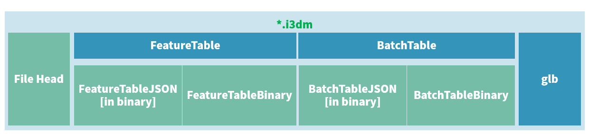

i3dm，即 `Instanced 3D Model`，实例三维模型的意思。

诸如树木、路灯、路边的垃圾桶、长椅等具有明显 **重复** 特征的数据。这类数据用得较少（笑，现在都喜欢搞BIM、倾斜摄影、精模、白模等）

# 瓦片文件二进制布局（文件结构）

与 b3dm 一致，文件头多了个属性。



# 1. 文件头：32byte

i3dm的文件头有8个属性，前7个与b3dm是一样的。

| 属性的官方名称                 | 字节长 | 类型                | 含义                                  |
| ------------------------------ | ------ | ------------------- | ------------------------------------- |
| `magic`                        | 4      | string（或char[4]） | 该瓦片文件的类型，在i3dm中是 `"i3dm"` |
| `version`                      | 4      | uint32              | 该瓦片的版本，目前限定是 1.           |
| `byteLength`                   | 4      | uint32              | 该瓦片文件的文件大小，单位：byte      |
| `featureTableJSONByteLength`   | 4      | uint32              | 要素表的JSON文本（二进制形式）长度    |
| `featureTableBinaryByteLength` | 4      | uint32              | 要素表的二进制数据长度                |
| `batchTableJSONByteLength`     | 4      | uint32              | 批量表的JSON文本（二进制形式）长度    |
| `batchTableBinaryByteLength`   | 4      | uint32              | 批量表的二进制数据长度                |
| `gltfFormat`                   | 4      | uint32              | gltf在i3dm瓦片中存在的形式            |

其中，前7个和b3dm意义一样，不做解释。

第8个，`gltfFormat` 只有两个值：0和1.

0，则位于 i3dm 瓦片文件最后的 gltf 内容是一个 uri，指向gltf的数据内容（可能是Base64 DataURL，也可能是其他地方的地址，笔者没见过...）

1，则位于 i3dm 瓦片文件最后的 gltf 内容是 二进制的 glb，大多数情况见的是这个。

默认情况，gltf 是 y 轴朝上，3dTiles 是z轴朝上，需要坐标转换。

# 2. 要素表

在上篇，有介绍到要素表存在 **全局属性** 和 **要素属性**。在 i3dm 中，这对概念就能得到很好的解释。

## ① 要素表的全局属性

| 属性名                  | 数据类型   | 描述                                                         | 是否必须                                    |
| ----------------------- | ---------- | ------------------------------------------------------------ | ------------------------------------------- |
| INSTANCES_LENGTH        | uint32     | instance的个数                                               | 是                                          |
| RTC_CENTER              | float32[3] | 如果坐标是相对坐标，那么相对中心由此属性给出                 | 否                                          |
| QUANTIZED_VOLUME_OFFSET | float32[3] | 量化空间范围体的偏移量                                       | 否，与要素属性中的POSITION_QUANTIZED 共存亡 |
| QUANTIZED_VOLUME_SCALE  | float32[3] | 量化空间范围体的缩放比例                                     | 否，与要素属性中的POSITION_QUANTIZED 共存亡 |
| EAST_NORTH_UP           | boolean    | 如果这个属性值是true，而且每个实例的方向没有定义，那么每个实例将默认指向WGS84椭球的正东、正北方向。 | 否                                          |

第一第二个能与 b3dm 中的 `BATCH_LENGTH` 和 `RTC_CENTER` 类比来理解，就不解释了。

最后一个属性指示当前 i3dm 瓦片的坐标轴朝向。

下列要着重介绍这个所谓的 `QUANTIZED_VOLUME`，即 **量化空间范围体**。

### a. 量化空间范围体

这个翻译是我自己意译的。


看到这，是否能理解“要素表的全局属性是对于整个瓦片文件而言”这句话了呢？

## ② 要素表的(逐)要素属性

| 属性名称            | 数据类型                 | 描述                                                  | 是否必须                        |
| ------------------- | ------------------------ | ----------------------------------------------------- | ------------------------------- |
| POSITION            | float32[3]               | 模型实例的坐标                                        | 是，与POSITION_QUANTIZED二选一  |
| POSITION_QUANTIZED  | uint16[3]                | 量化空间范围体内的模型实例坐标                        | 是，与POSITION二选一            |
| NORMAL_UP           | float32[3]               | 模型上方向向量                                        | 否，与NORMAL_RIGHT共存亡        |
| NORMAL_RIGHT        | float32[3]               | 模型右方向向量，必须与`up`向量正交                    | 否，与NORMAL_UP共存亡           |
| NORMAL_UP_OCT32P    | uint16[2]                | 模型上方向向量，32位精度八进制编码                    | 否，与NORMAL_RIGHT_OCT32P共存亡 |
| NORMAL_RIGHT_OCT32P | uint16[2]                | 模型右方向向量，必须与`up`向量正交，32位精度8进制编码 | 否，与NORMAL_UP_OCT32P共存亡    |
| SCALE               | float32                  | 该 instance 对于 gltf 的缩放比例                      | 否                              |
| SCALE_NON_UNIFORM   | float32[3]               | 该 instance 在三个方向上的缩放比例                    | 否                              |
| BATCH_ID            | uin8/uint16(默认)/uint32 | 用于在批量表里检索数据用的batchId                     | 否                              |


## ③ 要素表的JSON

上述所有属性全部会记录在要素表的 JSON 中，对于 全局属性，其值记录在 JSON 中，对于其要素属性，因为要素（即instance）很多的时候写在JSON中体积会变大，所以使用 JSON引用要素表二进制数据体 的形式。

下列是一个要素表的JSON：

``` JSON

```


## ④ 要素表体

要素表JSON中引用的二进制数据均顺次记录在此。

# 3. 批量表

批量表与b3dm的差不多。此处简单举例。

## ① 批量表JSON


## ② 批量表体


# 4. 要素表与批量表举例说明

此部分参考官方文档。


# 5. 字节对齐与编码端序

与b3dm里写的一致，可以回看：

# 6. 扩展（extensions）和额外信息（extras）

同样，这部分内容与b3dm篇章内介绍的一致，会在后续文章内介绍。