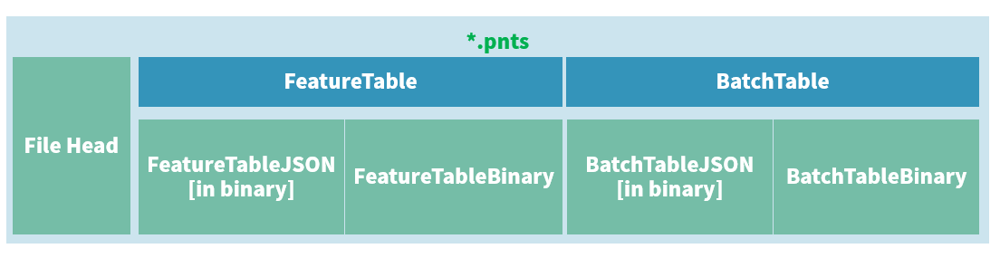

pnts，即 `Points`，点云的意思。

las、xyz数据等均可。

# 瓦片文件二进制布局（文件结构）

pnts不存在gltf模型，故结构如下：



# 1. 文件头：28byte

与b3dm是一样的。

| 属性的官方名称                 | 字节长 | 类型                | 含义                                  |
| ------------------------------ | ------ | ------------------- | ------------------------------------- |
| `magic`                        | 4      | string（或char[4]） | 该瓦片文件的类型，在pnts中是 `"pnts"` |
| `version`                      | 4      | uint32              | 该瓦片的版本，目前限定是 1.           |
| `byteLength`                   | 4      | uint32              | 该瓦片文件的文件大小，单位：byte      |
| `featureTableJSONByteLength`   | 4      | uint32              | 要素表的JSON文本（二进制形式）长度    |
| `featureTableBinaryByteLength` | 4      | uint32              | 要素表的二进制数据长度                |
| `batchTableJSONByteLength`     | 4      | uint32              | 批量表的JSON文本（二进制形式）长度    |
| `batchTableBinaryByteLength`   | 4      | uint32              | 批量表的二进制数据长度                |

# 2. 要素表

在 b3dm 篇，有介绍到要素表存在 **全局属性** 和 **要素属性**。在 pnts 和上篇 i3dm 中，这对概念会解释得很透彻。

## ① 要素表的全局属性

| 属性名                  | 数据类型    | 描述                                                         | 是否必须                                              |
| ----------------------- | ----------- | ------------------------------------------------------------ | ----------------------------------------------------- |
| POINTS_LENGTH           | uint32      | 瓦片中点的数量。所有的点属性的长度必须与这个一样。           | 必须存在                                              |
| RTC_CENTER              | float32 * 3 | 如果所有点是相对于某个点定位的，那么这个属性就是这个相对的点的坐标。 | 不必须                                                |
| QUANTIZED_VOLUME_OFFSET | float32 * 3 | 量化偏移值                                                   | 与QUANTIZED_VOLUME_SCALE属性必须同时存在或同时不存在  |
| QUANTIZED_VOLUME_SCALE  | float32 * 3 | 量化缩放比例                                                 | 与QUANTIZED_VOLUME_OFFSET属性必须同时存在或同时不存在 |
| CONSTANT_RGBA           | uint8 * 4   | 为所有点定义同一个颜色                                       | 不必须                                                |
| BATCH_LENGTH            | uint32      | BATCH_ID的个数                                               | 与点属性中的BATCH_ID必须同时存在或者同时不存在        |

第一第二个能与 b3dm 中的 `BATCH_LENGTH` 和 `RTC_CENTER` 类比来理解，就不解释了。

第3、4个与 i3dm 是一致的。

第5个即每个点的默认颜色，默认是灰色。

最后一个很有意思，和 b3dm 里的“重合”了，它的意义是：点云瓦片中这么多点是可以划分的，每一类叫做 BATCH。

例如对一栋建筑进行点云扫射，那么墙体的所有的点可以归属为 墙体BATCH，窗户的所有点可以归属为 窗户BATCH。

`BATCH_LENGTH` 指示了当前pnts瓦片的点被划分成了多少个类别。

### a. pnts瓦片中颜色的优先级

`RGBA`>`RGB`>`RGB565`>`CONSTANT_RGBA`。其中，`CONSTANT_RGBA` 是全局的，前三个是点要素属性里的。

当然，还可以使用 3dTiles 的 style 来改变样式。

### b. 量化空间范围体

这个词儿是我自己意译的。

通常点云数据只留其“形”，而具体每个点的坐标可以不那么精确。因为存储高精度的点坐标，是十分消耗空间的。默认每个点使用逐要素属性 `POSITION` 来记录每个点的坐标，坐标值类型是 `FLOAT`，即 4字节，假如使用量化坐标，每个坐标值使用 `UInt16` 类型，即 2字节，那么坐标信息就能压缩一倍！

具体什么是 量化空间范围体，我认为在上一篇 i3dm 中已经解释得很清楚了：

只不过，在点云瓦片中，`POSITION` 代表的不再是 instance 的坐标，而是点坐标。

看到这，是否能理解“要素表的全局属性是对于整个瓦片文件而言”这句话了呢？

## ② 要素表的(逐)要素属性

其实，我觉得在点云中叫 **点属性** 更好。

| 属性名             | 数据类型                  | 描述                                   | 是否必须                           |
| ------------------ | ------------------------- | -------------------------------------- | ---------------------------------- |
| POSITION           | float32 * 3               | 直角坐标的点                           | 是，除非POSITION_QUANTIZED属性存在 |
| POSITION_QUANTIZED | uint16 * 3                | 量化空间范围体内的直角坐标点           | 是，除非POSITION属性存在           |
| RGBA               | uint8 * 4                 | 四通道颜色                             | 不必须                             |
| RGB                | uint8 * 3                 | RGB颜色                                | 不必须                             |
| RGB565             | uint16                    | 有损压缩颜色，红5绿6蓝5，即65536种颜色 | 不必须                             |
| NORMAL             | float32 *3                | 法线                                   | 不必须                             |
| NORMAL_OCT16P      | uint8 * 2                 | 点的法线，10进制单位向量，有16bit精度  | 不必须                             |
| BATCH_ID           | uint8/uint16(默认)/uint32 | 从BatchTable种检索元数据的id           | 不必须，取决于全局属性BATCH_LENGTH |

其中，第一和第二个与 i3dm 中的定义一致。

第三~第五个是颜色信息，在第①小节中的a部分讲了。

第六、七与 i3dm 中的类似。

第八个与 i3dm 中的定义完全一致。

## ③ 要素表的JSON

上述所有属性全部会记录在要素表的 JSON 中，对于 全局属性，其值记录在 JSON 中。

对于其要素属性，因为点云中的点数量会非常巨大，写在JSON中体积会变大，所以使用 JSON引用要素表二进制数据体 的形式。

下列是一个要素表的JSON：

``` JSON
{
    POINTS_LENGTH : 4, // 意味着有4个点
    POSITION : {
        byteOffset : 0 // 意味着从ftBinary的第0个byte开始读取
    }
}
```

这个要素表的释义与 i3dm 中的示例一样，只不过从 `INSTANCES_LENGTH` 变成了 `POINTS_LENGTH`。

## ④ 要素表体

要素表JSON中引用的二进制数据均顺次记录在此，一般为要素属性（点属性）。

# 3. 批量表

批量表与b3dm的差不多，如果在 pnts 的要素表和批量表中存储了 `BATCH_LENGTH` 信息，那每个 BATCH 的属性就存于此。

但是与 b3dm、i3dm 略有不同的是，如果要素表JSON中没有 `BATCH_ID` 的定义，但是批量表中却存在与点的数量 `POINTS_LENGTH` 一样长的属性数组，那么说明该点云瓦片的每一个点都有属性。

结构参考 b3dm 篇章。

# 4. 要素表与批量表举例说明

此部分参考官方文档。

## ① 只有点坐标

``` JSON
const featureTableJSON = {
    POINTS_LENGTH : 4, // 意味着有4个点
    POSITION : {
        byteOffset : 0 // 意味着从ftBinary的第0个byte开始读取
    }
}

const featureTableBinary = new Buffer(new Float32Array([
    0.0, 0.0, 0.0,
    1.0, 0.0, 0.0,
    0.0, 0.0, 1.0,
    1.0, 0.0, 1.0
]).buffer)
```

这个例子只记录了4个点。

## ② 相对坐标与颜色信息

``` JS
const featureTableJSON = {
    POINTS_LENGTH : 4, // 意味着有4个点
    RTC_CENTER : [1215013.8, -4736316.7, 4081608.4], // 意味着相对于这个点
    POSITION : {
        byteOffset : 0 // 意味着从ftBinary的第0个byte开始读取
    },
    RGB : {
        byteOffset : 48 // 颜色值意味着从ftBinary的第48个byte读取，紧接在POSITION后
    }
}

const positionBinary = new Buffer(new Float32Array([
    0.0, 0.0, 0.0,
    1.0, 0.0, 0.0,
    0.0, 0.0, 1.0,
    1.0, 0.0, 1.0
]).buffer) // 一共12*4byte = 48byte

const colorBinary = new Buffer(new Uint8Array([
    255, 0, 0,
    0, 255, 0,
    0, 0, 255,
    255, 255, 0,
]).buffer) // 一共12*1byte = 12byte

// ftBinary一共48+12=60byte
const featureTableBinary = Buffer.concat([positionBinary, colorBinary]) 
```

这个例子有4个点，是相对于中心定位的点。颜色依次为：红绿蓝黄。

## ③ 量化坐标与八进制编码法向量

``` JS
const featureTableJSON = {
    POINTS_LENGTH : 4, // 意味着有4个点
    QUANTIZED_VOLUME_OFFSET : [-250.0, 0.0, -250.0], // 意味着偏移基坐标是 (-250, 0, -250)
    QUANTIZED_VOLUME_SCALE : [500.0, 0.0, 500.0], // 意味着x和z方向的缩放比是500
    POSITION_QUANTIZED : { 
        byteOffset : 0 // 意味着量化坐标的数据存在ftBinary的第0个字节往后
    },
    NORMAL_OCT16P : {
        byteOffset : 24 // 意味着量化坐标顶点法线的数据存在ftBinary的第24个字节往后
    }
}

const positionQuantizedBinary = new Buffer(new Uint16Array([
    0, 0, 0,
    65535, 0, 0,
    0, 0, 65535,
    65535, 0, 65535
]).buffer) // 一共12*2byte=24byte，Uint16=16bit=2byte

const normalOct16PBinary = new Buffer(new Uint8Array([
    128, 255,
    128, 255,
    128, 255,
    128, 255
]).buffer) // 一共8*1=8byte，Uint8=8bit=1byte

const featureTableBinary = Buffer.concat([positionQuantizedBinary, normalOct16PBinary])
```

这个例子中，有4个点，每个点的法向量都是八进制编码的$[0.0, 1.0, 0.0]$，它们将被放置在x和z方向上.

## ④ 点数据分类（BATCH）

``` JS
const featureTableJSON = {
    POINTS_LENGTH : 4, // 意味着有4个点
    BATCH_LENGTH : 2, // 意味着4个点分成了2类（批、batch）
    POSITION : {
        byteOffset : 0 // 意味着POSITION将存储在ftBinary的第 0 byte之后
    },
    BATCH_ID : {
        byteOffset : 48, // 意味着BATCH_ID的值将从ftBinary的第 48 byte之后
        componentType : "UNSIGNED_BYTE" // 意味着BATCH_ID的值类型是无符号字节数
    }
}

const positionBinary = new Buffer(new Float32Array([
    0.0, 0.0, 0.0,
    1.0, 0.0, 0.0,
    0.0, 0.0, 1.0,
    1.0, 0.0, 1.0
]).buffer) // 4个点，一共12个值，每个值4byte（Float每个数字占4byte，即32bit），一共48byte

const batchIdBinary = new Buffer(new Uint8Array([
    0,
    0,
    1,
    1
]).buffer) // 前2个的类型是0（batchId），后2个点的类型是1

const featureTableBinary = Buffer.concat([positionBinary, batchIdBinary]); // 合并

const batchTableJSON = {
    names : ['object1', 'object2']
} // 批量表JSON记录了属性值，有两个，刚好对上 BATCH_LENGTH
```

这个例子中，前2个点的 `batchId` 是0，后2个点的 `batchId` 是1。

## ⑤ 每个点都有属性

``` JS
const featureTableJSON = {
    POINTS_LENGTH : 4, // 意味着有4个点
    POSITION : {
        byteOffset : 0 // 意味着从ftBinary的第0byte开始
    }
}

const featureTableBinary = new Buffer(new Float32Array([
    0.0, 0.0, 0.0,
    1.0, 0.0, 0.0,
    0.0, 0.0, 1.0,
    1.0, 0.0, 1.0
]).buffer)

const batchTableJSON = {
    names : ['point1', 'point2', 'point3', 'point4'] // 意味着这4个点都有names属性，其值写在这里
}
```

如果在 要素表中没有 `BATCH_ID` 属性的定义，并且批量表中存有属性数据，那么这些属性的个数必定与点的个数相同，即每个点都有属性。

# 5. 字节对齐与编码端序

与b3dm里写的一致，可以回看：

# 6. 扩展（extensions）和额外信息（extras）

同样，这部分内容与b3dm篇章内介绍的一致，会在后续文章内介绍。