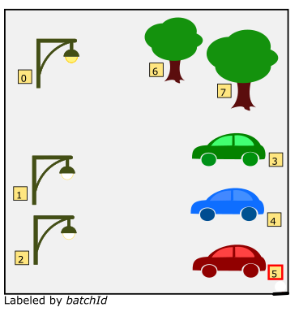
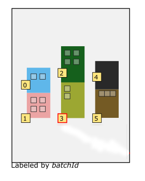

前面介绍瓦片文件时，留了个坑，即扩展功能，前文可能叫扩展数据，也可能叫扩展项，在这里一律叫扩展功能。

扩展数据允许在原有数据集所有特征、信息不改变的状态下，悄无声息地加入新的信息。它就像插件一样，不改变宿主的状态而提供更强有力的特性。

在 `tileset.json` 文件中，有两个顶级对象：`extensionsRequired` 和 `extensionsUsed`，这两个属性就是标记数据集是否存在扩展项的，它们是字符串数组，用于记录当前数据集用到的扩展数据的名字。其中，`extensionsRequired` 中出现的所有属性必须也在 `extensionsUsed` 中，反之则不然。

这么说可能很抽象，下面结合官方在 `3d-Tiles 1.0` 规范中已正式纳入标准的两个官方扩展数据：

- 用于支持 Google Draco 顶点、法线、uv等数据的压缩算法的扩展功能：`3DTILES_draco_point_compression`
- 用于扩充批量表使其具有更复杂属性数据的扩展功能：`3DTILES_batch_table_hierarchy`

# 1. 正式规范内的扩展功能

## ① Google Draco顶点压缩扩展：`3DTILES_draco_point_compression`

b3dm 与 i3dm 两种瓦片中包含 glTF 模型，而 glTF 模型本身就可以通过 `glTF 扩展功能` 启用模型的顶点压缩，但是，pnts 这种瓦片却没有 glTF 模型，它的坐标数据都存在要素表中，如何实现大批量点云数据的压缩呢？

启动此项扩展功能：`3DTILES_draco_point_compression`，就可以像 glTF 一样启用顶点、颜色、反射强度、法线等数据的压缩了。

当前此扩展基于 Google Draco BitStream Version 2.2。

### 修改 pnts 瓦片的要素表JSON

这是一个 pnts 要素表JSON，注意它启用了 `extensions` 属性，内含 `3DTILES_draco_point_compressions` 对象，以指示当前 pnts 瓦片使用了 Google Draco 压缩。

``` JSON
{
    "POINTS_LENGTH": 20,
    "POSITION": {
        "byteOffset": 0
    },
    "RGB": {
        "byteOffset": 0
    },
    "BATCH_ID": {
        "byteOffset": 0,
        "componentType": "UNSIGNED_BYTE"
    },
    "extensions": {
        "3DTILES_draco_point_compression": {
            "properties": {
                "POSITION": 0,
                "RGB": 1,
                "BATCH_ID": 2
            },
            "byteOffset": 0,
            "byteLength": 100
        }
    }
}
```

注意到这个对象有一个 `properties` ，它记录的是有哪些压缩数据被压缩。这里被压缩的是 `POSITION`、`RGB`、`BATCH_ID`，即 坐标、颜色、BATCHID。

还注意到，这三个数据对要素表二进制数据体的字节偏移都为0，这是规定——如果使用了这个扩展功能，那么被压缩的数据的 `byteOffset` 全部归零。`BATCH_ID` 还保留了 `componentType`，它指示的是未压缩数据的数据值类型。

每个被压缩的数据，在这个对象中有唯一的ID：`POSITION` 是 0，`RGB` 是 1，`BATCH_ID` 是 2. 

这个ID不能与批量表中被压缩的属性的ID重复。

目前，这个扩展功能仅支持压缩如下数据：`"POSITION"`，`"RGBA"`，`"RGB"`，`"NORMAL"` 和`"BATCH_ID"`.

`byteOffset` 即 此扩展功能压缩后的数据从 要素表二进制数据体的何处开始记录，`byteLength` 是数据长度。

`properties`、`byteOffset`、`byteLength` 三个属性对于此扩展功能对象是必须的，少写一个都不行。

### 批量表中的数据压缩

看一个批量表的JSON：

``` JSON
{
    "Intensity": {
        "byteOffset": 0,
        "type": "SCALAR",
        "componentType": "UNSIGNED_BYTE"
    },
    "Classification": {
        "byteOffset": 0,
        "type": "SCALAR",
        "componentType": "UNSIGNED_BYTE"
    },
    "extensions": {
        "3DTILES_draco_point_compression": {
            "properties": {
                "Intensity": 3,
                "Classification": 4
            }
        }
    }
}
```

有两个属性：反射强度 `Intensity` 和 分类 `Classification`，与要素表中的压缩是一致的。

注意：批量表的这个 `3DTILES_draco_point_compression` 对象并未定义 `byteOffset` 和 `byteLength`，是因为批量表中的属性数据一同被压缩到了 **要素表二进制数据体** 中去了。

### 疑问：如何解析这些被压缩的数据？

Cesium提供了实现：https://github.com/CesiumGS/cesium/blob/master/Source/Workers/decodeDraco.js

不能像普通数据一样按特定信息读取二进制字节然后转换了~

## ② 批量表的复杂结构实现：`3DTILES_batch_table_hierarchy`

### 前导：三维要素与其几何信息、属性信息

在前几篇博文总是会提到一个概念：`BATCH`，它们表达的是现实中的一个三维对象。怎么理解呢？

二维，用 **要素（feature）**这一概念表达地理实体，要素包括 几何形状 和 属性数据。

三维，3dTiles 使用 `BATCH` 来替代二维中要素的概念，其实可以说是等价的。`BATCH` 在各种瓦片中的表达不太一样：

- 在 b3dm 中，`BATCH` 是逻辑上最小的单元
- 在 i3dm 中，`BATCH` 即 instance
- 在 pnts 中，`BATCH` 表达的是某个物体的那一堆点

既然类比二维，那么 `BATCH` 肯定也拥有 几何形状 和 属性数据。

**`BATCH` 通过 id 索引批量表中的属性数据，通过 glTF 中的 `_BATCHID` 来绑定对应的几何数据。**

如下图所示：


这样就完成了二维升级到三维，但是，这没有考虑属性异构的问题与 `BATCH` 之间有联系的问题。

### 如何记录异构属性？

在一个 b3dm 文件中，一般情况下会有多个 `BATCH`，但是与二维要素不太一样的是，`BATCH` 所表达的实际现实物体，它们可能会有不同的属性！

举个例子，这里有一个 “广场”瓦片，内含 8 个 `BATCH` ：3个路灯，2棵树，3辆小车，它们的 id 标注在图上了。



路灯有 “灯光颜色”、“光的强度” 两个属性，树有 “树的年龄”、“树的品种” 两个属性，车有 “颜色”、“牌子” 等属性。

这个时候如果使用普通的批量表来记录属性数据，会造成极大的冗余：

``` JSON
{
    "lightStrength": [100,30,30,0,0,0,0,0],
    "lightColor": ["Yellow","White","White","","","","",""],
    "treeAge": [0,0,0,0,0,0,5,7],
    "treeType": [...],
    "carColor": [...],
    "carBrand": [...]
}
```

这里仅仅列出前三个 属性，就足以说明问题了，因为路灯并不需要 `treeAge`、`treeType`、`carColor`、`carBrand`这四个属性，事实上其他的对象也不需要路灯的属性，但是由于批量表的关系，数组长度必须和当前瓦片的 `BATCH` 个数一致，你却不得不记录这些冗余的数据：空字符串和数字0。

所以，为了解决这一问题，`3DTILES_batch_table_hierarchy` 这个批量表中的扩展功能就被设计出来了。

这个时候，批量表不再需要记录这6个属性，摇身一变：

``` JSON
{
  "extensions" : {
    "3DTILES_batch_table_hierarchy" : {
      "classes" : [
        {
          "name" : "Lamp",
          "length" : 3,
          "instances" : {
            "lightStrength" : [10, 5, 7],
            "lightColor" : ["yellow", "white", "white"]
          }
        },
        {
          "name" : "Car",
          "length" : 3,
          "instances" : {
            "carBrand" : ["Benz", "Benz", "Audi"],
            "carColor" : ["green", "blue", "red"]
          }
        },
        {
          "name" : "Tree",
          "length" : 2,
          "instances" : {
            "treeType" : ["A", "B"],
            "treeAge" : [5, 8]
          }
        }
      ],
      "instancesLength" : 8,
      "classIds" : [0, 0, 0, 1, 1, 1, 2, 2]
    }
  }
}
```

它在 批量表的JSON中清空了所有属性数组，转而使用 `extensions` 属性，记录下 `3DTILES_batch_table_hierarchy` 这个扩展功能。

从上到下依次为：

- 8个 `BATCH` 被分成多少个类别？classes.length  = 3个！
- 8个 `BATCH` 被重新组织成了多少个对象？instancesLength = 8个。是的，没错，和 `BATCH_LENGTH` 一样，这是因为它们之间并无逻辑相关，彼此还保持独立，在下面一个小节会看到 `instancesLength` 与 `BATCH` 数量不相等的情况。
- 被重新组织成的8个对象，对应了哪个类别？`classIds` 数组就是记录这个用的。

这时，如若我想读取 `BATCHID` 是4的 `BATCH` 的属性，如何索引呢？

- 第一步，获取 `BATCH` 对应的类别id，`classIds[4] = 1 ` 
- 第二步，确认第4个 `BATCH` 在它自己的 class 中排第几？我们看到有 3 个 Car，而第四个 `BATCH` 属于 3个 Car 中的第二个（索引是1）
- 第三步，去 `classes` 数组中找第 1 个class，找第 1 个class的第二个（即索引是1）属性，即 `classes[1]["instances"]["carType"][1]` 和 `classes[1]["instances"]["carColor"][1]`，即得所需属性值

有人可能觉得这更繁琐了，但是一旦这个“广场” 瓦片内的 `BATCH` 分类多了起来，`BATCH` 数量也多了起来，这么做肯定比记录冗余数据的普通批量表要好很多。

而且，不仅仅是异构属性表这么简单：

### 如何记录逻辑关联的信息？

`3DTILES_batch_table_hierarchy` 不仅仅可以记录多个 `BATCH` 属性数据不一致的问题，还能记录逻辑相关，即 `BATCH` 之间存在父子关系等逻辑信息。

这个特点简直就是为了 BIM 数据而设计的。

直接举例：



这里有一个区域瓦片，内含 6 个 `BATCH`，每个 `BATCH` 代表的是某栋楼房的外墙面。

说巧不巧的是，第0、1号墙面是一个楼的，2、3和4、5也是同样的情况。

但是，模型只有6个，如何用这 6 个外墙模型，去表达 1个区域包含3个楼房，楼房又包含不同外墙的信息呢？

直接上扩展后的批量表JSON：

``` JSON
{
  "extensions" : {
    "3DTILES_batch_table_hierarchy" : {
      "classes" : [
        {
          "name" : "Wall",
          "length" : 6,
          "instances" : {
            "wall_color" : ["blue", "pink", "green", "lime", "black", "brown"],
            "wall_windows" : [2, 4, 4, 2, 0, 3]
          }
        },
        {
          "name" : "Building",
          "length" : 3,
          "instances" : {
            "building_name" : ["building_0", "building_1", "building_2"],
            "building_id" : [0, 1, 2],
            "building_address" : ["10 Main St", "12 Main St", "14 Main St"]
          }
        },
        {
          "name" : "Block",
          "length" : 1,
          "instances" : {
            "block_lat_long" : [[0.12, 0.543]],
            "block_district" : ["central"]
          }
        }
      ],
      "instancesLength" : 10,
      "classIds" : [0, 0, 0, 0, 0, 0, 1, 1, 1, 2],
      "parentIds" : [6, 6, 7, 7, 8, 8, 9, 9, 9, 9]
     }
  }
}
```

`classes` 数组的含义与上面树木、车子、路灯的例子类似。

这个时候，`instancesLength` 是10了，即除了 `BATCH` 的数量 6，还加了 “虚拟” 的 3 个楼房，以及 “虚拟” 的1个区域。

所以，`instancesLength` 表达的是 实际的`BATCH` + 实际的 `BATCH` 构成的逻辑模型 的总个数。

但是，多了一个 `parentIds`，这个是什么的索引？

取 `parentIds[0]`，值是6，那么意思是 第 0 号逻辑模型的父级模型是 第6号 逻辑模型。

通过检索 `classIds[0]` 知道 第0个 逻辑模型属于第0个类，是第0个类里的第0个，`wall_color` 是 `"blue"`，`wall_window` 是 2。

同理，检索这个逻辑模型的父级模型 `classIds[6]` 知道第6个逻辑模型属于第1个类，是第1个类里的第0个，它的三个属性信息是 `"building_name":"building_0","building_id":"0","building_address":"10 Main St" `.

检索到最后，如果 逻辑模型 已经没有父级，那么它的 `parentId` 就是他本身。

**还希望读者仔细品读这一烧脑的逻辑组织，体会这强大的逻辑信息组织结构。**

# 2. (简单解读)制定中的扩展

别看这里有4个扩展，其实都是为了 `3DTILES_implicit_tiling` 这个服务的。

`3DTILES_implicit_tiling` 扩展仍然在制定中，

## ① `3DTILES_binary_buffers`


## ② `3DTILES_extent`


## ③ `3DTILES_implicit_tiling`


## ④ `3DTILES_tile_metadata`


# 3. (补充内容)GLTF的扩展

https://github.com/KhronosGroup/glTF/tree/master/extensions

glTF 自己也有扩展，尤其是在顶点数据、纹理贴图材质方面，扩充了许多官方的、第三方组织的扩展。3dTiles 正是借鉴了这个思想，也才拥有了自己的扩展能力。

找几个常见的：