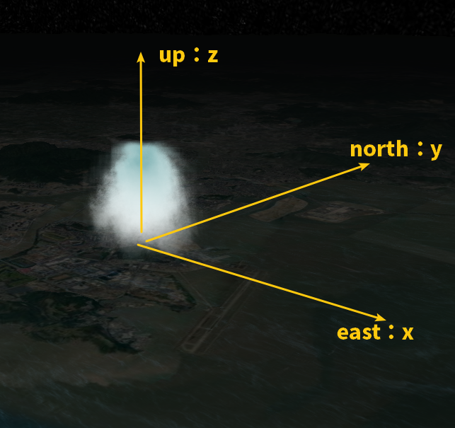
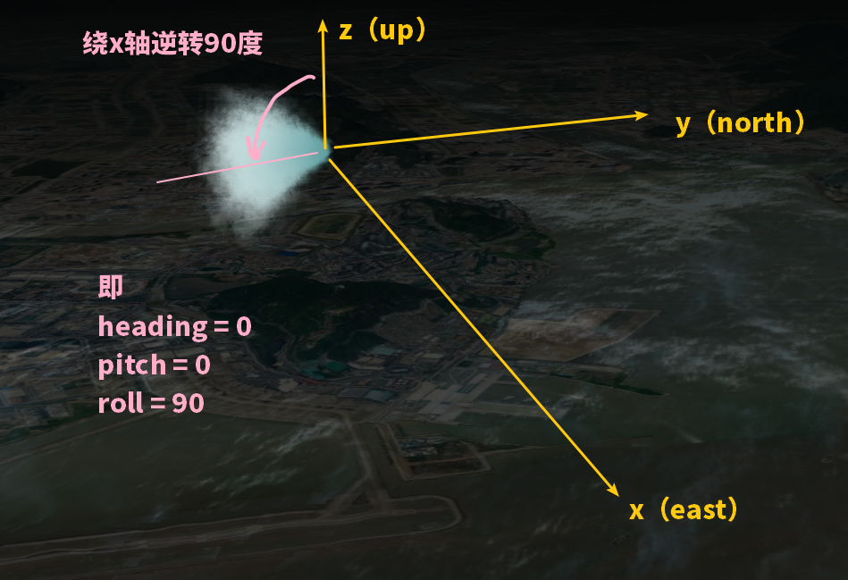

粒子系统用到的类主要有：

- ParticleSystem
- 四大Emitter
- Particle
- ParticleBurst

# 快速上手

``` JS
const sys = new Cesium.ParticleSystem({
    /* 贴图，影响粒子的效果、尺寸，image可以是 canvas 也可以是图像 */
    // image: getImage(),
    image: require('./images/smoke.png'), // nodejs 请求图片的方法
    imageSize : new Cesium.Cartesian2(100, 50),

    /* 颜色，出生颜色、消亡颜色 */
    startColor: Cesium.Color.WHITE.withAlpha(0.7),
    endColor: Cesium.Color.WHITE.withAlpha(0.1),

    startScale: 1.0,
    endScale: 4.0,

    lifetime : 16.0,
    particleLife : 1.0, 
    minimumParticleLife: 1.0,
    maximumParticleLife: 1.5,

    speed: 1.0,
    width: 100,
    height: 100,

    modelMatrix: emitterOptions.position.computeModelMatrix(viewer.clock.startTime, new Cesium.Matrix4()),

    /* 发射器，其中发射率影响发射得 ”强不强烈“ */
    emitter: new Cesium.CircleEmitter(5),
    emissionRate : 2.0
  })
```

## 与位置有关

- modelMatrix：粒子系统原点到世界坐标的转换矩阵。
- emitterModelMatrix：粒子系统相对于粒子系统原点的局部转换。

通常只需指定 modelMatrix 即可。

如果不指定，那么它们的默认值都是单位矩阵。

粒子系统最终的坐标是通过这样的一个顺序计算而来的：
$$
Vec_{LAST} = M_{modelMatrix}×M_{emitterModelMatrix}×Vec_{LOCAL}
$$

## 与效果有关

### ① 发射器

circle：朝上轴方向的一个圆随机发射

box：盒子内部随机发射

sphere：球体内部随机发射

cone：圆锥体顶端到底端

### ② 图案

通常使用带透明的 png 图，烟雾效果较好。也可以使用自定义的 canvas DOM元素。

图案大小使用 `imageSize` 指定。

除了图案本身的颜色，还可以指定起止颜色盖上去。

### ③ 粒子密度

imageSize大、emissionRate大、初速度慢、生命较长、缩放值较大就能共同造成一个效果：不容易消失且叠加很多，密度就大了。

### ④ 粒子生长控制

- emissionRate：这个值大了发射间隔就小了，看起来就多了
- imageSize：这个值
- maximumSpeed、minimumSpeed：发射的最大最小速度，即发射速度的范围
- scale：粒子图案的缩放比
- maximumLife、minimumLife：粒子的存活时间范围

### ⑤ 爆炸效果

使用 `burst` 参数可以在指定时刻控制不同的发射数量。

## 改变粒子每时每刻的状态

需要用到 `updateCallback`

粒子系统生成粒子 `Particle` 后，在其生命周期内，粒子的速度、方向、质量、位置、图像、图像的起止色、图像的起止缩放比、图像的尺寸均可由这个回调函数改变。

这个回调函数有两个参数：粒子本身，粒子变化时间。

以重力举例：

``` JS
const gravityVector = new Cesium.Cartesian3();
const gravity = -9.8; // 注意重力加速度是有方向的，指向地心为负

// 使用公式修改每时每刻的速度值 v += Δv，而 Δv = a × Δt
function applyGravity(p, dt) {
    // 获取笛卡尔位置向量，即 v
    var position = p.position;

  	// 归一化
    Cesium.Cartesian3.normalize(position, gravityVector);
  
  	// 计算 Δv，即 gravityVector = g * dt
    Cesium.Cartesian3.multiplyByScalar(gravityVector, gravity * dt, gravityVector);

    // v = v + Δv
    p.velocity = Cesium.Cartesian3.add(p.velocity, gravityVector, p.velocity);
}
```

只需把这个 `applyGravity` 函数传递给粒子系统的 `updateCallback` 即可。

## 发射器朝向

默认是垂直于该点向上，可以试试修改 emitterModelMatrix





``` JS
new Cesium.ParticleSystem({
  // ...
  emitterModelMatrix: computeEmitterModelMatrix()
})

function computeEmitterModelMatrix() {
  let hpr = new Cesium.HeadingPitchRoll(0, 0, Cesium.Math.toRadians((90)))
  let m3 = Cesium.Matrix3.fromHeadingPitchRoll(hpr)
  let m = Cesium.Matrix4.fromRotationTranslation(
    m3, new Cesium.Cartesian3(0, 0, 500)
  )
  return m
}
```

