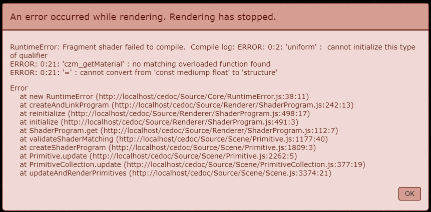
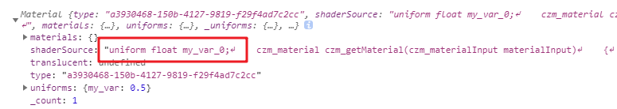
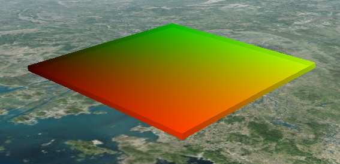

fabric 材质定义：着色器实践

# 1. 示例代码

贴到沙盒里就可以运行：

``` JS
var viewer = new Cesium.Viewer("cesiumContainer");
viewer.scene.globe.depthTestAgainstTerrain = true;
viewer.camera.setView({
    destination : new Cesium.Cartesian3(-2644963.9889313546, 5763731.142118295, 2199400.7089496767), //世界坐标系下的一个坐标点
    orientation : {//旋转角度
        heading :6.075,
        pitch :-0.727,
        roll : 6.283
    }
});

const extrudedPolygon = new Cesium.PolygonGeometry({
  polygonHierarchy : new Cesium.PolygonHierarchy(
    Cesium.Cartesian3.fromDegreesArray([
      112.41726298378288, 23.290411251106182,
      113.67072522399741, 23.560312361463682,
      114.09370956893551, 22.590768298743153,
      112.83803246418894, 22.285610818885644
    ])
  ),
  extrudedHeight: 3000
});

const instance = new Cesium.GeometryInstance({
  geometry: extrudedPolygon,
  id: 'box with height'
});

const m = new Cesium.Material({
  fabric: {
    type: 'Color',
    uniforms: {
      color: new Cesium.Color(216 / 255.0, 170 / 255.0, 208 / 255.0).withAlpha(0.618),
    },
  }
});

const aper =  new Cesium.MaterialAppearance({
  material : m,
});

var p = viewer.scene.primitives.add(new Cesium.Primitive({
  geometryInstances: instance,
  appearance: aper,
  releaseGeometryInstances: false,
  compressVertices: false,
}));

// p.readyPromise.then(v => console.log(v));

const vs = aper.vertexShaderSource;
const fs = aper.fragmentShaderSource;
const fs2 = aper.getFragmentShaderSource();

console.log(`// 顶点着色器：
${vs}`);
console.log(`// 片元着色器：
${fs}`);
console.log(`// 片元着色器2：
${fs2}`);
```

# 2. 修改 fabric 对象

``` js
const m = new Cesium.Material({
  fabric: {
    source: `float a = 12.0;`,
  }
});
```

随便定义一个浮点数，发现报错：


加上 `uniform` 限定字，报错稍微改了一点：



所以，这个 source 是有规则的。

## 2.1. 必须拥有函数 czm_getMaterial(czm_materialInput materialInput)

我改成这样：

``` JS
source: 
`czm_material czm_getMaterial(czm_materialInput materialInput)
{

}`,
```

报错变化了：


大意是指，`czm_getMaterial` 这个函数没有返回值。这很正常，强类型的 GLSL 规定了这个函数的返回值类型是结构体 `czm_material`，那么再次修改它。

## 2.2. 必须有返回值：不妨返回个默认值

``` JS
source: 
`czm_material czm_getMaterial(czm_materialInput materialInput)
{
	czm_material material = czm_getDefaultMaterial(materialInput);
 	return material;
}`,
```

这时，形状有颜色了：


material 这个变量是一个结构体，通过修改其材质因子即可实现材质修改。

修改其漫反射因子：

注意，glsl 中创建结构体 vec3 的默认值是 (0, 0, 0)，现在我想要个粉色，rgb色值是：(216 / 255.0, 170 / 255.0, 208 / 255.0)，即 (0.8470588235294118, 0.66666666, 0.8156862745098039)

``` JS
source: 
`czm_material czm_getMaterial(czm_materialInput materialInput)
{
	czm_material material = czm_getDefaultMaterial(materialInput);
	material.diffuse = vec3(0.8470588235294118, 0.66666666, 0.8156862745098039);
 	return material;
}`,
```

没毛病，颜色出来了：


## 2.3. 顶点着色器与片元着色器

你可以在很多个地方获取材质、外观的着色器源代码：

- Material.prototype.shaderSource：可读可写：当前 material 对象的 source 属性，支持实时修改
- Appearance.prototype.vertexShaderSource：只读：当前外观对象的顶点着色器，仅支持构造时传入
- Appearance.prototype.fragmentShaderSource：只读：当前外观对象的片元着色器，仅支持构造时传入
- Appearance.prototype.getFragmentShaderSource()：返回最终完全版片元着色器源代码。

上面在 fabric 对象中的 source 属性指定的 glsl 源代码，与 console.log(m.shaderSource) 出来的是完全一样的，所以此处忽略。

当通过 2.2 节中对漫反射属性的设置后，外观对象的 `vertexShaderSource` 和 `fragmentShaderSource` 输出结果如下：

``` glsl
// 顶点着色器：
attribute vec3 position3DHigh;
attribute vec3 position3DLow;
attribute vec3 normal;
attribute vec2 st;
attribute float batchId;

varying vec3 v_positionEC;
varying vec3 v_normalEC;
varying vec2 v_st;

void main()
{
    vec4 p = czm_computePosition();

    v_positionEC = (czm_modelViewRelativeToEye * p).xyz;      // position in eye coordinates
    v_normalEC = czm_normal * normal;                         // normal in eye coordinates
    v_st = st;

    gl_Position = czm_modelViewProjectionRelativeToEye * p;
}
```

``` glsl
// 片元着色器：
varying vec3 v_positionEC;
varying vec3 v_normalEC;
varying vec2 v_st;

void main()
{
    vec3 positionToEyeEC = -v_positionEC;

    vec3 normalEC = normalize(v_normalEC);
#ifdef FACE_FORWARD
    normalEC = faceforward(normalEC, vec3(0.0, 0.0, 1.0), -normalEC);
#endif

    czm_materialInput materialInput;
    materialInput.normalEC = normalEC;
    materialInput.positionToEyeEC = positionToEyeEC;
    materialInput.st = v_st;
    czm_material material = czm_getMaterial(materialInput);

#ifdef FLAT
    gl_FragColor = vec4(material.diffuse + material.emission, material.alpha);
#else
    gl_FragColor = czm_phong(normalize(positionToEyeEC), material, czm_lightDirectionEC);
#endif
}
```

### 捕获重点：片元着色器

观察片元着色器代码中的主函数，其中有一句调用 `czm_material material = czm_getMaterial(materialInput);`

这一句便是对我们在 fabric 对象中写入的 glsl 代码的调用。

最终，进入 `#ifdef FLAT` 分支（才疏学浅，不知道这个 FLAT 宏是什么），对像素着色，使用 material 结构的漫反射因子 + 自发光因子 + 透明度因子进行叠加，生成最终的颜色值。所以，这个时候不妨回到 Material 的 source 中，继续动手脚。

> 是存在直接修改 Appearance 对象 fragmentShader、vertexShader 的大佬的，后面有机会展开说说。

## 2.4. 牛刀小试：发个光吧

``` js
source: 
`czm_material czm_getMaterial(czm_materialInput materialInput)
{
	czm_material material = czm_getDefaultMaterial(materialInput);
  material.diffuse = vec3(0.8470588235294118, 0.66666666, 0.8156862745098039);
  material.specular = 1.0;
  material.shininess = 0.8;
 	return material;
}`,
```


（我偷偷把高度设为了 30000，不然不太明显）

换个地图和参数：


稍微有那么一点感觉了。

``` JS
const m = new Cesium.Material({
  translucent: false,
  fabric: {
    source: 
    `czm_material czm_getMaterial(czm_materialInput materialInput)
     {
       czm_material material = czm_getDefaultMaterial(materialInput);
       material.diffuse = vec3(0.24313725490196078, 0.7372549019607844, 0.9333333333333333);
       material.specular = 0.5;
       material.shininess = 0.8;
       material.emission = vec3(0.0, 0.66666666, 0.0);
       return material;
     }`,
  }
});
```


# 3. *高级运用：直接修改 Appearance 的片元着色器

用的是 1. 中的代码，修改 aper 对象的构造参数，直接将 2.3 中的片元着色器代码贴入看看：

``` js
const aper =  new Cesium.MaterialAppearance({
  fragmentShaderSource: 
  ` varying vec3 v_positionEC;
    varying vec3 v_normalEC;
    varying vec2 v_st;

    void main()
    {
        vec3 positionToEyeEC = -v_positionEC;

        vec3 normalEC = normalize(v_normalEC);
    #ifdef FACE_FORWARD
        normalEC = faceforward(normalEC, vec3(0.0, 0.0, 1.0), -normalEC);
    #endif

        czm_materialInput materialInput;
        materialInput.normalEC = normalEC;
        materialInput.positionToEyeEC = positionToEyeEC;
        materialInput.st = v_st;
        czm_material material = czm_getMaterial(materialInput);

    #ifdef FLAT
        gl_FragColor = vec4(material.diffuse + material.emission, material.alpha);
    #else
        gl_FragColor = czm_phong(normalize(positionToEyeEC), material, czm_lightDirectionEC);
    #endif
    }
   `
});
```

没有问题：


所以，基于此模板，只要胆大心细（划掉）只要对 Cesium 内置的着色器足够了解，完全可以自己改顶点和片元着色器。

### 试一试：把 2.2 和 2.4 中的尝试加入

``` JS
const aper =  new Cesium.MaterialAppearance({
  fragmentShaderSource: 
  ` varying vec3 v_positionEC;
    varying vec3 v_normalEC;
    varying vec2 v_st;

    void main()
    {
        vec3 positionToEyeEC = -v_positionEC;

        vec3 normalEC = normalize(v_normalEC);
    #ifdef FACE_FORWARD
        normalEC = faceforward(normalEC, vec3(0.0, 0.0, 1.0), -normalEC);
    #endif

        czm_materialInput materialInput;
        materialInput.normalEC = normalEC;
        materialInput.positionToEyeEC = positionToEyeEC;
        materialInput.st = v_st;
        czm_material material = czm_getMaterial(materialInput);
				material.diffuse = vec3(0.24313725490196078, 0.7372549019607844, 0.9333333333333333);
			  material.emission = vec3(0.0, 0.66666666, 0.0);
        material.specular = 0.5;
        material.shininess = 0.8;

    #ifdef FLAT
        gl_FragColor = vec4(material.diffuse + material.emission, material.alpha);
    #else
        gl_FragColor = czm_phong(normalize(positionToEyeEC), material, czm_lightDirectionEC);
    #endif
    }
   `
});
```

# 4. \*\*实验性记录：修改 Appearance 的顶点着色器

``` js
const apr = new Cesium.MaterialAppearance({
  vertexShaderSource: 
  `
  attribute vec3 position3DHigh;
  attribute vec3 position3DLow;
  attribute vec3 normal;
  attribute vec2 st;
  attribute float batchId;

  varying vec3 v_positionEC;
  varying vec3 v_normalEC;
  varying vec2 v_st;

  void main()
  {
      float zh = position3DHigh.z * 0.97;      
      float zl = position3DLow.z * 0.97;

      vec3 th = vec3(position3DHigh.xy, zh);
      vec3 tl = vec3(position3DLow.xy, zl);

      vec4 p = czm_translateRelativeToEye(th, tl);

      v_positionEC = (czm_modelViewRelativeToEye * p).xyz;      // position in eye coordinates
      v_normalEC = czm_normal * normal;                         // normal in eye coordinates
      v_st = st;

      gl_Position = czm_modelViewProjectionRelativeToEye * p;
  }
	`,
})
```

依旧是上方 1. 的例子，只不过在顶点着色器稍微动动手脚，可达到变形的效果：


很可惜这个 position3DHigh 和 position3DLow 并不是这个 Primitive 的局部相对坐标，所以直接修改 z = 0 是压不平的，但是从图中可略见端倪，猜测这个 z 值是世界坐标，后续使用半透明地形看看。

# 5. 给材质的着色器代码传入动态值：uniforms 的运用

`uniform` 在 WebGL 中就是恒定值的意思。一般 WebGL 用 `attribute` 关键字指定顶点属性或外来值，用 `uniform` 关键字指定常量，用 `varying` 关键字指定顶点着色器、片元着色器共享的变量。

在 Cesium fabric 规则中，fabric.uniforms 的所有变量，在 fabric.source 中可以直接使用。

例如，我需要传入一个透明度：

``` JS
const m = new Cesium.Material({
  fabric: {
    uniforms: {
      my_var: 0.5,
    },
    source: 
    `
    czm_material czm_getMaterial(czm_materialInput materialInput)
    {
        czm_material material = czm_getDefaultMaterial(materialInput);
        material.diffuse = vec3(0.5, 0.9, 0.3);
        material.alpha = my_var;
        return material;
    }
    `
  }
});
```

是可以的：


打印 这个 m变量，可以轻松看到 glsl 代码：



并且支持直接对 js 的变量进行修改以重新着色：

``` JS
m.uniforms.my_var = 0.9;
```


## 注：了解 uniforms

uniforms 是 fabric 对象的一个属性，按理说，你可以给这个对象传递任何与 glsl 内置结构、数据类型有对应关系的数据，例如上例的 `my_var`，是数字类型，在着色器内部自动解析为 `uniform float my_var_0;`

参考官方给出的二十多种预置 Material，如果你有兴趣，可以直接把它们的 source 打印出来观察。

例如，在镜面反射材质中，它的 uniforms 就有这两个：

``` JS
uniforms : {
  image : 'specular.png',
  channel : 'a'
}
```

一个是图片路径，一个是图片用于镜面反射强度的通道（此处是 alpha 通道）。

如果你传递的是对象，例如最常见的纹理材质中：

``` JS
uniforms: {
  image: 'diffuse.png',
  my_struct: {
    x: 10,
    y: 2
  }
}
```

这个 my_struct，最终会传入一个结构体 `uniform vec2 my_struct_0;`

当然有的时候不要作死，比如这个情况是转译不了的：

``` JS
uniforms: {
  my_var: 0.5,
  my_struct: {
    x: 12,
    y: 5,
    name: {
      value: 'aaa'
    },
    obj: false,
    time: 5
  }
}
```

会报错，因为 my_struct 已经超出了 glsl 能理解的类型。

事实上，你在 uniforms 对象中写的任何数据，在 fabric.components 中一样能用，并且 Cesium 的内置结构体常量、函数都是可以直接使用的。

从着色器的角度看，一种材质无非就是 `czm_getMaterial()` 函数的返回值罢了。

这里仅仅改的是材质，属于片元着色器阶段发生的事情，在第四节中已经看到了 Material 中写的着色器代码是如何被 Appearance 对象的片元着色器代码调用的。如果你想修改 Primitive 的形状，那就要去修改 Appearance 的顶点着色器。

Primitive 是 Scene 对象下的，在渲染循环中它是最终被宰杀的羔羊（划掉），只要是 Primitive，只要你有能力去修改它的着色器代码，就可以自定义很多东西出来。

## 玩一玩：可视化纹理坐标

将纹理坐标作为漫反射颜色写入，就能看到纹理坐标的样子了：

``` JS
const m = new Cesium.Material({
  fabric: {
    uniforms: {
      my_var: 0.5,
    },
    source: 
    `
    czm_material czm_getMaterial(czm_materialInput materialInput)
    {
        czm_material material = czm_getDefaultMaterial(materialInput);
        material.diffuse = vec3(materialInput.st, 0.0);
        material.alpha = my_var;
        return material;
    }
    `
  }
});
```



# 6. 后续想做的

- 研究自带材质的着色器以及最终生成的顶点着色器、片元着色器
- 继续结合源代码，研究各路 Primitive
- 研究自带 glsl 结构体、函数、常量，灵活运用
- 理解顶点着色器的坐标含义