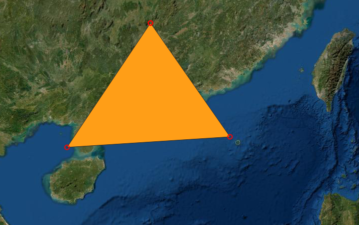
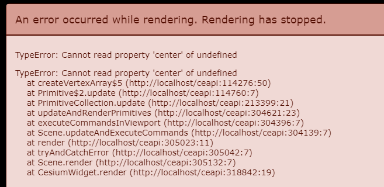
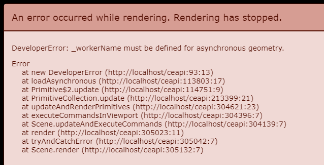

自定义 Primitive 实践：绘制一个纯色三角形

# 1 目的与结果

## 目的

有如下一个经纬高数组，表示三角形的三个点，逆时针顺序：

``` js
const coords_geo = [
  [112.470, 25.694, 200000],
  [109.961, 19.862, 200000],
  [118.122, 21.921, 200000]
]
```

其在GIS软件中绘制的形状如下：



最终在 Cesium 的绘制效果如下：

Q1{_S.png)

# 2 实现原理

使用 Primitive 创建静态图形，不依赖官方封装好的 XXGeometry（最方便的应该是 PolygonGeometry）和 XXAppearance，只用最基础的 Geometry 类和 Appearance 类。

Primitive API 创建图形对象的结构如下：

```
+Primitive
	- GeometryInstance | GeometryInstance[]
		- Geometry
			- GeometryAttributes
				- GeometryAttribute
	- Appearance
```

## 坐标系统选择

如果使用 ENU 坐标，则需要计算转换矩阵，官方已提供了例子。

此处全为经纬高坐标，需要借助 Cesium 数学API 进行世界坐标转换。

Primitive API 直到传递给 WebGL 之前，想要在地球上绘制正确，必须是世界坐标。

# 3 踩坑点

## 3.1 GeometryAttribute 的构造

### 3.1.1 position 的构造 - 数值类型

使用 `Cesium.ComponentDatatype.DOUBLE`，values 必须传递 `Float64Array`，否则顶点着色器中匹配不到 `attribute vec3 position3DHigh` 和 `attribute vec3 position3DLow`。

若改为 `Cesium.ComponentDatatype.FLOAT`，values 传递 `Float32Array`，会导致异常。

暂不清楚传递 `Float32Array` 时，顶点着色器的坐标 attribute 应该改成什么（或许根本不应传递 Float32Array）

### 3.1.2 顶点着色器中 attribute 变量的名称

参考 `GeometryAttributes` 的文档，允许的 attribute 有如下几个：

- 坐标 position，需为 Float64 的数值，且每个点必须是 xyz 三个维度的
- 纹理坐标 st，需为 Float32 的数值，且必须是 xy 两个维度的
- 顶点颜色 color，需为 Uint8 的数值，且必须是 xyzw 四个维度的
- 顶点法线 normal，需为 Float32 的数值，且必须是 xyz 三个维度的
- （不知道是什么，应该是切线之类的）bitangent，需为 Float32 的数值，且必须是 xyz 三个维度的
- 顶点切线向量 tangent，需为 Float32 的数值，且必须是 xyz 三个维度的

在 Primitive.prototype.update 方法运行时，有一个 `if (createSP)` 分支会调用 `createShaderProgram` 函数，其内会调用函数 `validateShaderMatching` 来检测着色器与 js 对象中 GeometryAttribute 的匹配情况。

顶点着色器中的 attribute 变量名，理应与 `attributes` 中的 key 一样，除了 position 被分解成了 `position3DHigh` 和 `position3DLow`（原因大家应该都知道，就是精度不够，需要分别编码）。

### 3.1.3 顶点着色器必须有 batchId attribute

否则会报错。


## 3.2 仅 3D 模式

若 new Viewer 时不指定 `scene3DOnly`，Primitive 的着色器要处理二三维的全部情况，这里只关心三维的情况，故要指定仅使用三维模式。

``` js
new Cesium.Viewer('cesiumViewport', {
  scene3DOnly: true,
})
```

**若不指定仅三维模式，且不计算范围球（见3.4），必报错。**

## 3.3 Appearance 的 renderState

一个对象，这个 renderState 对象的属性会在渲染时覆盖默认的 renderState。

- depthMask：是否将深度值写入缓冲区
- blending：透明度混合
- depthTest：
  - enabled 深度检测

具体更多细节见 Renderer/RenderState.js

这里必须指明的是，即使什么 renderState 都不给，也要在 new Appearance 时给 renderState 一个空对象：

``` js
new Cesium.Appearance({
  renderState: { },
  vertexShaderSource: `...`,
  fragmentShaderSource: `...`
})
```

否则会报错：


## 3.4 Geometry 的 boundingSphere

若不指定，图形就不会出现。

``` js
Cesium.BoundingSphere.fromVertices(coords_world)
```

coords_world 是世界坐标数组，[x1, y1, z1, x2, y2, z2, ...]

若不计算包围球且不指定仅三维模式（见3.2），程序将报错：



## 3.5 Primitive 的异步计算

new Primitive 时，有一个 `asynchronous` 选项用于指定异步计算生成图形，要自己写 `WebWorker`，在这里因为没有写 `WebWorker`，所以将其指定为 false 进行同步计算。

若不写 WebWorker 也不指定其为 false，将报错：



``` js
const primitive = new Cesium.Primitive({
	/* 其他属性 */
  asynchronous: false
})
```

# 4 代码

``` html
<div id="cesiumViewport"></div>
```

``` javascript
const vsSource = `
attribute vec3 position3DHigh;
attribute vec3 position3DLow;
attribute vec4 color;
varying vec4 v_color;

void main() {
  vec4 position = czm_modelViewProjectionRelativeToEye * czm_computePosition();
  float r = color.r / 255.0;
  float g = color.g / 255.0;
  float b = color.b / 255.0;
  float a = color.a / 255.0;

  v_color = vec4(r, g, b, a);
  gl_Position = position;
}`
const fsSource = `
varying vec4 v_color;

void main() { 
  gl_FragColor = v_color;
}`

const viewer = new Cesium.Viewer('cesiumViewport', {
  scene3DOnly: true,
})

/* 计算顶点坐标 */
const coords = [
  [112.470, 25.694, 200000],
  [109.961, 19.862, 200000],
  [118.122, 21.921, 200000]
]
const coords_world = coords.map((coord) => {
  const cart = Cesium.Cartesian3.fromDegrees(...coord)
  return [cart.x, cart.y, cart.z]
})
const coords_vbo = new Float64Array(coords_world.flat())
/* 结束计算顶点坐标 */

/* 装配并创建 Primitive */
const geometry = new Cesium.Geometry({
  attributes: {
    position: new Cesium.GeometryAttribute({
      componentDatatype: Cesium.ComponentDatatype.DOUBLE,
      componentsPerAttribute: 3,
      values: coords_vbo
    }),
    color: new Cesium.GeometryAttribute({
      componentDatatype: Cesium.ComponentDatatype.UNSIGNED_BYTE,
      componentsPerAttribute: 4,
      values: new Uint8Array([
        255, 10, 10, 123,
        10, 255, 10, 123,
        10, 10, 255, 123
      ])
    })
  },
  boundingSphere: Cesium.BoundingSphere.fromVertices(coords_world.flat())
})
const instance = new Cesium.GeometryInstance({
  geometry: geometry,
  id: 'aaa'
})
const primitive = new Cesium.Primitive({
  geometryInstances: [instance],
  releaseGeometryInstances: false,
  compressVertices: false,
  appearance: customAppearance,
  asynchronous: false
})
/* 装配结束 */

viewer.scene.primitives.add(primitive)

/* 定位 */
viewer.camera.setView({
  destination: new Cesium.Cartesian3(-5079092, 11300083, 4872035),
  orientation: {
    heading: 6.28,
    pitch: -1.57,
    roll: 0
  }
})

/* 点击拾取 */
const handler = new Cesium.ScreenSpaceEventHandler(viewer.scene.canvas)
handler.setInputAction((e) => {
  const result = viewer.scene.pick(e.position)
  console.log(result)
}, Cesium.ScreenSpaceEventType.LEFT_CLICK)
```


# 5 TODO

## Appearance 中的 Material：Fabric 材质定义的使用

例如：

``` js
const materialSource = `
uniform float speed;

float getSpeed(){
  return speed;
}
`

new Cesium.Appearance({
  material: new Cesium.Material({
    fabric: {
      uniforms: {
        speed: 0.1
      },
      source: materialSource
    }
  })
})
```

## Appearance 其他属性的使用

`aboveGround` 属性指示是否在地表，但是不是贴地

`translucent` 属性指示是否是透明，false 是不透明