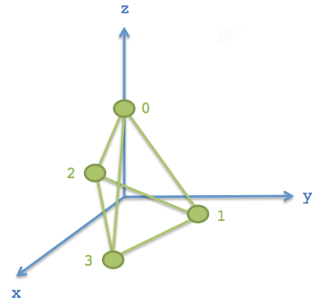
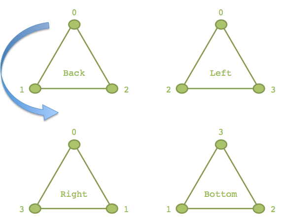
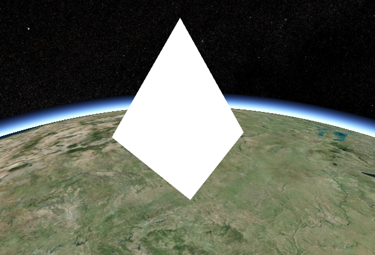
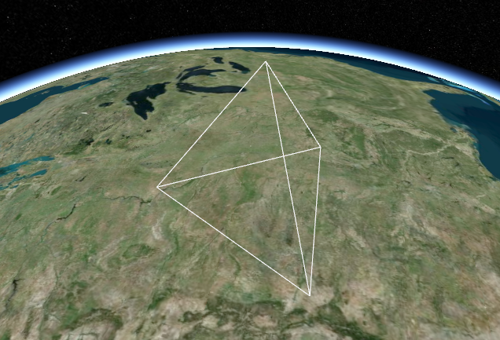
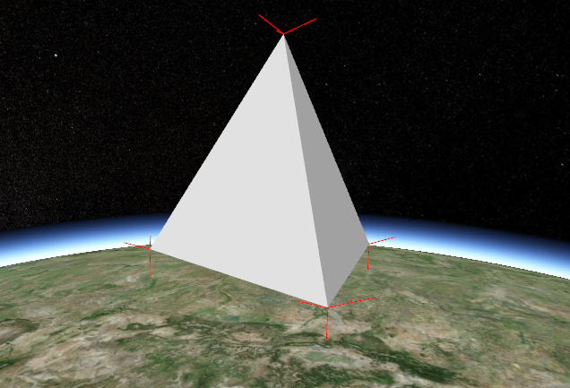

官方虽然说文章已过时，且说 2018 年会更新文章的代码，但是咕咕咕到了现在都没更新。

[Geometry and Appearances · CesiumGS/cesium Wiki (github.com)](https://github.com/CesiumGS/cesium/wiki/Geometry-and-Appearances)

# 创建自定义几何图形和外观

Cesium支持许多常见的图形，开箱即用。但是，有时候这些预置的图形不一定能满足需求。

由于 几何 和 外观 在 Primitive API 中是分离的，所以可以在外观相同的时候添加几何形状，反之亦然。

这么做需要一定的图形学知识，在这个教程中，将创建一个简单的三棱锥。

> 如果你有更好的几何图形，可以参考官方 “贡献说明” 来提交你的成果。

# 几何图形

Cesium 中的 `Geometry` 支持索引三角形、未索引三角形、线框渲染和点渲染。开始，我们先为四面体（三棱锥）创建它的几何形状，即四个等边三角形。首先，在 `Source/Core/` 下创建一个 `TetrahedronGeometry.js`：

> 官方代码是 AMD 格式的，我改为和 1.63 之后类似的风格。原文的代码可以直接到文章顶部的原文链接找。

``` JS
import Cartesian3 from './Cartesian3'
import ComponentDatatype from './ComponentDatatype'
import PrimitiveType from './PrimitiveType'
import BoundingSphere from './BoundingSphere'
import GeometryAttribute from './GeometryAttribute'
import GeometryAttributes from './GeometryAttributes'
import GeometryPipeline from './GeometryPipeline'
import VertexFormat from './VertexFormat'
import Geometry from './Geometry'

function TetrahedronGeometry() {
  const negativeRootTwoOverThree = -Math.sqrt(2.0) / 3.0;
  const negativeOneThird = -1.0 / 3.0;
  const rootSixOverThree = Math.sqrt(6.0) / 3.0;
  const positions = new Float64Array(4 * 3);
  
  // 四面体有4个三角形，共计12个点，但是由于重合的关系，可以只记录4个点
  // 点0 坐标
  positions[0] = 0.0;
  positions[1] = 0.0;
  positions[2] = 1.0;

  // 点1 坐标
  positions[3] = 0.0;
  positions[4] = (2.0 * Math.sqrt(2.0)) / 3.0;
  positions[5] = negativeOneThird;

  // 点2 坐标
  positions[6] = -rootSixOverThree;
  positions[7] = negativeRootTwoOverThree;
  positions[8] = negativeOneThird;

  // 点3 坐标
  positions[9] = rootSixOverThree;
  positions[10] = negativeRootTwoOverThree;
  positions[11] = negativeOneThird;
  
  // 创建顶点属性中的坐标
  const attributes = new GeometryAttributes({
    position : new GeometryAttribute({
      componentDatatype : ComponentDatatype.DOUBLE,
      componentsPerAttribute : 3,
      values : positions
    })
  });
  
  const indices = new Uint16Array(4 * 3);
  
  // 后面的三角形用到 0、1、2 号点坐标
  indices[0] = 0;
  indices[1] = 1;
  indices[2] = 2;

  // 左边的三角形用到 0、2、3 号点坐标
  indices[3] = 0;
  indices[4] = 2;
  indices[5] = 3;

  // 右边的三角形用到 0、3、1 号点坐标
  indices[6] = 0;
  indices[7] = 3;
  indices[8] = 1;

  // 下面的三角形用到 2、1、3 号点坐标
  indices[9] = 2;
  indices[10] = 1;
  indices[11] = 3;
	
  // 指定此四面体的各种属性
  this.attributes = attributes;
  this.indices = indices;
  this.primitiveType = PrimitiveType.TRIANGLES;
  this.boundingSphere = undefined;
}

export default TetrahedronGeometry
```

> 译者注：很明显，这是一个死数据的几何形状，不具备任何参数化建模（例如我能外部传入数据）的能力，但是这作为演示足够了

四面体由四个顶点组成，其所有点都在半径为1的球面上，为了表达精度，坐标存储在 `Float64Array` 这个类型数组中。下图是示意图（局部坐标）



四面体的有三个三角形面，每个三角形的点有三个，使用坐标数组中的序号来表达，称之为索引值，来节约内存。

对于这个四面体，每个顶点均被索引了三次（三个三角形共用一个顶点）。索引数组可以存在 `Uint16Array` 中，也可以存在 `Uint32Array` 中，如果顶点数量超过 64K 个，可考虑用后者。



“Back” 三角形这儿有个蓝箭头，表示的是顶点的顺序，现在是逆时针。使用右手定则，可以判断它的这个三角形的“外面”是朝向屏幕的。Cesium 使用逆时针顺序来定义三角形的面朝向。

四面体类需要分配四个属性，这是 Geometry 必须的：

``` JS
this.attributes = attributes;
this.indices = indices; // 可选
this.primitiveType = Cesium.PrimitiveType.TRIANGLES;
this.boundingSphere = undefined; // 可选
```

- `attributes` - 一个 `GeometryAttributes` 对象，每个顶点属性都存储在这个对象中，顶点属性包括但不限于：坐标、法线、颜色值、uv等
- `indices` - 索引数组，使用索引可以减少坐标个数，节约内存
- `primitiveType` - 几何图元的类型，这里使用了 `Cesium.PrimitiveType.TRIANGLES`，即每三个顶点被解析为一个三角形渲染。
- `boundingSphere` - 可选参数，包围整个几何形状的球体，可以辅助剔除来提高性能。

## ① 包围球

可以通过计算 `boundingSphere` 来提高绘制四面体的性能。

``` JS
this.boundingSphere = BoundingSphere.fromVertices(positions);
```

BoundingSphere 有一个 `fromVertices()` 函数来计算紧密包围几何形状所有坐标的包围球。不过，通常在其他情况下，可以用简单的几何知识来更快创建它。由于预先知道这个四面体的顶点坐标位于半径为1的球体上，所以可以用半径为1的球面作为边界球：

``` JS
this.boundingSphere = new BoundingSphere(new Cartesian3(0.0, 0.0, 0.0), 1.0);
```

## ② 使用 Primitive API 绘制一个四面体 

这个四面体的几何中心作为局部坐标原点。为了让它得以可视化，需要计算一个模型矩阵，用以定位和放缩它。此外，因为它只有坐标，且暂时只打算使用平面阴影，所以暂时不需要法线。

首先，构建源代码并启动本地 Cesium 开发环境

> 译者注：直接把上面这个类写在沙盒中更快且省事，方便修改

随后，打开沙盒，写一些代码：

``` JS
const widget = new Cesium.CesiumWidget('cesiumContainer');
const scene = widget.scene;
const ellipsoid = widget.centralBody.ellipsoid;

// 看似复杂，其实只是对经纬度 (-100, 40) 这个点做垂直地表向上平移200km的计算，并将几何体放大50w倍（即变成500km那么大），返回矩阵而已
const modelMatrix = Cesium.Matrix4.multiplyByUniformScale(
    Cesium.Matrix4.multiplyByTranslation(
        Cesium.Transforms.eastNorthUpToFixedFrame(ellipsoid.cartographicToCartesian(
            Cesium.Cartographic.fromDegrees(-100.0, 40.0))), // e-n-u计算，返回局部到世界坐标的转换矩阵
        new Cesium.Cartesian3(0.0, 0.0, 200000.0)), // 平移计算，矩阵·平移向量
    500000.0); // 缩放计算，矩阵·50w

const instance = new Cesium.GeometryInstance({
    geometry : new Cesium.TetrahedronGeometry(), // 如果直接写在代码而不是构建出来的，可以直接 new TetrahedronGeometry()
    modelMatrix : modelMatrix,
    attributes : {
        color : Cesium.ColorGeometryInstanceAttribute.fromColor(Cesium.Color.WHITE) // 快捷计算顶点颜色
    }
});

/* 使用 Primitive API 绘制几何 */
scene.primitives.add(new Cesium.Primitive({
    geometryInstances : instance,
    appearance : new Cesium.PerInstanceColorAppearance({
        flat : true,
        translucent : false
    })
}));
```

然后，它大概会长这样：



因为设置了 appearance 中的 `flat: true`，没有阴影，所以很难观察三角面。如果想看到线框图，可以改 TetrahedronGeometry 对象的 primitiveType 为 LINE。

使用 `GeometryPipeline` 类做这个转换工作会比较方便。

`GeometryPipeline.toWireframe` 方法将几何图形转换为 primitiveType 为 LINE 的模式。

稍作修改创建 GeometryInstance 的代码：

``` JS
const instance = new Cesium.GeometryInstance({
  geometry : Cesium.GeometryPipeline.toWireframe(new Cesium.TetrahedronGeometry()),
  modelMatrix : modelMatrix,
  attributes : {
    color : Cesium.ColorGeometryInstanceAttribute.fromColor(Cesium.Color.WHITE)
  }
});
```

如图所示：



## ③ 添加法线出现阴影

要想外观看起来有阴影，Geometry 的顶点属性中必须拥有法线。三角形的法线是垂直于三角面的单位向量：


在图形学中，通常法线是指每个顶点的法线。顶点的法线是这么定义的：顶点的法线是所有与它有关的面的法线的加和，并且必须是单位向量。下图所示：


修改 TetrahedronGeometry 类，使用 `GeometryPipeline.computeNormal` 方法可以计算它的每个顶点的法线：

``` JS
// ... 上面省略
const boundingSphere = new BoundingSphere(new Cartesian3(0.0, 0.0, 0.0), 1.0);

// 主要是改这里
const geometry = GeometryPipeline.computeNormal(new Geometry({
  attributes: attributes,
  indices: indices,
  primitiveType: PrimitiveType.TRIANGLES,
  boundingSphere: boundingSphere
}));

this.attributes = geometry.attributes;
this.indices = geometry.indices;
this.primitiveType = geometry.primitiveType;
this.boundingSphere = geometry.boundingSphere;
```

继续执行代码，图形就变成了这样：


这并不是想象中的样子。

为了更好地观察为什么会这样，不如把顶点的法线可视化出来，使用 `createTangentSpaceDebugPrimitive` 这个全局函数即可，修改沙盒中的代码：

``` JS
scene.primitives.add(Cesium.createTangentSpaceDebugPrimitive({
  geometry: tetrahedron,
  modelMatrix: modelMatrix,
  length: 0.2
}));
```

你就会看到顶点的法线了：


可以看到，这些顶点的法线因为是各个三角面的法线的矢量和，看起来就不是那么”法线“了。

通常，一个顶点附近的面大致接近平行的话，用这些平面的法线矢量和作为顶点的法线，会使得顶点附近的颜色看起来很光滑过渡。但是，像这种十分尖锐的形状，就不应该使用索引式顶点了，而是每个面的顶点单独使用，每个顶点的法线自己独立。

所以为了使得阴影看起来常规一些，必须使用独立顶点的三角形，即四面体一共4个三角形，一共12个顶点。如图：


再次修改 `TetrahedronGeometry` 类：

``` JS
var positions = new Float64Array(4 * 3 * 3); // 4个三角形，每个有3个坐标，一个坐标有3个float分量
// back triangle
positions[0] = 0.0;
positions[1] = 0.0;
positions[2] = 1.0;
positions[3] = 0.0;
positions[4] = (2.0 * Math.sqrt(2.0)) / 3.0;
positions[5] = negativeOneThird;
positions[6] = -rootSixOverThree;
positions[7] = negativeRootTwoOverThree;
positions[8] = negativeOneThird;

// left triangle
positions[9] = 0.0;
positions[10] = 0.0;
positions[11] = 1.0;
positions[12] = -rootSixOverThree;
positions[13] = negativeRootTwoOverThree;
positions[14] = negativeOneThird;
positions[15] = rootSixOverThree;
positions[16] = negativeRootTwoOverThree;
positions[17] = negativeOneThird;

// right triangle
positions[18] = 0.0;
positions[19] = 0.0;
positions[20] = 1.0;
positions[21] = rootSixOverThree;
positions[22] = negativeRootTwoOverThree;
positions[23] = negativeOneThird;
positions[24] = 0.0;
positions[25] = (2.0 * Math.sqrt(2.0)) / 3.0;
positions[26] = negativeOneThird;

// bottom triangle
positions[27] = -rootSixOverThree;
positions[28] = negativeRootTwoOverThree;
positions[29] = negativeOneThird;
positions[30] = 0.0;
positions[31] = (2.0 * Math.sqrt(2.0)) / 3.0;
positions[32] = negativeOneThird;
positions[33] = rootSixOverThree;
positions[34] = negativeRootTwoOverThree;
positions[35] = negativeOneThird;

var indices = new Uint16Array(4 * 3); // 12个顶点索引，各自独立

// back triangle
indices[0] = 0;
indices[1] = 1;
indices[2] = 2;

// left triangle
indices[3] = 3;
indices[4] = 4;
indices[5] = 5;

// right triangle
indices[6] = 6;
indices[7] = 7;
indices[8] = 8;

// bottom triangle
indices[9] = 9;
indices[10] = 10;
indices[11] = 11;
```

现在，仍旧使用 `GeometryPipeline.computeNormal` 来计算法线省的自己烧脑。最终，绘制的新四面体如下：



现在，每个三角形的阴影看起来就像正常的了，而不是在顶点附近”生硬“地”光滑过渡“。也看到了顶点的法线，同一个三角形的三个顶点法线是跟面的法线平行的。

至此，绘制算结束了。

## ④ 使用 WebWorker

对几何图形的计算可以使用 WebWorker 技术异步进行，使得界面保持响应。四面体可能比较简单，计算量少，但是对于复杂的几何体就很难说了，可以使用 Cesium 内置的 WebWorker。

首先，你得在 `Source/Workers` 目录下创建一个 `createTetrahedronGeometry.js` 文件，写一个函数来创建 Geometry。

> 译者注：已改为 es6 风格

``` JS
import TetrahedronGeometry from '../Core/TetrahedronGeometry' // 这个看你喜好咯
import PrimitivePipeline from '../Scene/PrimitivePipeline'
import createTaskProcessWorker from './createTaskProcessWorker' // 使用 Cesium 内置的工具函数

function createTetrahedronGeometry(parameters, transferableObjects) {
  const geometry = TetrahedronGeometry.createGeometry();
  PrimitivePipeline.transferGeometry(geometry, transferableObjects);

  return {
    geometry : geometry,
    index : parameters.index
  };
}
export default createTaskProcessWorker(createTetrahedronGeometry)
```

此时，TetrahedronGeometry 类还没有 createGeometry() 方法，修改使其拥有：

``` JS
TetrahedronGeometry.createGeometry = function() {
  return new Geometry({
      attributes : attributes,
      indices : indices,
      primitiveType : PrimitiveType.TRIANGLES,
      boundingSphere : new BoundingSphere(new Cartesian3(0.0, 0.0, 0.0), 1.0)
  });
};
```

最后，加上一句代码使得内置的 WebWorker 可以识别：

``` js
this._workerName = 'createTetrahedronGeometry';
// this 指的是 TetrahedronGeometry 
```

这些修改就能使用上面的代码异步生成四面体了。当然，你依旧可以使用 createGeometry() 方法同步生成四面体。

至此，自定义几何图形的生成教程结束。