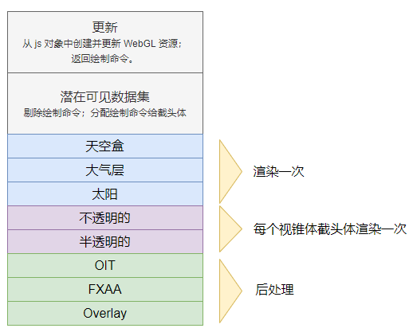
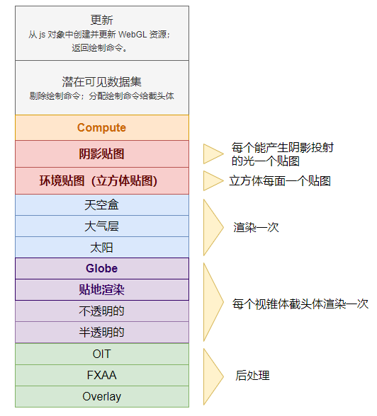

本文通过解读 Scene.render 方法，观察 WebGL 在 Cesium 1.9 中如何渲染一帧。读者可以在 Scene.render 方法处打断点进入调试。

由于 Cesium 专注于可视化地理空间内容，因此多光源的场景并不擅长、不多见，Cesium 使用的是传统的前向阴影流水线。Cesium 的流水线之所以独特，是因为它使用了多个视锥体来支持大范围的视距，而不需要对z轴进行扭曲变化（这句翻译得不是很好）。

# 起步

Cesium 把每一帧的生命周期相关的数据存储在一个叫 `FrameState`（参考 FrameState.js） 的对象中。在帧最开始时，初始化相机参数、时间之类的东西。帧的状态可用于其他的对象，例如 Primitive 对象可以调用当前帧的状态数据。

UniformState（参考 UniformState.js）是 FrameState 的一部分，它具有共有的、预先计算好的 uniforms。在帧开始时，它计算视图矩阵、太阳向量等 uniforms。

# 更新

Cesium 的动画、更新、渲染流水线是很经典的，动画的步骤可能是对 WebGL 无交互地对 primitive 的移动、改变其材质属性、添加删除 primitive 等。这并不是 Scene.render 的一部分，这些动画可能会在渲染一帧之前通过代码显式指定，或者使用 Entity API 的 Property 在后面默默改变。


经典的 动画-更新-渲染 流水线。

Scene.update 这个方法最主要的第一步是更新所有在 Scene 中的 primitives。（参考Scene.js > function updatePrimitives(scene) {}）

在这一步，每一个 primitive 将会：

- 创建/更新其对应的 WebGL 资源，即编译、链接着色器，加载纹理，刷新顶点缓冲区等；Cesium 永远不会在 Scene.render 方法外调用 WebGL，因为这样会浪费 requestAnimationFrame() 这个函数的时间，并使其与其他的 WebGL 引擎集成变得困难。
- 返回一列 `DrawCommand` 对象，这些对象代表的是 primitive 们创建的 drawcall 和 WebGL 资源。像 polyline、billboard集合可能会返回一个 DrawCommand，Globe 对象或 Model 等则可能会返回数百个 DrawCommands。大多数帧会包含几百到几千个 DrawCommand。

> 译者注：下面代码选自 1.9，在 1.75 已经找不到这个函数了，commandList 也找不到了。不过，这个 updatePrimitives 函数是在 function render 函数中调用的，render 函数（不是Scene.prototype.render 方法）在1.75版本中却还在，_primitives.update() 这一步也移动到了 scene.updateAndExecuteCommands() 方法中的 executeCommandsInViewport() 函数里了，commandList 也被拆开了。有兴趣的读者可以对比研究研究。

``` JS
// Scene.js 中的 updatePrimitives() 函数 -- v1.9
function updatePrimitives(scene) {
  var context = scene.context;
  var frameState = scene._frameState;
  var commandList = scene._commandList;

  if (scene._globe) {
    scene._globe.update(context, frameState, commandList);
  }

  scene._primitives.update(context, frameState, commandList);

  if (defined(scene.moon)) {
    scene.moon.update(context, frameState, commandList);
  }
}

// 调用
function render(scene, time) {
  // ... 
  updatePrimitives(scene);
  // ...
}
```

Cesium 中的地球对象：Globe，地形和卫星影像瓦片的引擎，一样是一个 “primitive”。它的更新功能指挥着瓦片的层次调度、剔除，以及负责管理加载地形瓦片和影像瓦片的内存。

# 潜在的可见数据集

剔除，是图形引擎对看不见的物体进行消除的优化方法，这样流水线就不必处理那些看不到的对象了。通过了可见性测试的物体，被称作“潜在可见性数据集”，将随着流水线传递下去。为了提高速度，可见性测试使用了不精确的测试方法，所有这些 “潜在可见性数据集” 可能最终是可见的，也可能是不可见的。

对于独立的绘制命令，Cesium 支持使用命令的的 boundingVolume （世界坐标空间下）进行视锥体和地平线的自动剔除。（这句话翻译得不太好，不太懂表达了什么）对于能自我剔除的 primitive，例如 Globe 对象，可以关闭这个功能。

传统的图形引擎检查每一个绘制命令，进行可见性测试，从而找到潜在的可见数据集。Cesium 的 createPotentiallyVisibleSet 函数（译者注：现在移动到 Scene.view 属性内了）先走了第一步，它将绘制命令动态地分为多个视锥体（通常是三个），这些视锥体把所有的绘制命令绑定在一起，并保持一定的远近比例以避免z值冲突。每个视锥体的截头体的张角和宽高比是一样的，只有近平面和远平面的举例不同。

这个函数做了优化。它利用时间上的连续，如果前后帧的绘制命令条件合适，那么已经计算好的视锥体及其截头体将会被重用，以减少计算量。


上图左边：多个视锥体（紫橙绿）；右边：一个视锥体的截头体的绘制命令

> 译者注
>
> 这段文章啃得生硬，不知道讲了什么东西，应该是 Cesium 的多视锥体机制能更好地优化剔除吧，源码要去了解 createPotentiallyVisibleSet 是怎么做的。注意版本。

# 渲染

每个视锥体都有自己的绘制命令列表，现在就可以触发 WebGL 的 drawElements 和 drawArrays 了。

Cesium 的渲染流水线核心是 `executeCommand` 函数，你能在 Scene.js 中找到。

**首先，**清除颜色缓存。如果使用了与顺序无关的透明度、快速近似抗锯齿（FXAA），则它们的缓存也被清除。

**然后**，使用整个视锥体（不是上面分开的那三个）绘制一些特殊的 primitive：

- 天空盒。老式的优化方法是跳过清除颜色缓存，先渲染天空盒。实际上这很损耗性能，因为清除颜色缓存有助于压缩GPU（与清除深度缓存类似）最佳的实践是，先渲染天空盒。Cesium 必须这么做，因为绘制完视锥后深度缓存会被清除（这里翻译不太懂）
- 大气层。
- 太阳。如果太阳被设为可见，则渲染太阳。如果还启用了辉光滤镜，则剔除太阳，然后对颜色缓存进行采样、变亮、模糊等操作，然后混合成辉光效果。

**接下来**，从最远的视锥体开始，按以下步骤执行每个视锥体中的绘制命令：

- 赋予当前视锥体的 uniform，仅为视锥体的近距离和远距离；
- 清除深度缓存
- 执行不透明图元的绘制命令。执行一个绘制命令会设置一些 WebGL 的状态，例如渲染状态（深度、混合模式等）、顶点数组、纹理、着色器程序、uniforms等，然后触发 drawcall。
- 接下来执行半透明的绘制命令。如果没有浮点数纹理导致 OIT 不被支持，则将绘制命令从头到尾排序并执行命令。（这句话又不是很懂了）否则，OIT 将用于提高重叠的半透明对象的显示质量，避免排序时 CPU 的开销。绘制命令的着色器对 OIT 进行了修正并缓存，如果支持 MRT，则执行一次 OIT 并进行渲染，或者作为回调进行两次渲染（还是不懂说什么）。见 `OIT.js` 中的 executeCommands() 函数。

使用多个视锥体会导致一些有趣的情况，例如一个绘制命令跨了两个视锥，那么命令就会被执行两次。

至此，每个视锥体的截头体的所有绘制命令已经执行，如果使用 OIT，则执行最后的 OIT 复合遍历将被执行。如果 FXAA （快速抗锯齿）启用了，那么还会执行全屏传递以进行抗锯齿。

与 Heads-Up Display 类似，最后执行的是 overlay pass 绘制命令。（这句话还是不懂）



Cesium 在 1.9 版本时的渲染流水线。


# 排序并合批

在每个视锥体中，由 primitive 传过来的绘制命令是按顺序执行的。例如，Globe 对其绘制命令进行了从前到后的排序，以利用 GPU early-z 的优势（z优先？不懂，需要查资料学习）。

绘制命令的数量决定了性能如何，因此 primitive 通过把多个对象的组合在一起，仅发出一条绘制命令来提高性能。例如，BillboardCollection 在一个顶点缓存中存储尽可能多的 Billboard，并使用同一个着色器进行渲染。

# 拾取

Cesium 的拾取功能利用了颜色缓存。每一个可拾取的对象都有一个唯一的 id（即颜色）。

给定视窗坐标系的 (x,y) 坐标，为了确定拾取了什么，则需要将帧渲染到屏幕之外的帧缓存，这个写在外面的帧缓存记录的颜色值即为拾取的 id。随后，使用 WebGL 的 readPixels 函数，读取颜色，拿到id，然后就能返回拾取的对象了。

Scene.pick 方法的流水线和 Scene.render 方法很类似，不过拾取的东西并不需要包括天空盒、太阳、大气层，所以能简化一些。

# 之后要做的

下列计划将提升帧渲染的性能。

## 地面遍历（原文 Ground Pass 不知道怎么翻译好）

上面关于在 Scene.render 方法中的遍历顺序（ opaque不透明，半透明translucent，overlay覆盖）其实在普通的图形引擎中很常见。实际上，不透明还要分开成 globe 和 opaque（不太懂是什么意思，应该说的是不透明的东西还能继续分解为地球对象和其他不透明对象）。

可以这么说，分开后的不透明物体顺序是：基本的 globe对象、贴地的矢量数据和一般的不透明对象。

## 阴影

阴影将通过阴影映射实现。场景从可产生阴影的光线触发，进行渲染，每个能投射的物体均作用于深度缓存，或者阴影贴图（模型到光源的距离？）。然后，在主色通道中，每个能接收阴影的对象检查每个灯光的阴影贴图中的距离值，检查是否在阴影内。

这个实现非常复杂，需要解决混叠伪影、柔和阴影、多视锥截头体以及地形引擎等因素。

## 深度纹理

阴影子集添加了对深度纹理的支持。例如，深度纹理能用来对 billboards 在地形上的深度测试，并根据深度值重新构造它在世界空间中的位置。

## WebVR

添加阴影后，提供了对不同角度进行渲染的能力。WebVR基于此。

每个眼睛使用一个视锥体进行渲染即可。

## 立方体贴图

阴影的另一个扩展能力是对立方体进行六面贴图，以进行环境渲染，将环境贴到盒子的六个面上，以显示盒子位于场景中的何处。这个功能会非常消耗计算资源（作者猜测），所以可能并不会用在实时计算上。

## 后处理效果

Scene.render 具有一些后处理效果，例如辉光、FXAA和OIT合成等。

官方计划创建一个通用的后处理框架，将纹理作为输入，通过一或多个后处理阶段来处理它们。这些后处理操作基本上是在视图窗口上的帧运行片元着色器，然后输出。

与其用硬算的方式制造辉光，可以用后处理的方式更好地完成，还能做景深、SSAO、发光、运动模糊等效果。

参考 [屏幕空间渲染细节 wiki](https://github.com/CesiumGS/cesium/wiki/Screen-Space-Rendering-Details)

## Compute pass

Cesium 使用旧式的 GPGPU 进行 GPU 加速来计算图像重投影。过程中，离屏渲染一个与屏幕（就是canvas）对齐的帧，然后推到着色器中。（不知道说了什么）




未来的渲染流水线

> 译者注
>
> 渲染流水线这个过程是相当的长，而且这个“未来的渲染流水线” 不一定适用了，不过大体框架的思路已经阐明，希望各位读者能得到一些启发，有些地方翻译得并不是很好。

# 致谢

作者和 Dan Bagnell 编写了大多数的渲染器。要获得细节可以参考 Cesium Wiki。作者还在念高中时，Ed Mackey 在90年代就在 AGI 进行了原生的多视锥体实现。

# 参考

[Bagnell13] Dan Bagnell. [Weighted Blended Order-Independent Transparency](https://cesium.com/blog/2014/03/14/Weighted-Blended-Order-Independent-Transparency/). 2013

[Cozzi13] Patrick Cozzi. [Using Multiple Frustums for Massive Worlds](https://github.com/pjcozzi/massiveworlds). In Rendering Massive Virtual Worlds Course. SIGGRAPH 2013.

[McGuire13] McGuire and Bavoil, [Weighted Blended Order-Independent Transparency](http://jcgt.org/published/0002/02/09/), Journal of Computer Graphics Techniques (JCGT), vol. 2, no. 2, 122–141, 2013

[ONeil05] Sean O’Neil. [Accurate Atmospheric Scattering](https://developer.nvidia.com/gpugems/GPUGems2/gpugems2_chapter16.html). In GPU Gems. Edited by Matt Pharr and Randima Fernando. 2005.

[Ring13a] Kevin Ring. [Horizon Culling](https://cesium.com/blog/2013/04/25/Horizon-culling/). 2013.

[Ring13b] Kevin Ring. [Computing the horizon occlusion point](https://cesium.com/blog/2013/05/09/Computing-the-horizon-occlusion-point/). 2013.