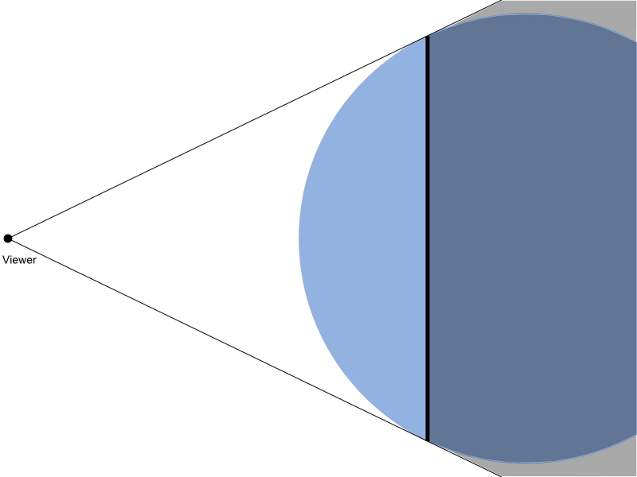
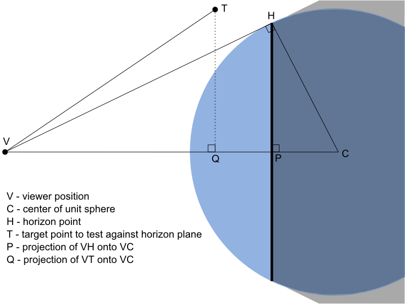

[Horizon Culling | cesium.com](https://cesium.com/blog/2013/04/25/horizon-culling/)

在开发 Cesium 程序时，需要快速确定场景中的对象什么时候不可见，从而判断它不需要渲染。

一种方法是使用视锥体平视剔除，但是还有另一种重要的剔除方法是地平线剔除。


上图中，绿色点是 viewer 内可见的。红色点是不可见的，因为它们在视锥体外面（视锥体用粗白线画出）。蓝色点虽然在视锥体内，但是它在地球背面，所以它也是不可见的。换句话说，它在地平线下。

地平线剔除的思路很简单，即不需要渲染 viewer 视野中地平线之下的东西。听起来简单，但是细节挺多的，尤其是要考虑到性能问题（要快速剔除）。Cesium 每次渲染时，为了检测这些地形瓦片的可见性，就要测试上百次，不过这很重要。

# 相对于球体的地平线下点剔除

可为所有静态对象（例如瓦片）计算其范围球体（boundingSphere）。假设这个范围球体很小以至于与地球比起来，像一个点，如果这个点在地平线下，那么我们也能说这个瓦片就在地平线下。

当前提出的新算法仅限于对椭球体计算单个点的情况。现在不妨设“遮挡点”已经被计算出来了。

为了说明简便，先进行正球体的地平线剔除，然后再推广到椭球体的地平线剔除。

考虑下面这张图片：



上图中，蓝色的圆是一个单位球面，从 Viewer 向外延申并和单位球面相切的这两条细黑线表示地平线。

垂直的这根粗黑线表示地平线交单位球面的所有地平点，是一个圆。

从 Viewer 到这个圆上的所有点的向量，就构成了一个圆锥体（包括阴影部分）。

> 译者注
>
> 想象一下一个漏斗套一个乒乓球，大概就是这个情况

图中阴影部分表示地平线以下的区域，Viewer 看不到这些区域。换句话说，如果一个点在这个阴影区域，那么这个点就在地平线下。

# 计算某点位于平面的哪一侧

首先，做一个简单的计算，来算出这个点在垂直黑直线那个圆的圆面的哪一边：



- V：Viewer的位置
- C：单位球面的中心
- H：地平线切单位球面的点
- T：待计算的目标点
- P：H点投影到VC向量的点
- Q：T点投影到VC向量的点

由勾股定理：
$$
||\vec{VH}||^2 + ||\vec{HC}||^2 = ||\vec{VC}||^2
$$
由单位球，易得 $\vec{HC}$ 向量的长度是1：
$$
||\vec{VH}||^2 = ||\vec{VC}||^2-1
$$
易证 $△VCH$ 和 $△HCP$ 相似，所以有：
$$
\frac{||\vec{PC}||}{||\vec{HC}||}=\frac{||\vec{HC}||}{||\vec{VC}||}
$$
代入 $||\vec{HC}|| =1$，整理得
$$
||\vec{PC}||=\frac{1}{||\vec{VC}||}
$$
所以，Viewer 到平面（下文均用平面简称，即地平线与球面相切的所有点的集合构成的圆周代表的面，即图上垂直黑色粗线）的距离：
$$
||\vec{VP}||=||\vec{VC}|| - \frac{1}{||\vec{VC}||}
$$
如果，$\vec{VT}$ 在 $\vec{VC}$ 的投影 $\vec{VQ}$ 长度小于 $\vec{VP}$，那么点就在平面内（视锥内）。

换句话说，如果 $||\vec{VQ}||>||\vec{VP}||$，那么点就在地平线下：
$$
||\vec{VQ}||=||\vec{VT}||cos(\vec{VT}, \vec{VC})=\vec{VT}·\hat{VC}>||\vec{VP}||=||\vec{VC}|| - \frac{1}{||\vec{VC}||}
$$
左右均乘以 $||\vec{VC}||$，即
$$
\vec{VT}·\hat{VC}·||\vec{VC}||=\vec{VT}·\vec{VC}>||\vec{VC}||^2-1
$$
结论

若想知道目标点位于平面的前面还是后面，只需取 Viewer 到目标点的向量 $\vec{VT}$、Viewer 到单位球心的向量 $\vec{VC}$，求其内积，判断结果与 Viewer 到单位球心距离与1的差的大小即可。

若大于，则点在地平线下（平面后），反之则在平面前（地平线上）

# 判断目标点与圆锥体的关系

仍旧是考虑原来的图，这次考虑两个角 $∠HVC$（记为α）、$∠TVC$（记为β）


当角 β < α 时，目标点 T 就位于圆锥内了。

在 $[0, π]$ 区间上，对于任意的 β > α，有
$$
cos(β) > cos(α)
$$
角 α 是 $Rt△VCH$ 的一个角，所以：
$$
cos(β) > \frac{||\vec{VH}||}{||\vec{VC}||}
$$
由余弦的定义，cos(β) 可写为
$$
cos(β) = \frac{\vec{VT}·\vec{VC}}{||\vec{VT}||·||\vec{VC}||}
$$
即
$$
cos(β) = \frac{\vec{VT}·\vec{VC}}{||\vec{VT}||·||\vec{VC}||} > \frac{||\vec{VH}||}{||\vec{VC}||}
$$
两边同时乘上 $||\vec{VC}||$ 并同时平方，则
$$
\frac{(\vec{VT}·\vec{VC})^2}{||\vec{VT}||^2}>||\vec{VH}||^2
$$
根据上一节的计算结果 $||\vec{VH}||^2=||\vec{VC}||^2-1$

最终，得到的不等式关系是：
$$
\frac{(\vec{VT}·\vec{VC})^2}{||\vec{VT}||^2}>||\vec{VC}||^2-1
$$
$\vec{VT}$ 和 $\vec{VC}$ 都很容易计算，若上式不等号成立，则说明目标点在视锥内，否则在视锥外。

# 推广到椭球体的情况

上述均为单位球的情况，现在推广到椭球体上。

单位球的方程是：
$$
x^2+y^2+z^2=1
$$
椭球体的方程是：
$$
\frac{x^2}{a^2}+\frac{y^2}{b^2}+\frac{z^2}{c^2}=1
$$
其中，a、b、c是三个轴的半长（轴半径）。

利用缩放矩阵，可以将椭球体上的所有点归为单位球上的计算：
$$
M=\begin{bmatrix}
\displaystyle\frac{1}{a} & 0 & 0 \\ 
0 & \displaystyle\frac{1}{b} & 0 \\ 
0 & 0 & \displaystyle\frac{1}{c} \\ 
\end{bmatrix}
$$

# 代码

作者认为数学推导过程很重要，但是可以归结成一些简单的代码。每当摄像机位置改变时，都要执行

``` GLSL
// 椭球的三个轴半径 此处使用 WGS84椭球体
var rX = 6378137.0;
var rY = 6378137.0;
var rZ = 6356752.3142451793;

// 向量CV，缩放到单位球空间（除以各轴半径），方便计算
var cvX = cameraPosition.x / rX;
var cvY = cameraPosition.y / rY;
var cvZ = cameraPosition.z / rZ;
// 向量VH长度的平方
var vhMagnitudeSquared = cvX * cvX + cvY * cvY + cvZ * cvZ - 1.0;
```

然后对于每个点，要进行测试遮挡剔除算法：

``` GLSL
// 目标点T，缩放到单位球空间（除以各轴半径），方便计算
var tX = position.x / rX;
var tY = position.y / rY;
var tZ = position.z / rZ;

// 向量VT
var vtX = tX - cvX;
var vtY = tY - cvY;
var vtZ = tZ - cvZ;
// 向量VT长度的平方
var vtMagnitudeSquared = vtX * vtX + vtY * vtY + vtZ * vtZ;

// VT点乘VC 和 VT点乘CV的相反数是一样的
var vtDotVc = -(vtX * cvX + vtY * cvY + vtZ * cvZ);

// bool值，前者是判断是否在平面内，后者判断是否在锥体内
var isOccluded = vtDotVc > vhMagnitudeSquared && vtDotVc * vtDotVc / vtMagnitudeSquared > vhMagnitudeSquared;
```

在 Cesium 中，预先进行了单位球空间的缩放，而不是每次测试都缩放。

``` JS
EllipsoidalOccluder.prototype.isPointVisible = function (occludee) {
  var ellipsoid = this._ellipsoid;
  var occludeeScaledSpacePosition = ellipsoid.transformPositionToScaledSpace(
    occludee,
    scratchCartesian
  );
  return isScaledSpacePointVisible(
    occludeeScaledSpacePosition,
    this._cameraPositionInScaledSpace,
    this._distanceToLimbInScaledSpaceSquared
  );
};
```


# 展望

与之前使用最小范围球进行剔除的方法相比，使用这个技术减少大约 15% 的瓦片绘制。

其他就不翻译了

# 实际应用

在 Cesium 的私有类 `EllipsoidalOccluder` （位于Core目录下）中，就使用了这个算法进行剔除计算。