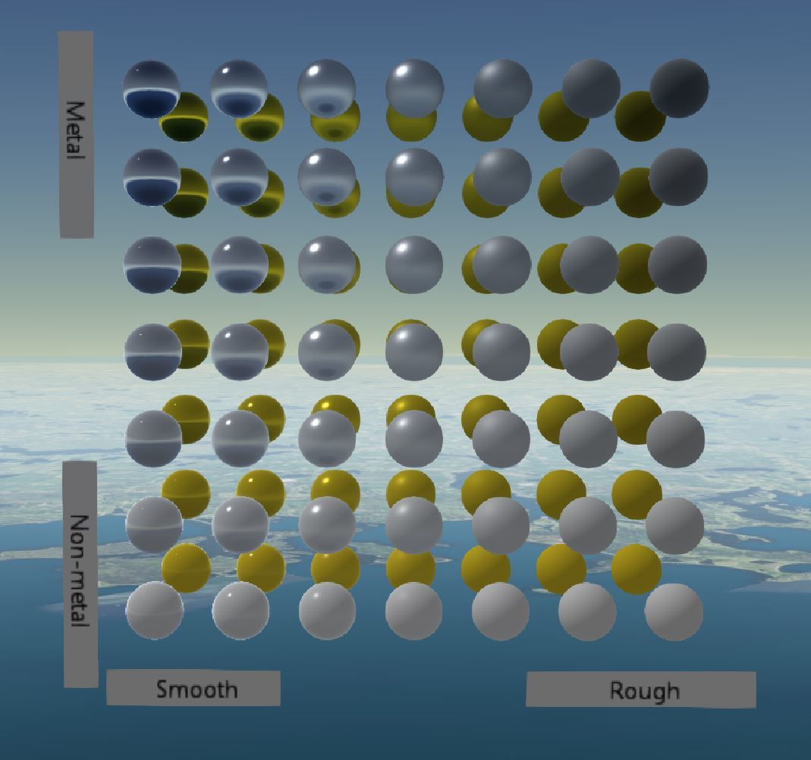
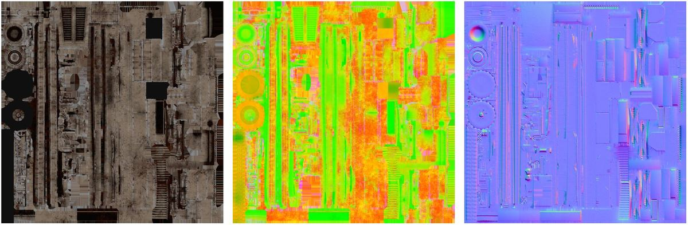
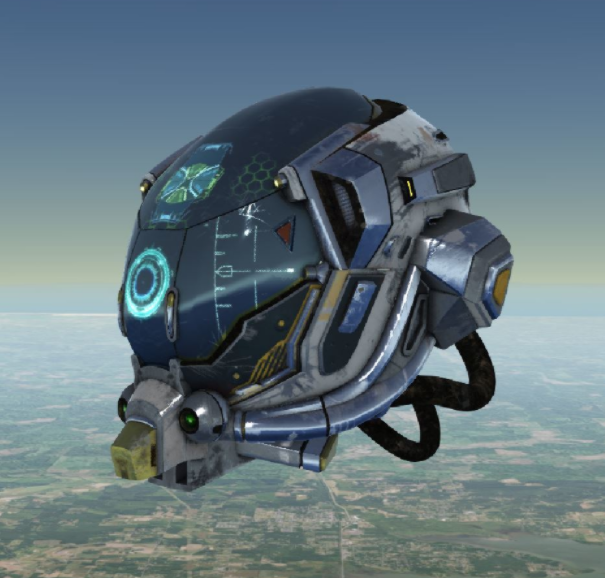
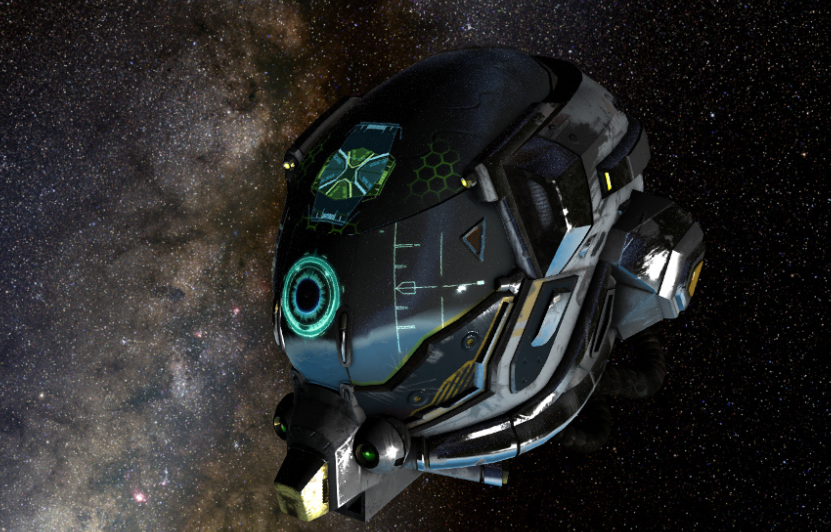

随着 Cesium 1.36 版本的发布，其支持了 glTF 2.0 规范中的 pbr 材质渲染。

原文作者系宾夕法尼亚大学计算机图形学、游戏技术的硕士研究生，他大多数时候都在研究 pbr。

> 然后作者介绍了一大段什么是 pbr 的文字，pbr 这个东西在图形渲染中应该很广泛了，各大博客、知乎均有更详尽的介绍，不做翻译了，进入正题。

# 1. 什么是 pbr？

pbr全称 Physically-based Rendering，对计算机图形学来说并不是什么新词汇。近年来，pbr 已经成为实时渲染的标准，并且已经成为 Cesium 的渲染模式了。

在 glTF 中，pbr 材质有三个主要属性：

- **base color（基础色）**
- **metallicness（金属光泽强度）**
- **roughness（粗糙度）**

使用这三个属性，建模人员可以创建很多种材质。例如下图所示，可以完美模拟镜面（左上角材质球），可以模拟发光的塑料（左下角材质球），暗淡的金属（右上），磨砂的表面（右下）以及介于它们之间的所有材质。

还可以配合设置一些纹理或者法线贴图、自发光贴图、遮罩贴图以添加更真实的细节，例如下面这个卡车：

它用到的三张贴图：基本颜色（即漫反射）、遮罩+粗糙度+金属光泽度（合并为rgb三个通道一张图）、法线贴图如下图所示（从左到右）

# 2. Cesium 中独特的 pbr

glTF 2.0 的引入，使得着色器从 glTF 模型中分离解耦。

取而代之的是，由渲染引擎决定用什么技术来渲染模型。对于 Cesium 而言，这使得太阳运动、大气环境成为光源来参与渲染。

对于这些模型的照明，官方假定使用太阳光为入射光，忽略了太阳的太阳的距离、形状，并根据物体当前相对于地球的位置来决定太阳光的方向。

只有太阳光是不够的，因为只有太阳光会显得比较黑暗，下图是一个头盔，它仅使用太阳光为光源来渲染：

这是因为，我们在现实中看到的物体，其实受到了环境中各种反射光的影响，所以仅考虑太阳光这个单光源是不现实的。

实时渲染还没有能力将环境中物体反射的光参与计算。Cesium 没有云，所以可以将天空看作一个光源，从模型出发，追踪光的颜色。

所以，Cesium 将大气、地表反射的光作为入射光一起模拟。这意味着 Cesium 团队考虑到了模型所处的高程，可以计算出模型到地平线有多远。一旦拥有了高程、地平线距离，那么就可以为 Globe 和 大气层 添加一个反射计算，例如 Globe 是反射的是深蓝色，大气层反射的是浅蓝色。

如果模型足够接近太空，甚至能保证太空中的星体的光也参与到大气层的反射光中进行渲染。

上图为大气层中的模型。

上图为大气层外的模型。

合成这两个光源，Cesium 就算是引入了 pbr，而且是包括天文物体的 pbr。

# 3. pbr 当前或将来可预见的好处

除了效果好看外，当然 pbr 还有别的好处。

例如，利用参数化的 pbr 以及倾斜摄影技术等准确地将物体的反射率表达出来，窗户、街道等三维模型要素能准确表达它们对太阳光的反射。

另一个好处是，开发者可以直接调整更为直观的三个属性（金属度、基础色、粗糙度）而不是关注 pbr 其中的物理数学计算细节。Cesium 对选中的模型修改基础色，以达到突出显示的效果。

最后，能渲染如此多物理原理相关的材质，也使得视觉体验有提高。在沙盒的例子中，能找到 glTF 模型是如何与环境、时间变动这些变化完美融合的例子。

# 译者注

翻译得比较烂，总之作者想表达的只有一个中心：pbr 来了，Cesium 使用太阳光+模拟的环境反射光 来实现 pbr。事实上，Cesium 的光很拉跨... 就算是再精美的 pbr 材质的模型，Three 渲染的随随便便吊打 Cesium，证明了 Cesium 的强项并不是效果，而是 “高精度宇宙级三维地理数据的渲染”。