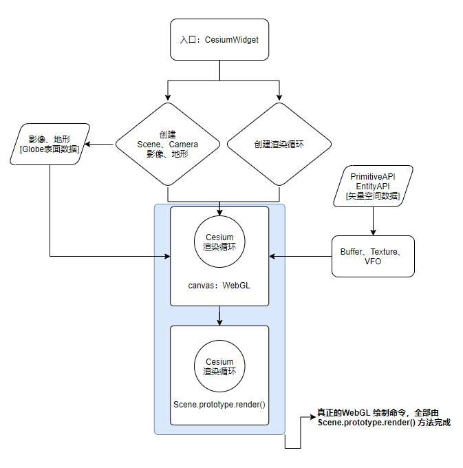

Cesium 与 其他 WebGL 3D 引擎是一样的，一旦启动，就进入一个无限循环。

在这个无限循环中，刷新着每一帧，Cesium 引擎不辞辛劳地在后台刷新着，刷新着。

源码阅读有三个目标：

- 理清从 CesiumWidget 类开始到一切妥当时的渲染流水线启动流程
- 数据是如何被加载进来的（Cesium 的数据模型）
- 寻找优化的可能性

# 1. 熟悉 1.63 之后的代码风格

## ① 类的定义

``` js
// CesiumWidget 举例
function CesiumWidget(container, options) {
  // ...
}
```

## ② 实例字段定义

使用 `this._xxx` 的格式：

``` js
function CesiumWidget(container, options) {
  this._canvas = canvas;
  // ...
}

// es6 等价写法
class CesiumWidget {
  constructor(container, options) {
    // ...
    this._canvas = canvas;
  }
}
```

**cesium 不希望用户直接修改这些下划线开头的变量，而是尽可能用③中的get、set访问器，而且，API 文档中的用法也是对 get、set 访问器的。**

## ③ get、set访问器定义

使用 `Object.defineProperties()` 方法。

不太熟悉这个的，建议看看 C# 中的 `Property`，极为相似。

> 注：这个是有 es6 等价写法的
>
> ``` JS
> class A {
>   get method() {
>     // ..
>   }
> }
> 
> // 等价，注意是定义在 prototype 上
> function A {}
> Object.defineProperties(A.prototype, {})
> ```

## ④ 实例方法定义

定义在 prototype 上

``` JS
CesiumWidget.prototype.resize = function () {
  // ...
}

// es6 等价写法
class CesiumWidget {
  constructor(container, options) {
    // ..
  }
    
  resize() {
    // ..
  }
}
```

## ⑤ 类方法定义

即静态方法，大量出现在工具函数中。以 `Color` 类举例

``` JS
function Color(red, green, blue, alpha) {
  // ...
}

Color.add = function (left, right, result) {
  // ...
}
```

## ⑥ 类字段定义

即静态字段

``` js
Color.packedLength = 4;
```

## ⑦ 导入导出类的机制

使用 `ESM` 标准。在 1.63 之前，用的是 `AMD` 标准的 `requirejs`。

通常一个文件导出一个同名的默认类。

# 2. 结构图（20201123）



渲染循环的起源，抽丝剥茧，其实只有两个最顶级的对象：

`CesiumWidget` 和 `Scene`。

由 CesiumWidget 提供容器功能，初始化一号子对象（摄像机、地球、地形、影像，以及最重要的 Scene 对象等），随即触发 Scene 对象的实例方法：render。

从此，Cesium 就进入了渲染循环。

