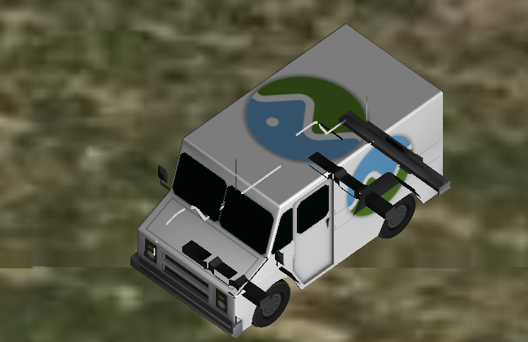

# 大改动

- 更新 `WallGeometry` 为点的顺序，而不是原来的逆时针顺序。有纹理贴图的墙体的外观会受到影响，如果这次更新的版本对墙体有变，那么请调整点的顺序。

# 功能添加

- `Cesium3DTileset` 和 `Model` 类添加 `backFaceCulling` 属性，以支持观察瓦片/模型的底面或者内部，**解决了从模型里面看外面透视的问题**。

- `Ellipsoid` 类添加 `surfaceArea` 属性，用来计算贴地矩形的近似面积。
- CZML 数据增加 PolylineVolume 形状的支持。
- `Color` 类添加 `toCssHexString` 方法来获取 CSS 中hex格式的颜色字符串。

# 修复

- 修复了当3dtiles没有gltf动画时的错误（意思就是当 i3dm 和 b3dm 内嵌的 gltf 有动画时，将被支持）

- 修复了给定原点的情况下， `Ellipsoid.geodeticSurfaceNormal`  除以 0 的计算错误，返回 `undefined` 作为代替。

- 修复了 `WallGeometry` 在坐标很接近时的错误

- 修复了启用对数缓存情况下的模型显示的问题（模型穿透等）

    

- 修复了 `Polyline` 中 `ArcType.RHUMB`（恒向线，如果同纬度则是纬度圈上的线而不是大圆上的弧）绘制会崩溃的问题。

- 修复了标签的背景色、内填充选项的处理问题

- 修复了几个使用 WebGL2 渲染的问题

- 修复了从透视视图切换到正交视图时三角面相互重叠的错误（即穿模）

- 修复了首帧切换到正交视图时导致缩放级别不正确的错误（例如画面模糊等）

    

- 修复了 `scene.pickFromRay` 操作不正常的问题，之前容易获取到模型内部的点位，而正确的点位应该在模型表面

    

- 修复了当构造 `Entity` 时没有传递 name 属性（传递 undefined 或者 null）抛异常的问题

- 文档修复，`ScreenSpaceEventHandler.getInputAction` 返回值的文档已经修正。

- 修改了报错面板的样式。

    

- 修复动画面板在 iOS 13.5.1 中 SVG图标未显示的问题。

