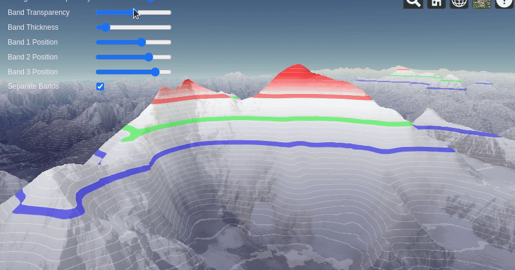

## 1.77 发布时间：2021-01-04

##### 新增功能 🎉

添加了 `ElevationBand` 材质类型，能给指定范围的海拔高度的地形映射对应的颜色（或渐变）

这个和之前的 [Globe Materials - Cesium Sandcastle](https://sandcastle.cesium.com/?src=Globe Materials.html) 很像，但是比 `ElevationRamp` 更灵活。

##### 修复 🔧

修复了当改动模型或 3dtiles 的颜色、背面裁剪、轮廓宽度时的错误

> 主要是修改了 Model 类的 updateColor函数、updateBackFaceCulling函数、updateSilhouette函数的三处判断

##### 即将过期 ⏳

`EasingFunction.QUADRACTIC_IN`、`EasingFunction.QUADRACTIC_OUT`、`EasingFunction.QUADRACTIC_IN_OUT` 三个属性将于 1.79 版本移除，分别使用 `EasingFunction.QUADRATIC_IN`、`EasingFunction.QUADRATIC_OUT` 和 `EasingFunction.QUADRATIC_IN_OUT` 代替。