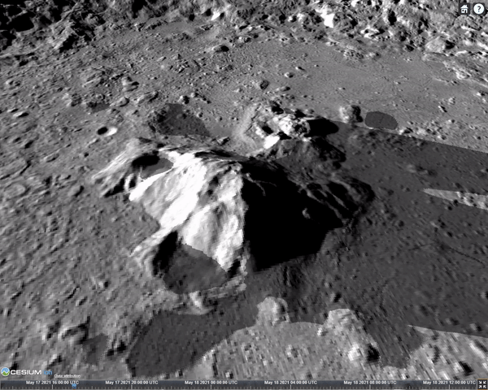

Cesium 1.83 发布日志

## 概览

**动态地形夸大**、**过倾光线时阴影渐隐效果**、**增加 KTX2 和  Basis Universal 纹理格式的支持**、自定义高程提供器、3D-Tiles 扩展检查机制

提供 Windows 平台外边线无效的提示文档

修复旧式 tileset 顶级瓦片无几何误差的错误、修复相机互操作问题、修复后处理异常和闪屏问题

更新部分文字性描述（文档类） 

终结 IE11 的支持：1.83 是最后一个支持 IE11 的版本。

## 破坏式更新 📣

- 不再支持 KTX1 和 Crunch 纹理；使用 [ktx2ktx2](https://github.com/KhronosGroup/KTX-Software) 升级 ktx1 文件

## 功能新增 🎉

- 新增 **动态地形夸大功能**，见 `Globe.terrainExaggeration` 和 `Globe.terrainExaggerationRelativeHeight`。

  此更新是自 2015 年以来的再次优化。前者是夸大的倍数，后者是向上向下夸大的基准高度。

  地形夸大的旧 API `Globe.terrainExaggeration` 将在 1.85 中移除。

  原理：存储每个顶点的 f32 类型的测地法线，并在着色器中将其添加到相对中心，它的效果即使不是 64 位仿真中也是不错的，官方测试中使用 32 位法线精度最多只有 10 厘米的误差值。

  ``` glsl
  float newHeight = (height - relativeHeight) * exaggeration + relativeHeight;
  positionRTC += geodeticSurfaceNormal * (newHeight - height);
  // ... 从 positionRTC 坐标转世界坐标
  ```

  当地形夸大数字不是 1.0 时（哪怕是 1.01）才存储大地表面法线。所以，**这是一个消耗内存的行为**。静态夸大（旧API）是类似于烘焙的效果直接写入几何中，所以内存是不变的。在 `TerrainMesh` 类中，大约会额外占用 30% 的内存（可参考 Chrome 开发者工具的 内存快照，查看具体类的内存占用）。

  [参考 pr](https://github.com/CesiumGS/cesium/pull/9603)

- 新增 ShadowMap 参数：`options.fadingEnabled` 来当光源接近地平线时，控制阴影是否具有淡出的效果。此选项默认开启。

  

  ```js
  var shadowMap = viewer.shadowMap;
  shadowMap.maximumDistance = 100000.0; // 米为单位
  shadowMap.darkness = 0; // 月球上是黑色阴影
  // !!!
  // 新 API，这个属性默认是 true，此处显性设为 false
  shadowMap.fadingEnabled = false;
  ```

- 新增对 KTX2 和 Basis Universal 纹理格式的支持；

  - 增加对 glTF 格式中 `KHR_texture_basisu` 扩展的支持
  - 添加了对 8 位、16 位浮点和 32 位浮点的 KTX2 镜面反射环境贴图的支持
  - 在 `Material` 模块中添加了对 KTX2 图像的支持
  - 对枚举模块 `PixelFormat` 和 `WebGLConstants` 添加了 `EXT_texture_compression_bptc` 和 `WEBGL_compressed_texture_etc`、`WEBGL_compressed_texture_astc` 扩展

  KHR_texture_basisu 纹理支持非 2次幂 尺寸的纹理贴图，但是官方仍然建议使用长宽尺寸一样的、且为 2次幂 的纹理贴图。见 pr [9513](https://github.com/CesiumGS/cesium/pull/9513)

- 新增自定义高度图地形提供器，即新 API `CustomHeightmapTerrainProvider`，从一个回调函数里获取高程数据。从下列例子中可看出，只需指定能 **返回高度类型数组** 的回调函数、宽度、高度三个属性即可。

  ```js
  var width = 32;
  var height = 32;
  
  var viewer = new Cesium.Viewer("cesiumContainer", {
    terrainProvider: new Cesium.CustomHeightmapTerrainProvider({
      callback: function (x, y, level) {
        var buffer = new Float32Array(width * height);
        for (var yy = 0; yy < height; yy++) {
          for (var xx = 0; xx < width; xx++) {
            var v = (y + yy / (height - 1)) / Math.pow(2, level);
            var heightValue = 8000 * (Math.sin(4000 * v) * 0.5 + 0.5);
            var index = yy * width + xx;
            buffer[index] = heightValue;
          }
        }
        return buffer;
      },
      width: width,
      height: height,
    }),
  });
  ```

  有趣的是，这个虽然很灵活，但是官方仍然建议使用成熟的 TerrainProvider，因为这个没有水面特效。

- 3dTiles 扩展检查器

  若一个 tileset 在 extensionsRequired 数组中指定了一个非官方记录的扩展，会直接弹出运行时错误：

  ``` js
  throw new RuntimeError("Unsupported 3D Tiles Extension: " + extension)
  ```

  参考 API `Cesium3DTileset.checkSupportedExtensions(this._extensions)`，官方参考了 `ModelUtility.js` 模块中对 glTF 的扩展的扩展检查。

- 终于！更新了文档：在 Windows 平台上所有主流浏览器将忽略 `outlineWidth` 属性（在Windows 的 WebGL 本身不支持外边线线宽绘制）。涉及到的模块有：

  - `BoxGraphics`
  - `CorridorGraphics`
  - `CylinderGraphics`
  - `EllipseGraphics`
  - `EllipsoidGraphics`
  - `PlaneGraphics`
  - `PolygonGraphics`
  - `RectangleGraphics`
  - `WallGraphics`
  - `PolylineVolumeGraphics`

  届时可以查看最新的帮助文档。

- 为 `KmlTour`, `KmlTourFlyTo`, 和 `KmlTourWait` 模块增加了文档。为 `KmlDataSource` 模块的 `kmlTours` 读类型属性添加文档，并从 `KmlTourSoundCues` 类中移除文档引用。

- 对 OSM Buildings 以及其他在 glTF 模型中用到了 `CESIUM_primitive_outline` 扩展的 tileset 提供隐藏边线的能力。

  主要是在 `Model.js`、`Batched3DModel3DTileContent.js`、`Cesium3DTileset.js`、`Gltf3DTileContent.js`、`Instanced3DModel3DTileContent.js`、`ModelInstanceCollection.js`、`createOsmBuildings.js`、`ModelSpec.js` 作出了修改，部分模块加入 `showOutline` 属性。 （[参考 pr](https://github.com/CesiumGS/cesium/pull/9629)）

- 对于 glTF 某些特定的纹理和 `ImageBitmap` 的色彩空间，提供了 `ignore` 选项。

  

## 修复🔧

- 修复了一些旧式 tileset 中顶级瓦片因为没有几何误差而不加载的错误

  以往有一些 3dtiles 的根属性中没有 `geometricError`，会导致 `preprocess3DTileContent.js` 模块判断错误。在 1.83 中已修复为判断 `root` 属性。

  

- 修复了 `WebMapTileServiceImageryProvider` 这个模块中若 URL 使用了子域（SubDomains）后，请求会因为查询参数而失败的情况（详细问题见：[9598](https://github.com/CesiumGS/cesium/issues/9598)）

- 修复了 `ScreenSpaceCameraController.tilt3DOnTerain` API 中当摇晃相机视角时，会有偏移的小问题。精彩推理见：[9562](https://github.com/CesiumGS/cesium/pull/9562) 似乎是国人

- 当地球表面瓦片（GlobeSurfaceTile模块）请求错误时，修复在控制台中的报错

- 修复了沙盒示例中 KML 示例的缩略图丢失

- 修复了 `GlobeFS` 着色器中当自定义材质的 `positionToEyeEC` 和 `tangentToEyeMatrix` 属性未设置的错误

  ``` glsl
  // GlobeFS.glsl
  void main() {
    // 其他部分略
    materialInput.positionToEyeEC = -v_positionEC;
    materialInput.tangentToEyeMatrix = czm_eastNorthUpToEyeCoordinates(v_positionMC, normalize(v_normalEC));  
  }
  ```

- 修复了 `Matrix4` 模块中 `inverse` 和 `inverseTransformation` 中使用 仿射变换 的误导性文档，已使用旋转和平移替代。

- 当 glTF 模型引用了外部图像资源且没有被 `preferImageBitmap` 加载时，它会在主线程的解码过程中造成帧率暴跌的问题，已经修复；通常 glTF 的图像资源都是内嵌的，也就是 glb 的形式，这个问题被官方发现并修复。针对的模块：`Scene/GltfImageLoader.js` 和 `Scene/Model.js`

- 修复 `Cesium3DTileStyle` 中关于颜色、显隐的误导性 `else` 条件设置。逻辑上，如果没有给定，那就应该使用默认值 true。主要针对的模块：`Scene/Cesium3DTileBatchTable.js`

- 修复后处理禁用后再启用时发生崩溃的问题，这个修复同时能防止在第一次启用后处理阶段功能时闪屏的问题。原因似乎是如果没有任何一个后处理阶段被标记为活动的话，缓存的纹理就不会创建 FBO，虽然这些后处理都启用了。针对模块：`PostProcessStageCollection.js`


## 功能废弃⏳

-  `CesiumWidget`, `Viewer`, 及 `Scene` 模块的 `Scene.terrainExaggeration`、`options.terrainExaggeration` 将会在 1.85 版本中移除。 使用 `Globe.terrainExaggeration` API 来代替他们。
- `loadCRN` 和 `loadKTX` 函数被移除。
- 对 IE11 的支持将在 1.84 正式停止