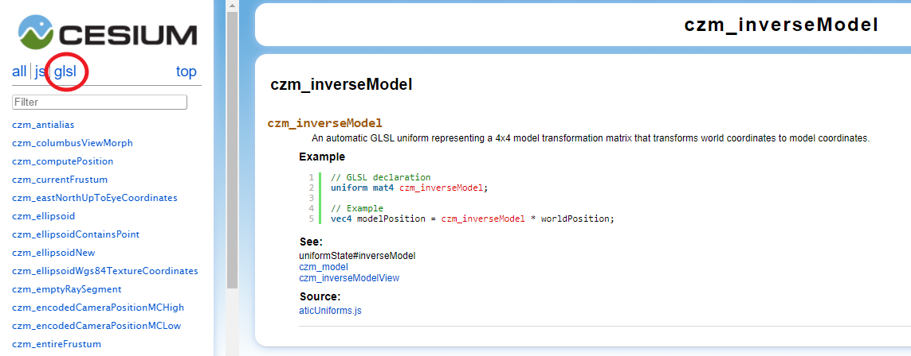

你能在分发包或源码包的 `Source/Shaders` 目录下找到很多着色器代码。它的结构是这样的：

``` 
Shaders
├── Appearances
├── Builtin
│   ├── Constants
│   ├── Functions
│   └── Structs
├── Materials
└── PostProcessStages
```

而 `Shaders` 下就有一堆非常重要的着色器代码文件。

了解这些着色器，先导知识有：

- Cesium的应用基础
- WebGL以及其图形学原理
- GLSL基本语法
- Cesium的渲染流水线

# 1. 你在哪里能见到着色器

## 1.1. Appearance 类

这个类在 `Source/Scene` 目录下，并且你能在帮助文档中找到它的两个构造参数：

- vertexShaderSource: string
- fragmentShaderSource: string

## 1.2. ShaderSource、ShaderProgram、ShaderCache 类

这几个文件在 `Source/Renderer` 下，不过并未导出到文档，说明是一个非 API 类。

## 1.3. Shaders 目录下的着色器代码

这便是重点。

# 2. Source/Shaders 介绍

其实，在很久很久以前，Cesium 这堆着色器代码的 js 文档注释是有文档的，根据我的努力，在 beta29 开始，js 文档就不再生成着色器部分了。

它大概长这样：



注意到左侧有一个 `glsl` 的选项，这就是 着色器有关的代码的文档了。

不过好在即使是最新版的 1.7x 中，这些代码注释并没有删除，只不过 jsdoc 忽略掉了而已，有能力的朋友可以自己恢复编译。

gulp 会把 glsl 文件翻译成 js 文件，即导出着色器代码字字符串。

Cesium 预定义了一套函数、结构体和常量，它位于 `Shaders/Builtin` 目录下，通过 `CzmBuiltins.js` 导入并合成一个大的 Object 导出。

除了这一套东西，剩下的就是着色器了：

## 2.1. Shaders/Appearances

这个目录下全部都是着色器，共计14个。

从单词的意义上来说，这些着色器是与效果有关的，合并 FS 和 VS，主要有：

``` 
AllMaterialAppearance 着色器
BasicMaterialAppearance 着色器

EllipsoidSurfaceAppearance 着色器

PerInstanceColorAppearance 着色器
PerInstanceFlatColorAppearance 着色器

PolylineMaterialAppearance 着色器
PolylineColorAppearance 着色器

TextureMaterialAppearance 着色器
```

一共五种，都不算很大，最大的才 2KB。

## 2.2. Shaders/Builtin

这就是上面说的 函数（Functions 子目录）、常量（Constants 子目录）和结构体（Structs 子目录）所在的文件夹。

| 类型   | 个数 |
| ------ | ---- |
| 函数   | 73   |
| 结构体 | 6    |
| 常量   | 37   |

常量和变量的比较简单，函数可能会难一些，不过都有注释。

## 2.3. Shaders/Materials

这个目录是材质定义（根据名字猜测）。

一共17个材质。

## 2.4. Shaders/PostProcessStages

Cesium 中的后处理用到的着色器（应该是吧？里面都有main函数，现阶段不太熟悉着色器，反正不是顶点也不是片元着色器）

我看到一个 FXAA （抗锯齿）的就在里面。

## 2.5. Shaders/*

从 A 到 V，共计着色器 137 个。其中，有超过40个着色器代码文件大于 2KB。

最大的是 `GlobeFS.glsl`，可见 `Globe` 对象的重要程度。

# 3. 下一步

双线并行，一边先从简单的 `Builtin` 目录开始翻译，一边了解 Cesium 是如何加载着色器代码、编译、链接、执行的。

# 4. 资料

[搜索会话 (google.com)](https://groups.google.com/g/cesium-dev/search?q=shader)

http://www.moonsun.xyz/tag/cesium

[Cesium着色器中构建依赖树的代码分析 – 化石 (moonsun.xyz)](http://www.moonsun.xyz/2019/06/25/07/358/cesium着色器中构建依赖树的代码分析/)

[Cesium的着色器（shader） – 化石 (moonsun.xyz)](http://www.moonsun.xyz/2019/06/24/09/331/cesium的着色器（shader）/)

[Cesium的着色器二 – 化石 (moonsun.xyz)](http://www.moonsun.xyz/2019/06/25/06/356/cesium的着色器二/)


[Cesium源码入口 – 化石 (moonsun.xyz)](http://www.moonsun.xyz/2019/06/12/06/199/cesium源码入口/)

[Cesium的代码流程一 – 化石 (moonsun.xyz)](http://www.moonsun.xyz/2019/06/13/12/205/cesium的代码流程一/)

[Cesium的代码流程二 – 化石 (moonsun.xyz)](http://www.moonsun.xyz/2019/06/16/13/213/cesium的代码流程二/)

[Cesium代码流程三 – 化石 (moonsun.xyz)](http://www.moonsun.xyz/2019/06/17/13/225/cesium代码流程三/)

[Cesium代码流程四 – 化石 (moonsun.xyz)](http://www.moonsun.xyz/2019/06/18/02/231/cesium代码流程四/)

[Cesium代码流程五 – 化石 (moonsun.xyz)](http://www.moonsun.xyz/2019/06/18/05/243/cesium代码流程五/)

[Cesium代码流程六 – 化石 (moonsun.xyz)](http://www.moonsun.xyz/2019/06/19/09/282/cesium代码流程六/)

[Cesium代码流程七 – 化石 (moonsun.xyz)](http://www.moonsun.xyz/2019/06/24/06/325/cesium代码流程七/)

[Cesium的requestRenderMode – 化石 (moonsun.xyz)](http://www.moonsun.xyz/2019/06/24/05/313/cesium的requestrendermode/)

[Cesium事件：鼠标、键盘、触摸、frame帧循环 – 化石 (moonsun.xyz)](http://www.moonsun.xyz/2019/09/25/06/1171/cesium事件：鼠标、键盘、触摸、frame帧循环/)

[Cesium帧循环 – 化石 (moonsun.xyz)](http://www.moonsun.xyz/2019/09/27/01/1184/cesium帧循环/)


[Cesium 基于本地空间的HeadingPitchRoll到世界空间 – 化石 (moonsun.xyz)](http://www.moonsun.xyz/2019/05/27/11/83/cesium-基于本地空间的headingpitchroll到世界空间/)