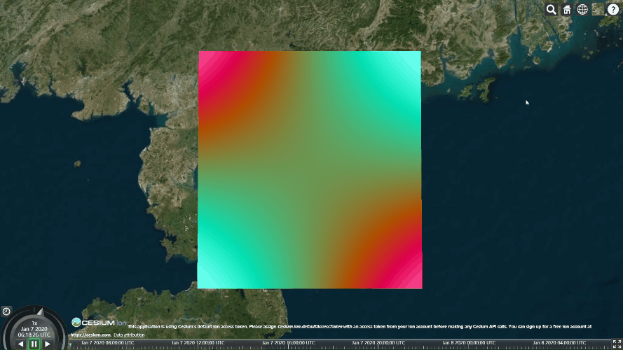

# 大致结构

``` js
const viewer = new Cesium.Viewer('container')

const points = [110.2, 20.0, 112.2, 20.0, 110.2, 22.0, 112.2, 22.0] // xy,xy,... 坐标
const uv0 = [0,0,0,1,1,0,1,1] // uv 坐标
const indices = [0,1,2,1,2,3] // 构成三角形的顶点索引
const colorfulPlane = new CustomPlane({
  viewer: viewer,
  positions: points,
  sts: uv0,
  indices: indices
})

viewer.scene.camera.setView({
  destination: Cesium.Cartesian3.fromDegrees(110.2, 20.0, 500000)
})
```

# 自定义平面类

``` js
function CustomPlane(options) {
	const _viewer = options.viewer
  const _vertexShaderCode = getVertexShaderCode()
  const _fragmentShaderCode = getFragmentShaderCode()
  
  const _sts = new Uint8Array(options.sts)
  const _indices = options.indices
  const _positions = options.positions
  const _tempPosition = []

  for (const point in _positions) {
    _tempPosition.push(point.x)
    _tempPosition.push(point.y)
    _tempPosition.push(point.z)
  }
  
	const _positionsArrayBuffer = new Float64Array(_tempPosition)
  const _geometry = createGeometry(_positionsArrayBuffer, _indices, _sts)
  const _appearance = createAppearance(_vertexShaderCode, _fragmentShaderCode)
  _viewer.scene.primitive.add(new Cesium.Primitive({
    geometryInstances: new Cesium.GeometryInstance({
      geometry: geometry
    }),
    appearance: _appearance,
    asynchronous: false
  }))
}
```

# 着色器和外观、几何对象的创建

``` js
/*
着色器的代码比较的简单就是将平面每一个像素点的颜色进行动态的计算，实现一个动态效果，就是再传uniform值的时候与Three.js不同，Three.js是直接在着色器中收这个值，而Cesium是通过在Source中收在调用到着色器中来获取这个值。因为刚开始研究可能还有更好的方式来获取这个值。
*/

function getVertexShader() {
  return `
	attribute vec3 position3DHigh;
	attribute vec3 position3DLow;
	attribute float batchId;
	attribute vec2 st;
	varying vec2 v_st;
	void main() {
		vec4 position = czm_modelViewProjectionRelativeToEye * czm_computePosition();
		v_st = st;
		gl_Position = position;
	}
	`
}

function getFragmentShader() {
  return `
	varying vec2 v_st;
	void main() {
		vec2 position = -1.0 + 2.0 * v_st;
		float speed = getSpeed();
		float time = czm_frameNumber * speed;
		float r = abs(cos(position.x * position.y + time / 5.0));
		float g = abs(sin(posttion.x * position.y + time / 4.0));
		float b = abs(cos(posttion.x * position.y + time / 3.0));
		gl_FragColor = vec4(r, g, b, 1.0);
	}
	`
}

function getMS() {
  return `
	uniform float speed;
	float getSpeed() {
		return speed;
	}
	`
}

// -----------------
function createGeometry(positions, indices, uv0) {
  return new Cesium.Geometry({
    attributes: {
      position: new Cesium.GeometryAttribute({
        componentDatatype: Cesium.ComponentDatatype.DOUBLE,
        componentsPerAttribute: 3,
        values: positions
      }),
      st: new Cesium.GeometryAttribute({
        componentDatatype: Cesium.ComponentDatatype.FLOAT,
        componentsPerAttirbute: 2,
        values: uv0
      })
      indices: indices,
      primitiveType: Cesium.PrimitiveType.TRIANGLES,
      boundingSphere: Cesium.BoundingSphere.fromVertexes(positions)
    }
  })
}

function createAppearance(vs, fs) {
  return new Cesium.Appearance({
    material: new Cesium.Material({
      fabric: {
        uniforms: {
          speed: 0.1
        },
        source: getMS()
      }
    }),
    translucent: false, // 不透明
    renderState: {
      blending: Cesium.BlendingState.PRE_MULTIPLIED_ALPHA_BLEND,
      depthTest: { enable: true },
      depthMask: true // 将深度值写入深度缓存
    }，
    fragmentShaderSource: fs,
    vertexShaderSource: vs
  })
}
```



# 参考

[Cesium.js着色器的简单实现_柠檬绿dk的博客-CSDN博客](https://blog.csdn.net/weixin_42443851/article/details/103871260)