# 0 准备

装好 vscode，装好 spring 插件、java 插件

- jdk要求：11 及以上（插件不认8了）
- 插件列表
  - Debugger for Java
  - Dependency Analytics
  - Language Support for Java(TM) by Red Hat
  - Lombok Annotations Support for VS Code （这个之后会说明）
  - Maven for Java
  - Project Manager for Java
  - Red Hat Commons
  - Spring Boot Dashboard
  - Spring Boot Extension Pack
  - Spring Boot Tools
  - Spring Initializr Java Support

# 1 创建 maven 工程

`Ctrl` + `Shift` + `P` 快捷键搜索 spring，创建 maven 工程

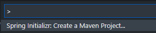

然后选择 maven 版本（默认即可，标SNAPSHOT是不稳定版）

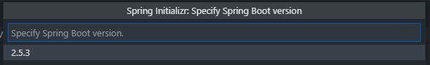

然后选择语言（默认 Java）

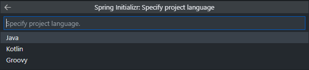

然后填 Group Id（假定我的域名是 sukiruga.cn，那么就填 cn.sukiruga）：

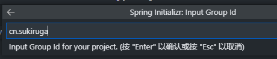

然后填 Artifact Id（随便，小写单词即可）


发布的格式，默认 jar 包：

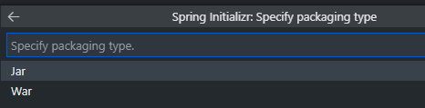

选择 Java 版本（我选了与本机一致的 11）：

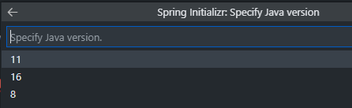

选择依赖项：

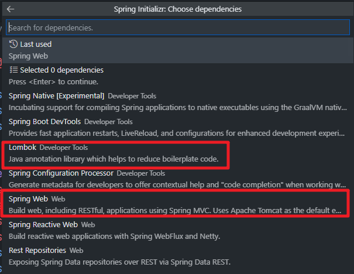

lombok 是一个好用的包，通过注解少写很多代码，具体自己查，如果不选，后续要在 pom 文件中自己加 lombok 的依赖。

如果是老手，你知道要做鉴权，要连数据库，那你可以翻到下面自己找想要的依赖点选即可，最后回车完成创建，会让你选一个文件夹存放生成的项目有关文件：

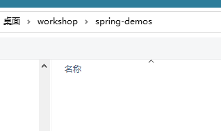

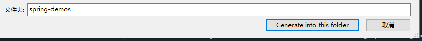

随后插件会下载依赖，并提示创建成功，点击 Open 即可在新的 vscode 窗口打开：

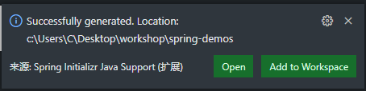

插件还会提示，这是个 java 工程，是否导入：


选 yes 即可。

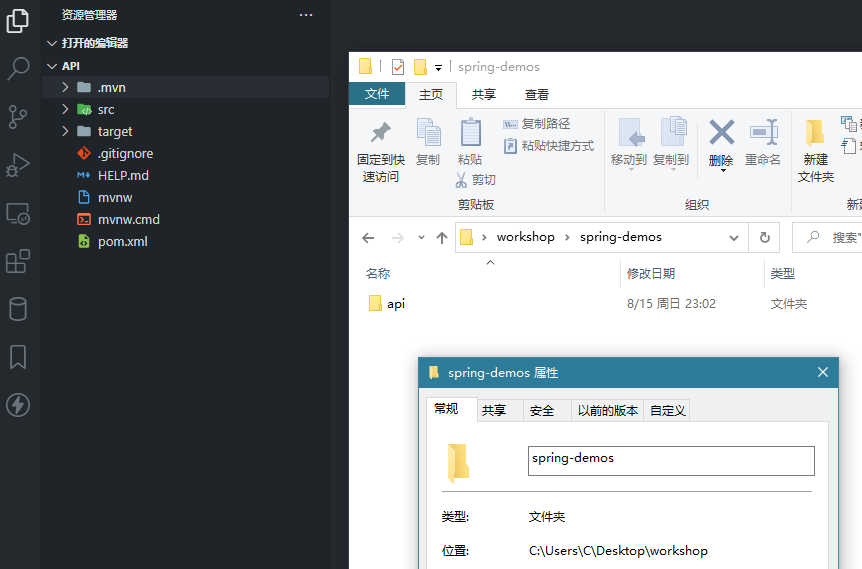

# 2 认识项目文件结构

`src/main/java` 目录即写代码的地方，按上面的步骤来看，这个目录下应该会有这样层级的目录：

`cn/sukiruga/api`，并且在这个 `api` 文件夹下会有一个主程序入口类的文件 `ApiApplication.java`。

这个命名是大驼峰，跟 Artifact Id 是一样的，后面接 Application 尾缀。

假如 Artifact Id 是 `demo`，那么这个入口主程序文件的名称将是 `DemoApplication.java`。

# 3 创建数据模型类

在 `cn/sukiruga/api` 下创建一个 Student 类，路径如下：`cn/sukiruga/api/models/Student.java`

``` java
package cn.sukiruga.api.models;

import lombok.AllArgsConstructor;
import lombok.Data;

@Data
@AllArgsConstructor
public class Student {
  private long id;
  private String name;
  private int age;
}
```

这两个注解即 lombok 提供的，可以少写很多 getter、setter 等常用函数和常用全参数构造函数。lombok 有很多这种注解，网上资料不少，需要自己查。

这个类的实例代表的就是一条数据，对应关系数据库表里的一个记录（一行）。

# 4 创建表示连接器的接口（也叫 repository）

在 `cn/sukiruga/api` 下创建一个接口 `repository/IStudentContext.java`，我习惯了 ASP.NET 的写法和称呼，这边抄过来用了，你也可以写 `repository/StudentRepository.java`，对应待会的实现类即 `StudentRepositoryImpl.java`，我这里待会的实现类即 `repository/impl/StudentContext.java`。

接口用来表示依赖：

``` java
package cn.sukiruga.api.repository;

import java.util.Collection;

import cn.sukiruga.api.models.Student;

public interface IStudentContext {
  public Collection<Student> getAll();
  public Student getOne(long id);
  public void createOrUpdate(Student student);
  public void delete(long id);
}
```

Springboot 会根据对应类的注解 `@Repository` 将它注入程序内部：

``` java
package cn.sukiruga.api.repository.impl;

import java.util.Collection;
import java.util.HashMap;
import java.util.Map;

import org.springframework.stereotype.Repository;

import cn.sukiruga.api.models.Student;
import cn.sukiruga.api.repository.IStudentContext;

@Repository
public class StudentContext implements IStudentContext {
  private static Map<Long, Student> virtualDatabase;
  static {
    virtualDatabase = new HashMap<>();
    virtualDatabase.put(1L, new Student(1L, "张三", 21));
  }

  @Override
  public Collection<Student> getAll() {
    return virtualDatabase.values();
  }

  @Override
  public Student getOne(long id) {
    return virtualDatabase.get(id);
  }

  @Override
  public void createOrUpdate(Student student) {
    virtualDatabase.put(student.getId(), student);
  }

  @Override
  public void delete(long id) {
    virtualDatabase.remove(id);
  }
}
```

> `cn.sukiruga.world.repository` 包下的接口、实现类，表示某个对应的 model 能具备什么行为，在某个具体的 repository 实现类下，你可以定制不同的链接数据库的方式，或者像本例一样，用 `HashMap` 代替数据库作为示例程序。
>
> `SpringBoot` 认 `@Repository` 这个注解。
>
> repository 表示能怎么样对数据库、数据来源进行怎么样的操作，而下文的 controller 则不对数据库，它拥有一个 repository 成员变量，对外暴露访问接口。
>
> 这样，repository 对内，controller 对外，分工明确。

# 5 创建控制器

创建于 `cn/sukiruga/api/controller/StudentController.java`，对应包名即 `cn.sukiruga.api.controller`

``` java
package cn.sukiruga.api.controller;

import java.util.Collection;

import org.springframework.beans.factory.annotation.Autowired;
import org.springframework.web.bind.annotation.DeleteMapping;
import org.springframework.web.bind.annotation.GetMapping;
import org.springframework.web.bind.annotation.PathVariable;
import org.springframework.web.bind.annotation.PostMapping;
import org.springframework.web.bind.annotation.PutMapping;
import org.springframework.web.bind.annotation.RequestBody;
import org.springframework.web.bind.annotation.RequestMapping;
import org.springframework.web.bind.annotation.RestController;

import cn.sukiruga.api.models.Student;
import cn.sukiruga.api.repository.impl.StudentContext;

@RestController
@RequestMapping("/student")
public class StudentController {

  // 自动将 StudentContext 对象注入
  @Autowired
  private StudentContext context;

  @GetMapping
  public Collection<Student> getAll() {
    return context.getAll();
  }

  @GetMapping("/{id}")
  public Student getOne(@PathVariable("id") long id) {
    return context.getOne(id);
  }

  @PostMapping
  public void save(@RequestBody Student student) {
    context.createOrUpdate(student);
  }

  @PutMapping
  public void update(@RequestBody Student student) {
    context.createOrUpdate(student);
  }

  @DeleteMapping("/{id}")
  public void delete(@PathVariable long id) {
    context.delete(id);
  }
}
```

这有一堆注解，对应的功能也笔记好认：

- `@RestController`：指明这个控制器是 `REST` 风格控制器
- `@RequestMapping`：指明这个控制器对应的路由，此处参数是 `"/student"`
- `@GetMapping`：这个注解表示此方法处理当前控制器 get 请求，可带参数，见代码中带 `"/{id}"` 的方法
- `@PostMapping`：这个注解表示此方法处理当前控制器 post 请求
- `@PutMapping`：这个注解表示此方法处理当前控制器的 put 请求
- `@DeleteMapping`：这个注解表示此方法处理当前控制器的 delete 请求，可带参数
- `@PathVariable`：这个注解表示参数是请求 url 中的 queryString 动态参数，例如代码中的 id
- `@RequestBody`：这个注解表示会把请求体中的 json（springboot 默认序列化和反序列化 json）反序列化为 Student 类对象

这里几个简单的增删改查方法，利用了 context 成员变量，就不需要在这个类里操心数据是从哪来的了。

对应接口如下：

| api             | 方法   | 参数                                             |
| --------------- | ------ | ------------------------------------------------ |
| `/student`      | GET    | 无参则返回 json 数组，全体 student 数据          |
| `/student/{id}` | GET    | 有参则查询某个 student                           |
| `/student`      | POST   | 一个 json 对象，字段使用小驼峰，表示创建一条记录 |
| `/student`      | PUT    | 一个 json 对象，字段使用小驼峰，表示更新一条记录 |
| `/student/{id}` | DELETE | 删除对应 id 的记录                               |

# 6 代码写完后的目录结构

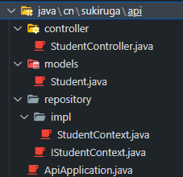

# 7 修改端口：修改 yml 文件

SpringBoot 本来就提倡少配置、无配置，不过这东西也不能绝对没有，尽量减少它的书写即可。

它的配置文件名必须是 `application` 起头，至于命名规则和不同后缀名的优先级和书写格式则可以自行寻找博客。

例如：https://www.jianshu.com/p/a0b3147bc4de

本文使用 yml 格式。

创建项目时，插件在 `src/main/resources` 目录下（也必须是这个目录）创建了一个 `application.properties` 文件，将其改为 `application.yml`，并使用 yaml 格式指明启动端口（端口随你指定）：

``` yaml
server:
  port: 2351 
```

关于 yml 和 properties 格式的切换，百度搜索“maven application.properties 和 yml”能搜到很多博客。

在这就说个经验好了：如果之前使用了 properties 文件运行过，现在转用 yml，要清理一次 `maven -X clean install` 再运行。

properties 文件存在则 yml 文件失效。

# 8 调试

vscode 装完准备章节的插件后，在侧栏会有如下面板：

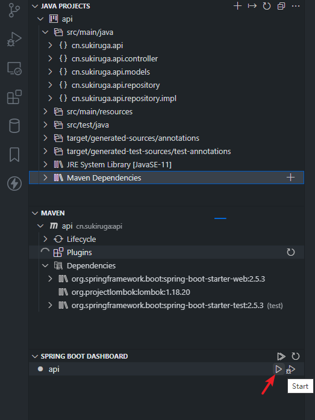

`JAVA PROJECT` 面板比较全，其中 `{}` 图标表示是一个包。此截图中最顶级的 `api` 图标，有三条小竖线，代表是一个项目。右键 `api` 层级可以点击 `Run` 进行运行调试，也可以点 `api` 层级最右侧的三角箭头按钮运行项目。

`MAVEN` 面板则比较简单，下一节的打包成 jar 则要用到这里的右键菜单 - package 命令。

`SPRING BOOT DASHBORAD` 面板则针对 SpringBoot 项目，它能识别出 Java 项目中的 SpringBoot 框架程序，你除了在 `JAVA PROJECT` 面板中运行外，也可以在这里运行。

启动项目后，可以在控制台看到消息：


端口也是改了之后的端口。

可使用 vscode 插件 `Thunder Client` 或者 postman 软件进行接口测试：

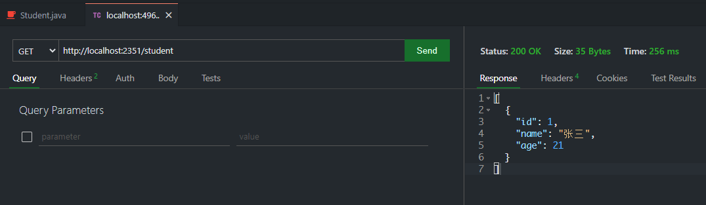

# 9 发布 jar 包并使用终端运行

在 `MAVEN` 面板右键执行 `package` 命令，在项目根目录下的 `target` 文件夹会生成 `<Artifact Id>-<version>-<SNAPSHOT/RELEASE>.jar` 包：

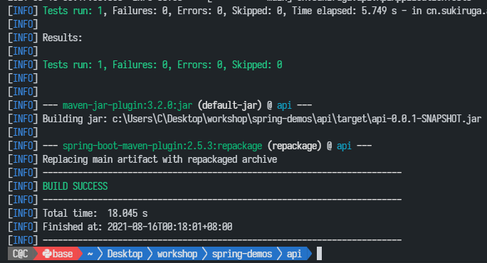

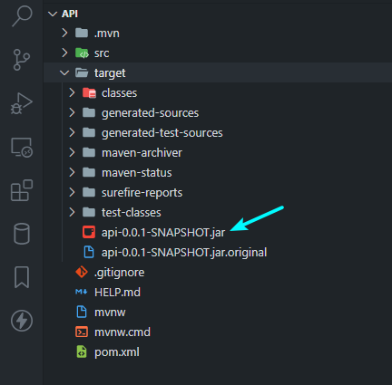

然后，你就可以拷这个文件到有 Java 环境的系统运行啦，运行命令是：

``` bash
java -jar /path/to/api-0.0.1-SNAPSHOT.jar
```


# 10 作为 Windows Service 或 Linux 守护进程在后台运行

Windows 考虑使用 WinSW 程序制作 Windows 服务；

Linux 使用 Systemctl 程序制作 service。

# 11 如果是纯 maven 项目（使用诸如 idea 等 ide 创建的）如何创建

需要自己在 pom 包中添加 parent 依赖和 dependencies 依赖（包括 springboot 有关的依赖和 lombok 依赖），

除了上面写的源代码外，还需要手动写一个第 2 节中提到的入口主程序类，类似 C# ASP.NET 中的 Program 类。