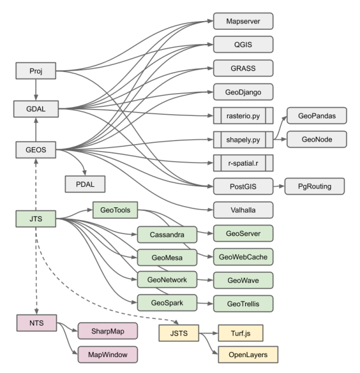
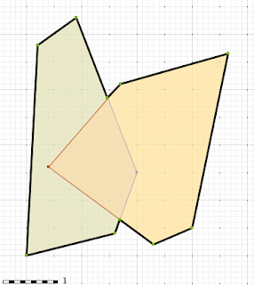
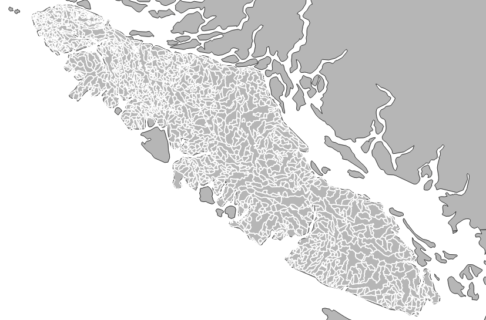
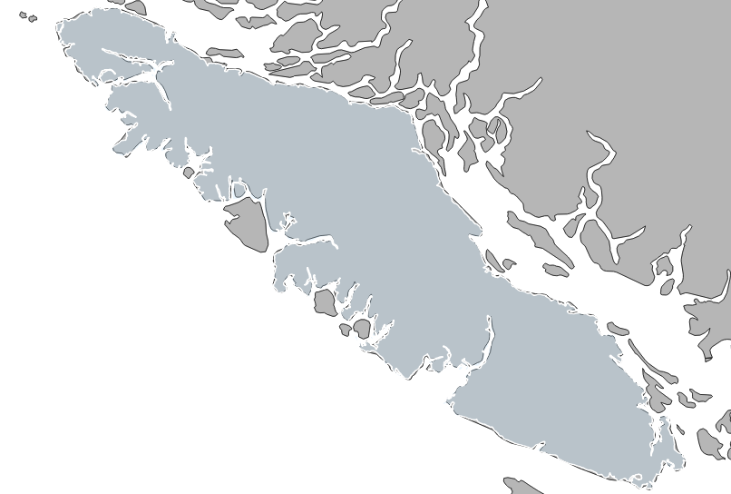

# 概述

虽然我们大多数时候提及“PostGIS”也就那么回事，但请不要忘记，它是诸多非常优秀的地理空间库的结晶，当然也包括它本身的源代码。

再复习一遍，PostGIS 提供的核心功能：

- 基于 PostgreSQL
- 不同数据格式的 IO
- 基本的距离或者面积量测算法
- 简单的几何图形操作
- 其它库中不存在的算法

Proj.4 库则提供坐标转换功能；

GDAL 库提供栅格数据格式的算法支持；

GEOS 库提供计算几何算法支持，包括几何拓扑运算、几何关系运算、常用基础计算几何算法（三角剖分等）。GEOS 中的算法实际上是著名 Java 地理空间库 JTS 的 C++ 实现。

依托 JTS 等库的生态，有如下关系示意图：



# Overlay NG 引擎

这是 JTS/GEOS 中关于几何叠加的一个引擎，在2020年一整年，Crunchy Data 团队在上面投入了大量资金，对 JTS/GEOS 中关于相交、联合、差异、对称差异等函数的几何叠加引擎进行了彻底的改造，使得它的计算效能更快，更稳定。

下图为几何相交和几何联合：



叠加分析有一种用途，那就是化大为小，找到数据共同的地方，下面的 SQL 查询展示了按 wsa 数据（分水岭数据）分类汇总 bec 数据（气候区数据）：

``` sql
SELECT 
  Sum(ST_Area(ST_Intersection(b.geom, w.geom))) AS area_zone, 
  w.wsd_id, 
  b.zone
FROM bec b
JOIN wsa w
ON ST_Intersects(b.geom, w.geom)
WHERE w.nwwtrshdcd like '128-835500-%'
GROUP BY 2, 3
```

如下图所示。


查询速度是原来的 2 倍，而且在更大的区域上原来报错不能计算出结果的情况被解决了。

还有个例子就是将空间上相连的数据合并成一个，下面是对 1300 多个多边形进行空间联合的操作：

``` sql
SELECT ST_Union(geom)
FROM wsa
WHERE nwwtrshdcd like '920-%'
   OR nwwtrshdcd like '930-%'
```

如图：



合并后：



