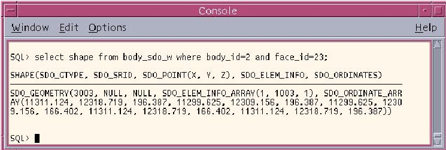
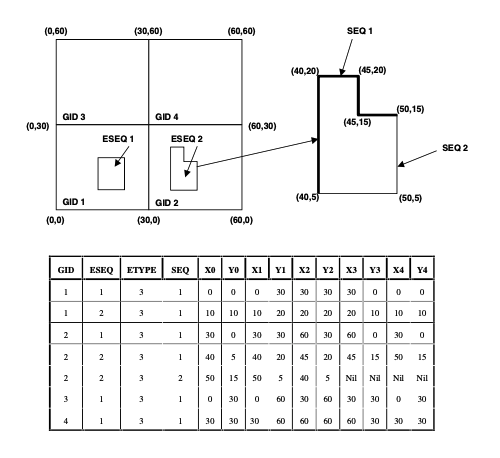
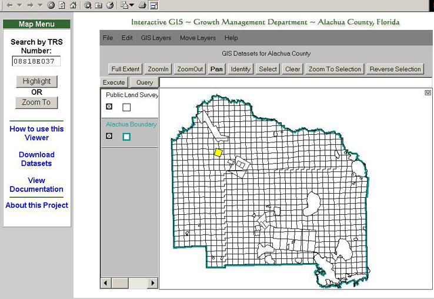
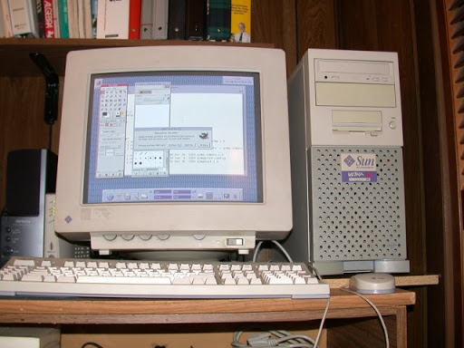

开源 GIS 数据库的 20 个年头

---

2001 年 5 月 31 日，雅虎小组上发送了一封邮件，宣布 PostGIS 第一个版本发布。

PostGIS 与原作者 Paul Ramsey 在 90 年代创办的一家咨询公司 Refractions Research 有很大关系。他的第一桶金是 British Columbia 省政府给的，政府由于自己的原因不想用 ESRI 的软件，所以他的公司就积累了大多数“GIS公司”没有的技能和经验。

他们比较擅长数据库和 FME，最开始擅长 Perl，最后变成了 Java。他们起初最开始的产品叫 Facet，现在不用了，是他们最初四年左右的业务核心。这玩意儿是那个政府任务的关键部分，他们做的事情是编写分析程序，对外提供空间数据分析和导出表格、地图的功能。

考虑到那个时代的算力，他们不得不使用多个 Sun 工作站在全省范围内跑运算，然后把结果放进当时的 PostgreSQL 中。

将碎化的空间数据作为 BLOB 导入到 PostgreSQL 是 PostGIS 的灵感来源，很明显，他们那时候已经具备了交互式实时分析引擎的基础，倘若他们可以更进一步，对这些 blob 做更多的事情，而不是简单的存个 blob 字段值，那就更有趣了。

# 或许应该做一个空间数据库

观察 2000 年那时的空间数据库，会发现有这些：

- Oracle 8i 的空间数据选项
- OpenGIS Simple Features for SQL 规范

然后就没别的了。

最终，他们采取了两个措施，一成一败。

第一个措施，希望省政府能聘用一家精通 Oracle 空间功能的咨询公司。省政府实际上希望在 Oracle 空间功能基础上做标准化，但是几经努力仍没什么进展。

那时的甲骨文并没把 GIS 作为普遍需求，认为 GIS 仍然是一个特殊的领域，没有看到“空间数据库”有啥用途。

下图：当时的 Oracle 中的空间数据功能。



或许，这样未尝不是一件好事。

第二个措施，那就是探索 OpenGIS Simple Features for SQL 规范中所描述的空间数据模型是否可以落地。除了对空间数据类型和要素的描述外，规范中还描述了如何在表中存储空间数据。



存储方案如下：

方案1A：每个要素分解其坐标分量，即 x、y、z 等，分别存储在普通关系数据表的行列中；

方案1B：存“二进制大对象（BLOB）”

方案2：存“几何类型”

由于之前的工作积累了使用 PostgreSQL 的经验，他们对其进行了理论测试，希望能把空间数据存储在数据库中，并且有效地能提取出来，这样才能制作一个由 PostgreSQL 支撑起来的空间数据查看器。



对于查看器的实现，他们使用了 JShape（一种 Java applet）库来实现并实验，顺带给客户做了一些小网页应用。因为它能连接到动态数据库而不是静态文件，这让人很感兴趣。

所有的开发工作都是在 Sun Ultra 10 台式机上完成的，说的是创办公司时借了 10000 美刀贷款买的。当时，他们的收入大部分来自 Facet 软件，这玩意儿只跑在 Sun 的硬件平台上。



对于方案1A，把几何坐标切碎分到关系表里然后取出来重新组成几何，这个慢到爆，根本没法用；

对于方案1B，使用 PostgreSQL 的 BLOB 类型存储大对象，速度好很多，但是还是不够满意，因为没什么办法给空间数据添加空间索引。


# 突破

由于方案1A/B 比较糟糕，他们几乎停止了开发，他们甚至已经翻遍了 PostgreSQL 文档。

团队中的大佬，Dave Blasby，他学过计算机科学（当时团队大部分人是数学和物理学的背景），不忌惮低级语言，他上去就是看 PostgreSQL 的源代码和如何贡献代码的资料，然后就排出“给我点时间，我做一个自定义的类型来存储空间数据”的豪言壮语。

Dave 花了几天时间，结果：成了。

当 Dave 写出一个大概之后，他们把草鸡程序连接到 applet 程序上，随后就高歌猛进了。

即使加载足够大的数据表，缩放数据、绘制地图，它也很快。原本是 Unix 工作站上的 XWindows 屏幕上能看到的玩意儿，现在居然能在普通 PC 的 applet 上运行，太感人了。

团队已经从 PostgreSQL 那获得了不错的体验，但是 PostgreSQL 的扩展插件没什么商业生态，所以最好的办法就是把 PostGIS 开源放在那晾着，看看有没有什么关注度。

当时 Refractions 好像有 6 个人吧（作者记得不是很清楚了），很多人都为首发做出了贡献。

- Dave Blasby 继续完善代码，添加了一些有趣的功能；
- Jeff Lounsbury 是唯一会 C 语言的，他负责把 shp 文件转换成 SQL，以便更轻松加载已有的空间数据文件；
- 原作者本人 Paul Ramsey 则承担了些 Makefile、CVS版本管理、写文档以及为开源做准备的相关工作；
- 生意上的合作人 Graeme Leeming 和 Phil Kayal 默许了这种开源行为。Chris Hodgson 是一个很聪明的开发者，他应该挺忙的，起初没来，不过后面也出现在了提交日志中。


# 发布

最后，在 2001 年 5 月 31 日，Dave 发布首发消息，它就是 PostGIS 0.1，如果你想，你现在仍然可以下载到它。

> 译者注：GitHub 官方仓库的第一个 commit tag 还保存得很完整，那个就是 PostGIS 0.1 的提交，你甚至能看到简朴的文本日志。

第一个版本有一个几何类型（GEOMETRY），它使用 PostgreSQL GIST API 作为空间索引，以及附送了下列函数：

- npoints(GEOMETRY)
- nrings(GEOMETRY)
- mem_size(GEOMETRY)
- numb_sub_objs(GEOMETRY)
- summary(GEOMETRY)
- length3d(GEOMETRY)
- length2d(GEOMETRY)
- area2d(GEOMETRY)
- perimeter3d(GEOMETRY)
- perimeter2d(GEOMETRY)
- truly_inside(GEOMETRY, GEOMETRY)

`truly_inside()` 是唯一的分析函数，它只是用来计算一个点是不是在一个多边形内。

现在回过头看 2001 年那些早期的邮件，感叹 20 年里 PostGIS 集成各路开源地理空间成果的速度是那么的快。

GDAL 的 Frank Warmerdam 和 MapServer 的 Daniel Morissette 在 PostGIS 发布的第一个月内就发布了贴子，Java GeoTools/GeoServer 方面的开发人员也很快就出现了。

对开源空间数据库的需求之大，可以想象。他们只是出现在了合适的时间点。


# 他们现在怎么样啦

- Graeme，Phil，Jeff 和 Chris 仍然在 Refractions Research 从事地理空间咨询服务的工作
- Dave 最初的几年里维护和改进了 PostGIS，离开 Refractions 后从事别的工作，但是依旧是开源地理空间方面的，主要是 GeoServer 和其它 Java 项目中
- 作者本人 Paul Ramsey 觉得 PostGIS 有光明的未来，反而地理咨询工作并不能激起他的兴趣，2008年，他离开了 Refractions 并学习了足够的 C 语言，作为贡献者加入 PostGIS 开发社区，从那时到现在一直在做这件事，目前是 Crunchy Data 的地理空间执行工程师


# 译者注

原文来自 PostGIS 的初创，也是核心贡献者 Paul Ramsey 在 2021 年 5 月的博客 http://blog.cleverelephant.ca/2021/05/postgis-20-years.html

通过了解这段历史，在震撼、惊讶于世界开源 GIS 社区在这 20 年的持续发展的成果的同时，我更敬佩的是这群大叔在那个新千年伊始，那个或许与现在我差不多的年纪能做出那么有意义的事情。放到现在，说是开源 GIS 社区的开天辟地也不为过。

GIS 重数据，重概念，天生合适后端，彼时还没有数据库厂商把空间数据作为一个菜篮子，顶多就是存储一个非常简单的坐标、线、多边形之类的简单功能。

笑。现在国内跑业务的大部分团队不也是这样吗？

可是就是 20 年前那会儿，他们就意识到了这点，并做了开源。

时至今日，PostGIS 仍然是开源 GIS 数据库的一哥，MySQL 等数据库虽然有简单的空间功能，但与 PostGIS 融合了世界图形界多个成熟库做出来的一批函数相比，实在只能说还不够“GIS”味，好比早餐吃油条少了豆浆，缺了点什么。

现在，PostGIS 已经来到了 3.x，也有公司在背后背书，GitHub 上的源代码也仍然在有节奏地更新，有不错的学习价值。

希望阅读这些资料能对自己有所启迪，如果能启发读者，那是我的荣幸。


# 附件 PostGIS 中几何类型有关的结构体定义

## 第一个版本

``` C
typedef struct
{
	double x,y,z;  //for lat/long   x=long, y=lat
} POINT3D;

typedef struct
{
  POINT3D LLB,URT; /* corner POINT3Ds on long diagonal */
} BOX3D;

typedef struct
{
  int32 size;           // postgres variable-length type requirement
  int32 type;           // this type of geometry
  bool is3d;            // true if the points are 3d (only for output)
  BOX3D bvol;           // bounding volume of all the geo objects
  int32 nobjs;          // how many sub-objects in this object
  int32 objType[1];     // type of object
  int32 objOffset[1];   // offset (in bytes) into this structure where 
                        // the object is located
  char objData[1];      // store for actual objects
} GEOMETRY;


// ONLY FOR INDEXING
typedef struct geomkey {
	int32 size; /* size in varlena terms */
	BOX key;
} GEOMETRYKEY;
```

## 最新版本

而现在，它位于 https://github.com/postgis/postgis 仓库中 `liblwgeom/liblwgeom.h.in` 文件下，有着非常不一样的定义：

``` c
/******************************************************************
* LWGEOM (any geometry type)
*
* Abstract type, note that 'type', 'bbox' and 'srid' are available in
* all geometry variants.
*/
typedef struct
{
	GBOX *bbox;
	void *data;
	int32_t srid;
	lwflags_t flags;
	uint8_t type;
	char pad[1]; /* Padding to 24 bytes (unused) */
}
LWGEOM;
```

