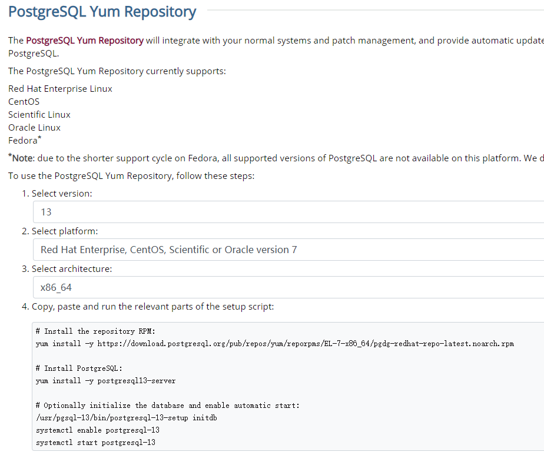

# 到官网找教程

[PostgreSQL: Linux downloads (Red Hat family)](https://www.postgresql.org/download/linux/redhat/)

本记录是用 yum 安装，源码安装以后再试试。

# pg13



``` BASH
# 安装官方仓库源
sudo yum install -y https://download.postgresql.org/pub/repos/yum/reporpms/EL-7-x86_64/pgdg-redhat-repo-latest.noarch.rpm

# 安装
sudo yum install -y postgresql13-server

# 可选：初始化数据库、启动服务
sudo /usr/pgsql-13/bin/postgresql-13-setup initdb
sudo systemctl enable postgresql-13
sudo systemctl start postgresql-13
```

一般来说会安装到 /usr下？

`/usr/pgsql-13/bin/pg_ctl` 安装到这里了，切换到root用户才能看到。