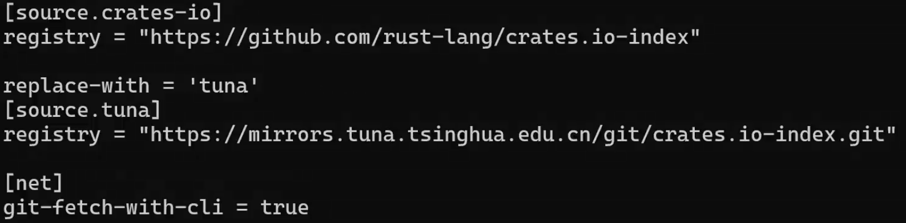

# 下载慢

vscode ctrl+P，调用 stop rust server，然后去删一下 cargo.exe 外面的缓存文件。

（主要是在 `~/.cargo` 目录下的 `.package-cache` 文件）

此时，在 `~/.cargo` 目录下创建一个 config 文本文件，无后缀名，然后设置一下国内源即可。



# 引入包

``` rust
use <包名>::...;
```

