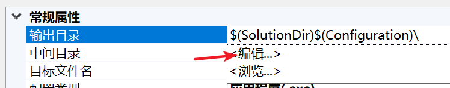
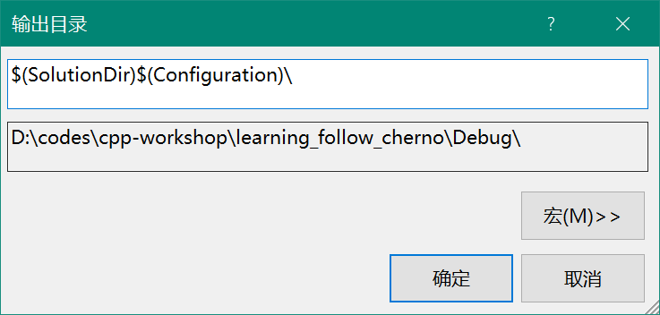
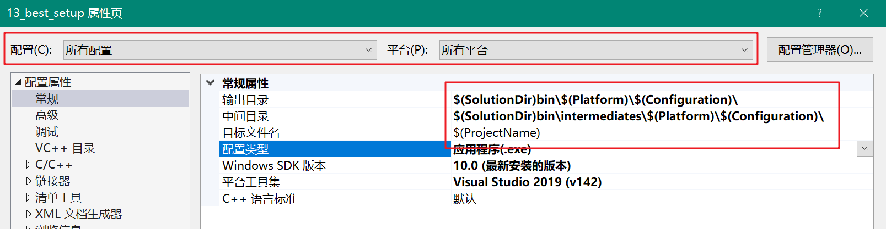

# 1. 目录树里的过滤器

这些叫做过滤器，并不是真正的文件夹，最上面一排按钮由三个文件图标的，是切换到真实文件视图

过滤器随便删随便创建。

# 2. 调整编译成果存放目录

默认状态下，VS会把预处理、编译、链接的中间文件放在项目目录下，而把最终的可执行程序单独作为一堆东西，放在解决方案外面的一个新文件夹。

右键项目 - 属性

这三个就是要改的地方

如果你不知道这些 `SolutionDir` 是什么，它们叫做宏，点开编辑后，你就知道往哪找了：

通常的配置是：

- `$(SolutionDir)bin\$(Platform)\$(Configuration\`
- `$(SolutionDir)bin\intermediates\$(Platform)\$(Configuration\`