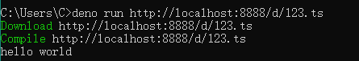

使用nginx部署一个静态路径（端口为8888）：

``` JSON
location /d {
    alias D:/MyCodes/deno-workshop/examples;
}
```

访问`http://127.0.0.1:8888/d/123.ts`，成功访问。（内容是一句console.log())

运行命令

```BASH
deno run http://127.0.0.1:8888/d/123.ts
```

成功。

