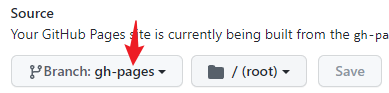

设有一仓库 `somerepo`，其 URL 为

```
https://github.com/somebody/somerepo
```

这个仓库的 `main` 分支是 vite 标准工程，若使用分支来发布 dist 静态页面，则需要配置 vite 的 base 路径

``` typescript
import { defineConfig } from 'vite'

export default defineConfig({
  base: '/somerepo/'
})
```

然后依次操作：

- 执行 build 命令，打包至默认的 `dist` 目录
- 执行 `git add dist -f && git commit -m "some message."` 命令，强制提交 dist 目录到版本管理，这是因为 `.gitignore` 中忽略了 `dist` 目录
- 执行 `git subtree push --prefix=dist origin gh-pages`，推送子仓库 `dist` 到 origin 这个远程仓库的 gh-pages 分支。

此时，到 GitHub Page 设置界面设置其分支即可



于是你就可以访问 `https://somebody.github.io/somerepo` 访问页面啦