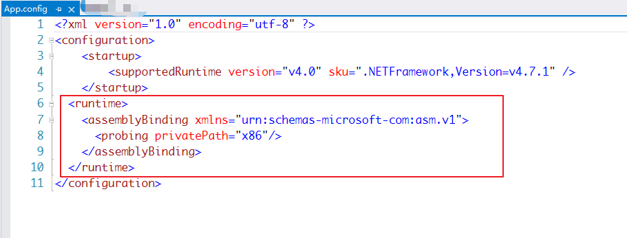
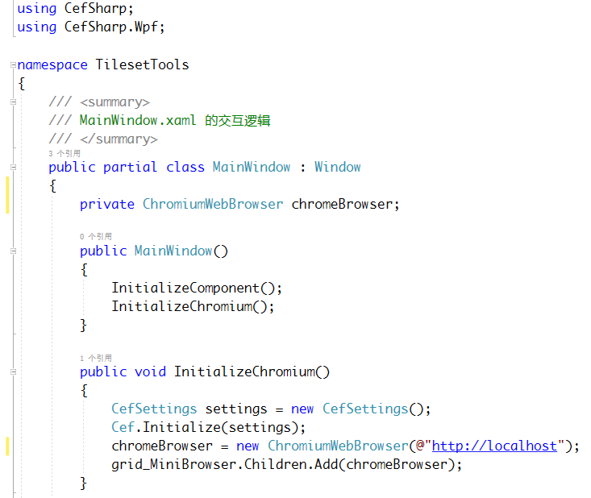

参考博客https://www.jianshu.com/p/fdfea2fc5352

# 1 安装

``` nuget
install cefsharp.wpf
```

使用nuget安装，在wpf项目中支持较好。在wpf中，一个浏览器窗口对应一个 `Grid` （别的没试过）。


不通过命令可以自己搜索安装。

# 2 配置

不配置是不能用的，版本 ≥ 51的 Cefsharp 支持 Any CPU 配置的编译了，但是仍然要简单配置。

在你需要创建 CefSharp 应用的 WPF 项目的属性中，勾选首选32位，目标平台 AnyCPU：


在 C# 项目文件 `.csproj` 内找到第一个 `PropertyGroup` 元素，把这一行配置写到 `PropertyGroup` 的最后：

``` XML
<CefSharpAnyCpuSupport>true</CefSharpAnyCpuSupport>
```


最后，修改 WPF 项目的 App.config 文件，在文件中的 `<configuration>` 元素中添加如下配置： 



然后在你需要创建 CefSharp 浏览器窗口的地方，

``` c#
using CefSharp;
using CefSharp.Wpf;
```

就可以开心地写了。

# 3 绑定 CefSharp 对象到 Grid 控件上

例如，在窗体的构造函数调用创建 CefSharp 的方法：



这个 grid_MiniBrowser 变量是一个 Grid 控件。

# 4 修改浏览器地址

``` C#
chromeBrowser.Address = @"C:\Users\C\Desktop\dataurl.html";
chromeBrowser.Load(@"C:\Users\C\Desktop\dataurl.html");
```

这两句是类似的，不过最好使用 Load 加载。

也可以直接指向 http 协议的地址或dataurl：

``` C#
string dataurl = "data:text/html,<div id=\"t\" style=\"border: 1px solid red; width: 50vw; height: 20vh\"></div>";
chromeBrowser.Load(dataurl);
```

``` c#
chromeBrowser.Load(@"http://www.qq.com");
```

# 5 添加 Grid 的 F12 按键事件处理，增加调试功能

``` C#
private void grid_MiniBrowser_KeyDown(object sender, KeyEventArgs e)
{
    if (e.KeyStates == Keyboard.GetKeyStates(Key.F12))
    {
        chromeBrowser.ShowDevTools();
    }
    else if (e.KeyStates == Keyboard.GetKeyStates(Key.F5))
    {
        chromeBrowser.Reload();
    }
}
```

# 6 js与C#交互

https://www.cnblogs.com/yang-fei/p/4699604.html