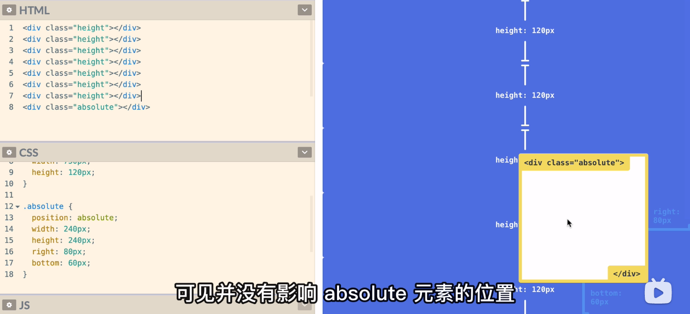
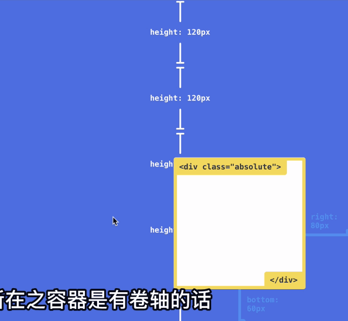
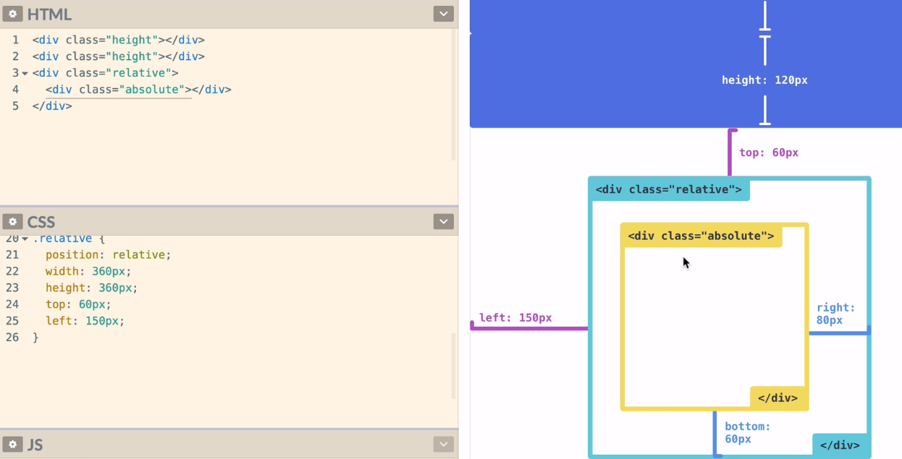
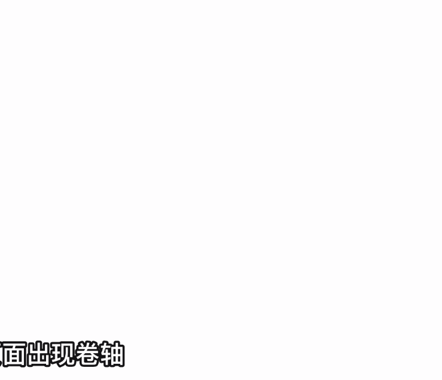
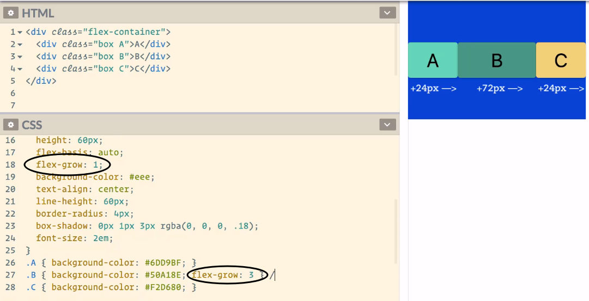

> 以下全部css均为列出主要属性，长宽之类的有可能会省略。


# 1. 古老的 float 布局

css 选择器内有一个属性：`float`，可指定为 "left" 或 "right"，通常搭配 `width: xx%` 使用

float 布局的元素，是有顺序讲究的，如果是右对齐，那么第一个元素是最右边的。

## 存在问题

只要指定了 float 属性的元素，就是行内的了，后续如果再跟行内的内容（比如普通文本、span等），是紧跟着上面的 float 元素的。

解决方法有

① 拿一个div包着所有 float 的元素，并将其 css 的 `display` 属性设为 `flow-root`，即可独行

② 上一种方法 IE 不支持，可考虑使用伪类选择器，将①中的外包 div 的 ::after 选择器填入如下属性（假设外包div的类是 container）：

``` css
.container::after {
  content: '';
  clear: both;
  display: block;
}
```

③ 将外包 div 的 `overflow` 设为除了 `visible` 之外的任何值

``` css
.container {
  overflow: auto;
}
/* 这样 container 就变成了一个 bfc（Block Formatting Context）块级可视化上下文 */
```

# 2. Position 属性

有5个：`static`、`absolute`、`relative`、`fixed` 和 `sticky`

所有元素的默认 position 都是 `static`。


## static

跟随 html 结构流动的定位法则，排在它之前的html后面。可指定 width、height。

### static 套 absolute

下面还会有 relative 套 absolute，static 套 absolute 是无效的，absolute 会无视 static 而基于整个 html 定位，但是会尊重 relative。

## absolute

通常搭配 `right`、`bottom`、`left`、`top` 中的两个使用，比如 上左、下右。

意思是当前 html 文档的绝对定位，不随 html 结构变化。



注意，如果 html 超过一个屏幕（或者更准确的说，有滚动条，那么它还是会跟随滚动条移动的）



### absolute 嵌套

那么子元素就绝对于父元素


## relative

通常会跟 `top`、`left`、`right`、`bottom` 一起使用。

它是带了上下左右相对偏移值的 static。


### relative 内 嵌套 absolute

此时，内部的 absolute 会根据父级 relative 来绝对定位：



在 static 里就不是这样了。


## fixed

通常会跟 `left`、`right`、`top`、`bottom` 属性一起使用。


通常来说，就是右下角那个 “回到页首” 那个按钮的定位方式，即相对于屏幕固定住了，而不是 html 结构。


### relative 套 fixed

默认不设置 上下左右时，会相对于 relative 定位。


如果 fixed 有 top、left、right、bottom，那么 fixed 将无视 relative，直接基于屏幕定位。


## *sticky （IE 不支持）

配合 `top`、`right`、`left`、`bottom` 一起使用。

在屏幕内时，和普通的 static 没什么区别

如果它的 上下左右 触及了设定好的值，那么它就会固定在这个值的屏幕位置上，像导航栏：



# 3. 上下左右居中

**左右很简单**

行内、行内块级 使用 text-align 属性，设为 center 即可。（行内的一小块）

块级，使用 margin-left 和 margin-right，设为 auto 即可。（独占一行的 block）

## 方法一：Position 设为 absolute（调整元素本身）

``` CSS
#box {
  position: absolute;
  top: 50%;
  left: 50%;
  transform: translateX(-50%) translateY(-50%);
}
```

## 方法二：flex布局（容器式，对齐到某个元素，此例为对齐body）

首先，先把 body 最小高度设为视口的 100%，并将其 margin 设为 0.

``` CSS
body {
  min-height: 100vh;
  display: flex;
  justify-content: center; /* 主轴 */
  align-items: center; /* 交叉轴 */
  margin: 0
}
```

## 方法三：Table 布局（容器式，对齐到某个元素，此例为对齐body）

``` CSS
body {
  display: table;
  witdh: 100%;
  min-height: 100vh;
  margin: 0;
}

/* 此时你只要管容器内的元素定位即可 */

.cell {
  display: table-cell;
  vertical-align: middle; /* 垂直（上下） */
  text-align: center; /* 左右 */
}
```


# 4. flex 布局


flex 布局起码要求有一个 display 为 flex 的容器元素，通常是div

## 4.1. flex 容器的设定

### ① flex-direction 属性：设定横向（默认）或纵向

4个值：row是横向，是默认值，column是垂直。

row-reverse 是反过来的横向，colume-reverse 是反过来的纵向。

> flex 容器内的两根轴
>
> 当 flex-direction 是 row 时，主轴是 row，另一轴是 column；反过来同理。

### ② justify-content 和 align-items：主轴 和 交叉轴的排序法则

若 justify-content 设为 center，那么就沿着主轴（即 flex-direction）居中

一个上下左右居中的例子：

``` CSS
.flex-container {
  display: flex;
  flex-direction: row;
  justify-content: center;
  align-items: center;
  
  background-color: #369;
  height: 300px;
}
```

justify-content 的可选值还有

- flex-end：对齐容器主轴起点
- flex-start：对齐容器主轴终点

### ③ flex-wrap（默认 nowrap）：是否换行

默认不换行，设为 wrap 后换行。

### ④ flex-flow：组合 flex-direction 和 flex-wrap

``` css
.flex-container {
  flex-flow: row wrap;
}

/* 等价于 */
.flex-container {
  flex-direction: row;
  flex-wrap: wrap;
}
```

### ⑤ align-content

设定多行之间，行与行的对齐。

``` CSS
.flex-container {
  align-content: flex-start; /* 多行对齐到主轴开始 */
  align-content: flex-end; /* 多行对齐到主轴末尾 */
  align-content: center; /* 多行对齐主轴中间 */
  align-content: initial; /* ？ */
  align-content: space-around; /* 两端对齐？ */
  align-content: space-evenly; /* 平均分布 */
  align-content: space-between; /* 对齐到起点和结束？ */
}
```

## 4.2. item 的设定

### ① order 属性：顺序优先级

默认都是0，越大，优先级越低，越往主轴的后排列。

可以是负数。

### ② align-self 属性：覆盖容器的 `align-items` 属性

想单独改一个 item 的交叉轴对齐顺序，可以用这个属性。


### ③ flex-basis 属性：主轴的默认尺寸

``` css
.container {
  flex-direction: column;
}

.item {
  flex-basis: 100px;
}
```


### ④ flex-grow 属性：不够一轴时拉伸沾满主轴


这个数字是占多大比例，如果 B 占3份：



若设为0，则按原本的大小。

### ⑤ flex-shrink：flex-grow 的对子

即撑爆主轴时，每个元素如何缩小，占多少份（没有设置 flex-wrap 换行的情况下）。

设为 0，表示不缩放，会超出容器：


如果都设为 1，那么：


数字越大，缩小的越多


**flex-shrink，是基于超出空间来计算缩减比例的。**

### ⑥ 总属性 flex：flex-grow+flex-shrink+flex-basis

``` CSS
.item {
  flex: 1 0 auto;
  /*等价于*/
  flex-grow: 1;
  flex-shrink: 0;
  flex-basis: auto;
}
```


# 5. grid 布局

主要是设置容器的css

## ① grid-template-rows & grid-template-columns

### 像素写法

``` CSS
#grid-container {
  display: grid;
  grid-template-rows: 100px 100px 100px 100px 100px; /* 分成5行 6条轴 */
  grid-template-columns: 100px 100px 100px 100px 100px; /* 分成5列 6条轴 */
}
```

### fr比例写法

``` CSS
#grid-container {
  display: grid;
  grid-template-rows: 3fr 1fr 1fr; /* 分成3行 4条轴，比例 3:1:1 */
  grid-template-columns: 1fr 1fr 1fr; /* 分成3列 4条轴，比例 1:1:1 */
}
```


### 函数+fr比例写法

``` CSS
#grid-container {
  display: grid;
  grid-template-rows: 3fr repeat(4, 1fr); /* 分成5行 6条轴，比例 3:1:1:1:1 */
  grid-template-columns: repeat(4, 1fr); /* 分成5列 6条轴，比例 1:1:1:1:1 */
}
```


### 轴命名

可以给非函数写法的模板加轴名

``` css
#grid-container {
  display: grid;
  grid-template-rows: [row-axis1] 100px [row-axis2] 100px [row-axis3] 100px [row-axis4] 100px [row-axis5] 100px [row-axis6];
  grid-template-columns: [column-axis1] 100px [column-axis2] 100px [column-axis3] 100px [column-axis4] 100px [column-axis5] 100px [column-axis6];
}
```


## ② grid-template-area

每行一个字符串，每个字符串一个空格分割每一列

``` css
#grid-container {
  display: grid;
  grid-template-area: "header header header header header"
    "nav body body body body"
    "nav body body body body"
    "nav body body body body"
    ". footer footer footer ."
}
```

命名是随意的

## ③ 统一间距：row-gap & column-gap

每个格子的间距。

## 格子内的元素写法

``` CSS
.cell-1 {
  grid-row: 1 / 4; /* 从第一根轴开始，到第4根轴结束 */
  grid-column: 2 / 6;
}
```

或者可以用 `from-range` 写法

``` CSS
.cell-1 {
  grid-row: 1 / span 4; /* 从第一根轴开始，横跨4根轴 */
  grid-column: 2 / 6;
}
```

或者一步到位，使用 grid-area 属性定义 “左上~右下”

``` CSS
.cell-1 {
  grid-area: 1 / 1 / 4 / 3; /* 横轴纵轴 1、1为左上，4、3为右下的范围 */
  /* 左上横轴 / 左上纵轴 / 右下横轴 / 右下纵轴 */
}
```

使用轴命名法

``` CSS
.cell-1 {
  grid-area: row-axis1 / row-column1 / row-axis4 / column-axis3; /* 横轴纵轴 1、1为左上，4、3为右下的范围 */
}
```

