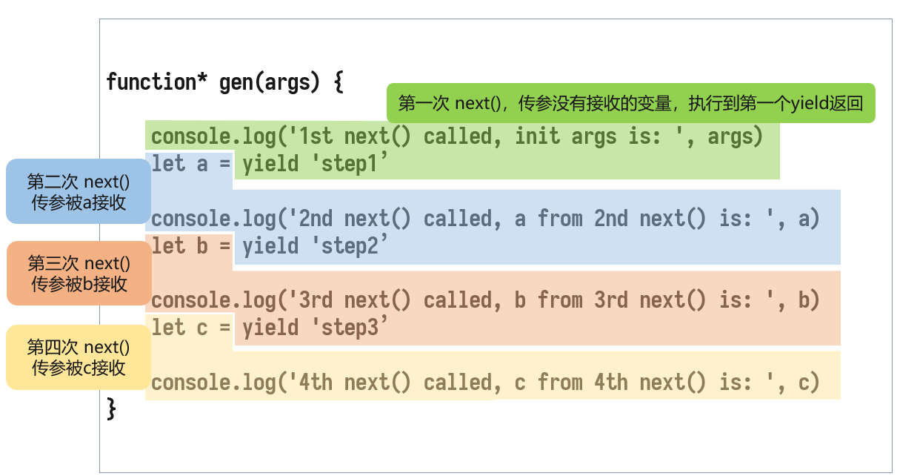

# 1. 干啥用的

先来一段

``` JS
function *listColors(){
    yield 'red'
    yield 'green'
    yield 'blue'
}

const colors = listColors()
```

语法挺简单，就function后面多了个*，然后 `yield` 了三个字符串

这个 `colors` 就是一个 **`generator`**，即生成器

> 这个 * 放在哪都可以，贴 function 关键字也可以，贴函数名也可以。

## 怎么用它

``` JS
colors.next()
```

返回一个对象：

``` JSON
{
    value: "red",
    done: false
}
```

有迭代器那味儿了。

直到 `yield` 完所有值，next() 就没东西了

> 如果不执行 next()，是不会执行 function* 里面的代码的

实际上，所有的 yield 执行完后，生成器的生命周期才会结束。

# 2. 结合axios控制请求流程

``` JS
function *steps() {
    const users = yield req(`https://api.github.com/users`)
    const firstUser = yield req(`https://api.github.com/users/${users[0].login}`)
    const followers = yield req(firstUser.followers_url)
}

function req(url) {
    axios.get(url)
    	.then(res => userGen.next(res.data))
}

const userGen = steps()
userGen.next()
```

这里，看到了 `userGen.next()` 其实是可以传值的，传递的值会在对应的 `yield` 语句中返回，第一个 yield 返回被 users 变量接收，第二个则由 firstUser 接收，等等。

这个例子执行顺序是：

```
userGen.next() → req() → userGen.next(res.data) → users 接收 res.data, 结束第一个yield → 
req() → userGen.next(res.data) → firstUser 接收 res.data, 结束第二个 yield →
req() → userGen.next(res.data) → followers 接受 res.data, 结束第三个 yield
```

当往 `next()` 方法传参时，这个参数就会作为上一个 yield 的返回值。

## next传参

`next(res.data)` 这个代码会执行第二个 `yield`，但是，执行之前会结束第一个 `yield`，并将这个参数作为第一个 `yield` 的返回值返回给 `const users`。

# 3. 什么时候用它

当你有一些步骤性的操作，每一步执行的时间都不确定，而且最重要的是：下一步需要上一步的结果时，Generator 就很合适。

这里，每一步的操作（通常是执行某个耗时间的函数）就可以用 `yield` 关键词标上它，直到这一步结束，生成器函数才会返回这一步的值。

那么，某一步结束后，它返回值怎么拿呢？

``` JS
const result = genFunc.next()
```

通常使用生成器的 next() 方法的返回值作为那一步操作的返回值，而 next() 方法当然也是可以传递参数的。


# 4. next() 会走到哪一步

看下列代码

``` js
function* gen(args) {
// -> 第一次 next() 开始
  console.log('1st next() called, init args is: ', args)
  						 let a = yield 'step1'
// 第二次 next() 开始↑  ↑第一次 next() 结束       || 第二次 next() 开始时，传入的参数 'arg1' 才会被 a 接收
  console.log('2nd next() called, a from 2nd next() is: ', a)
               let b = yield 'step2'
// 第三次 next() 开始↑  ↑第二次 next() 结束       || 第三次 next() 开始时，传入的参数 'arg2' 才会被 b 接收
  console.log('3rd next() called, b from 3rd next() is: ', b)
               let c = yield 'step3'
// 第三次 next() 开始↑  ↑第二次 next() 结束       || 第四次 next() 开始时，传入的参数 'arg3' 才会被 c 接收
  console.log('4th next() called, c from 4th next() is: ', c)
// -> 第四次 next() 结束
}
    
let itor = gen('init args')
console.log(itor.next())
console.log(itor.next('arg1'))
console.log(itor.next('arg2'))
console.log(itor.next('arg3'))
```

