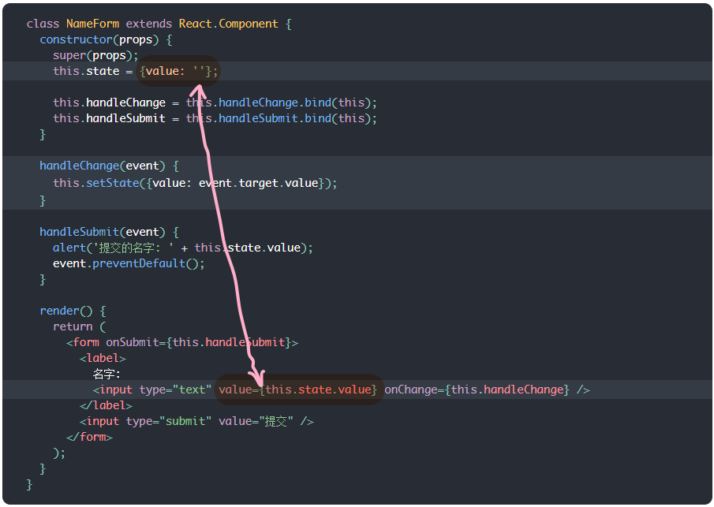
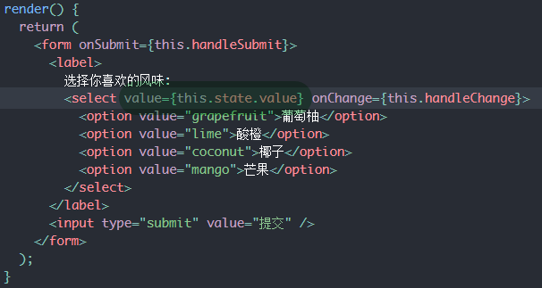

表单通常自己有自己的状态，react建议把这些原生的状态接过来管理，也就是所谓的劫持原生表单行为和数据变化，交由react自己管理。



这里，NameForm 组件中 state 只有一个 value，它就是劫持原生 input 标签的 value 用的。

# 其他原生标签的状态劫持

## ① textarea


同样，使用 value

## ② select



原生 html 的 select 标签下嵌套 option 标签，option 标签使用 `selected` prop 来表示已经被选中。

但是在上面的截图中可看出，直接在 select 标签中使用 value prop 即可。

对于多选型 select 标签：

``` JSX
<select multiple={true} value={['B', 'C']}>
```

## ③ input[type="file"]

当 input 标签指定为 file 类型后，就可以上传文件，传递给服务器或用 FileAPI 来控制。

这时，其 value 属性是只读的，所以劫持不了喽~

