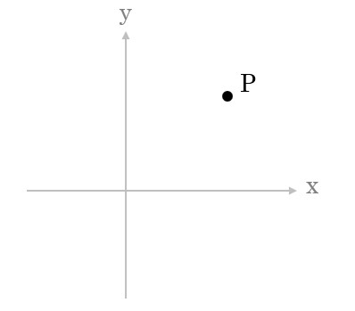
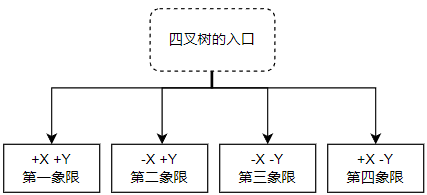

空间索引小记

# 0. 概述

如何从一堆数据中寻找其中特定的一条呢？

最笨的方法就是从头撸到尾，挨个找。聪明的人们使用“树”这个结构，使得可以单步搜索省去非常多无关的信息。

对于数字这种数据，只需简单的比大小就可以放进平衡二叉树中。

当维度从单个数字的数轴扩充到二维、三维，也就是对于空间数据，“范围”是分割空间的手段，也就是构造空间数据索引的依据。

我们其实学过最简单的空间索引，那就是平面直角坐标系的四个象限：

两个垂直的轴，x 轴和 y 轴把平面一分为四，这就是最简单的空间四叉树（广义的空间包括平面）。

假设设点集 C 有非常多个点，有如下搜索：寻找点集 C 内距离点 `P(3.4, 3.0)` 距离最短的点 T，使用普通顺序搜索，那就要把所有的点都比对一次距离，才能找到 T 点；但是，如果把点集 C 所有的点使用这四个象限分成 4 个子集：

那么，在理想状态下（即四个象限的点分布都很均匀），只需比对一次，就可以减少大概 3/4 的算量。

有人说这么简单的查找，学过中学数学的都知道可以不用计算其它三个象限的其它点，为什么需要用空间四叉树归类呢？

答案是计算机不知道，程序是需要人去写的。殊不知即使没有构造四叉树对点集 C 进行归类，只要在程序中使用了 `if/else` 分支逻辑判断四个象限，其实隐隐之中已经使用了四叉树的第一层，也就是四个象限作为索引了。

树结构当然不至于只有一层，可以按点的密度去做 N 层四叉树，这样进入某个象限后，仍能迭代地用 3/4 的算量差额去优化搜索负担。

这就是空间索引于空间数据的意义。上述例子只是二维平面对点进行搜索，实际上对地理、三维的事物模拟中，有非常多的“升级”，譬如树结构还有其它的选择，譬如点可以是线、面、体，等等，需要考虑的东西较多。

但是，空间索引万变不离其宗，终究是对空间对象的归类，使用范围作归类标准，构建空间树结构只是较为常用的一种。

# 1. PostgreSQL 中的空间索引

索引是数据库的基本功能，PostgreSQL 有：

- B树
- R树
- GiST

# 2. R树索引

# 3. PostGIS 应用

# 附录A 常见空间索引方法

- 空间二分树（BSP-tree）
- 空间层次范围（Bounding volume hierarchy，BVH）
- 地理哈希（GeoHash）
- 网格（Grid）
- 螺旋超空间码（Helical Hyperspatial Code，HHCode）
- 希尔伯特 R 树（Hilbert R-tree）
- K维树（KD-tree）
- M树
- 四叉树
- 八叉树
- PH树
- R树（R 即 Rectangle）
- R+树
- R*树
- UB树
- X树
- Z序曲线

# 参考文档

- [enwiki - 空间数据库](https://en.wikipedia.org/wiki/Spatial_database)
- [university consortium for gis - 空间索引](https://gistbok.ucgis.org/bok-topics/spatial-indexing)
- [doc - libspatialindex](https://libspatialindex.org/en/latest/#)
- [boost 1.78 doc - geometry](https://www.boost.org/doc/libs/1_78_0/libs/geometry/doc/html/index.html)
- [emory.edu - index](http://www.mathcs.emory.edu/~cheung/Courses/554/Syllabus/3-index/)
- [博客园 - PostGIS与MySQL空间索引对比](https://www.cnblogs.com/wenqingfu/articles/14848219.html)
- [githubio - Postgres索引与PostGIS空间数据查询](http://just-cj.github.io/2015/07/23/PostgresIndex/)
- [博客园 - 空间索引 - 各数据库空间索引使用报告](https://www.cnblogs.com/zhenbianshu/p/6817569.html)
- [博客园 - 空间索引 - GeoHash算法及其实现优化](https://www.cnblogs.com/zhenbianshu/p/6863405.html)
- [博客园 - 空间索引 - 四叉树](https://www.cnblogs.com/zhenbianshu/p/7061550.html)
- [CrunchyData Blog - PostGIS 中那些空间索引](https://blog.crunchydata.com/blog/the-many-spatial-indexes-of-postgis)
- [PostgreSQL 文档 - 9 索引](https://www.postgresql.org/docs/current/indexes.html)
- [CSDN - PostGIS中的空间索引（一）](https://blog.csdn.net/eqmaster/article/details/108767435)
- [CSDN - PostGIS中的空间索引（二）](https://blog.csdn.net/eqmaster/article/details/108767460)
