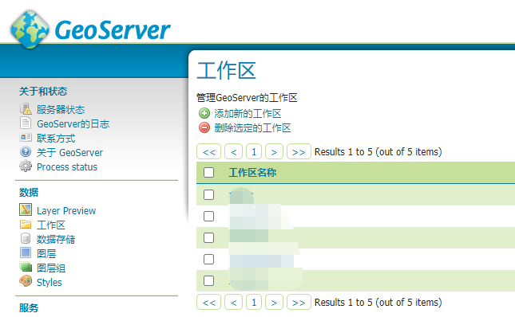

https://docs.geoserver.org/latest/en/user/gettingstarted/index.html#getting-started

# 使用web管理页面

网页访问地址是：

``` 
http://<host>:<port>/geoserver
```

默认是：

``` 
http://localhost:8080/geoserver
```

## 登录

为了安全着想，你还是登录吧。

1. 右上方输入账户密码：

    - 账户：admin 密码：geoserver

    注意：这个默认账户密码可以在“安全”部分修改。

2. 然后就OK了。功能都在左手边的一列。

## 图层预览（Layer Preview）

图层预览可以查看已经发布的图层。

# 发布shp文件

假设geoserver运行在`http://localhost:8080/geoserver`上。

## 数据准备

首先，获取数据。

1. 下载官方的数据：[`nyc_roads.zip`](https://docs.geoserver.org/latest/en/user/_downloads/30e405b790e068c43354367cb08e71bc/nyc_roads.zip)，是一份纽约的城市数据。
2. 解压到一个名为`nyc_roads`的目录。
3. 把`nyc_roads`目录移动到`<GEOSERVER_DATA_DIR>/data`下。

## 创建工作区（workspace）

下一步就是给shp文件创建工作区。

**工作区，就是一个容器，用来存放相似的图层。**

> 注意：这一步不是必须的，可以用自带的工作区。不过为了相对独立，还是建议建一个。

1. 打开web管理页面，登录

2. 在左侧找到工作区，如下图：

    

3. 点击“添加新的工作区”

4. 然后，你需要输入工作区的名称，还有URI：

    

5. 输入名称“nyc”，输入URI“http://geoserver.org/nyc”

    名称不能超过10个字符（含空格），URI并不需要是一个真实的URL，仅仅做关联使用（你也可以随便写，能识别就行）

6. 点提交，完成创建。

## 创建一个数据存储

创建晚工作区后，就需要创建一个数据存储。

**数据存储告诉GeoServer如何连接到shp文件。**

1. 找到左侧：数据👉数据存储

2. 现在可以看到数据存储的列表，包括它的类型、所属哪个工作区。

3. 为了添加shp文件，你需要点击“添加数据存储”按钮，然后页面跳转到一个类型列表。注意，类型列表是可以通过插件扩展的。默认是这样：

    

4. 点击“shapefile”，然后“新增矢量数据源”的页面就打开了。

5. 开始填写基本信息。

    - 选择工作空间
    - 输入数据源的名称
    - 输入一个简单的描述

6. 在连接参数的地方，输入本机上这个shp文件的路径。用右边的“浏览”自己定位也可以，还能切换硬盘分区。

7. 点击保存，新的数据存储就创建好了。

## 创建一个图层

现在，数据存储已经加载到geoserver了，然后我们需要发布图层。

1. 在左侧：数据👉图层中，点击“添加新的资源”，发布它。


2. 然后来到编辑图层的页面，需要添加一些参数。输入**名称**，这个是必须的。标题、摘要不必须，但是建议填写。
3. 从数据计算NativeBoundingBox和纬度/经度边框。
4. 点击发布选项卡，可以设置一些样式，不过这就不介绍了。
5. 最后滚动到页面最下方，点击保存。

## 预览图层

为了验证发布成功与否，我们可以预览它。

去左侧：数据👉图层预览，即可选择对应的图层、合适的方式预览。

# 发布PostGIS的一个数据表

假定pg已经安装在你电脑上，并且在5432端口运行，并且还假定geoserver安装在localhost:8080/geoserver上。

## 数据准备

1. 下载官方数据：[`nyc_buildings.zip`](https://docs.geoserver.org/latest/en/user/_downloads/bbd4b941ceb36074c9d19feab3f57609/nyc_buildings.zip).

2. 创建一个pg数据库，名为`nyc`：

    ``` shell
    createdb nyc
    psql -d nyc -c 'CREATE EXTENSION postgis'
    ```

3. 解压下载到的zip文件，得到sql文件

4. 导入sql文件到nyc数据库：

    ``` shell
    psql -f nyc_buildings.sql nyc
    ```

## 创建工作区

工作区和shp一样。

## 创建一个数据存储

数据存储和shp不太一样。

在添加数据源页面时，选择`PostGIS`，输入的信息如下：

- 选择工作区
- 输入数据存储名
- （可选）一个简单的描述
- host（主机名，如果是本机就写localhost，远程写ip地址）
- 端口
- 数据库
- 模式
- pg的账户密码

然后点击保存即可。

## 创建一个图层

和shp的一样，不重复了。

## 预览图层

和shp的一样，不重复了。
