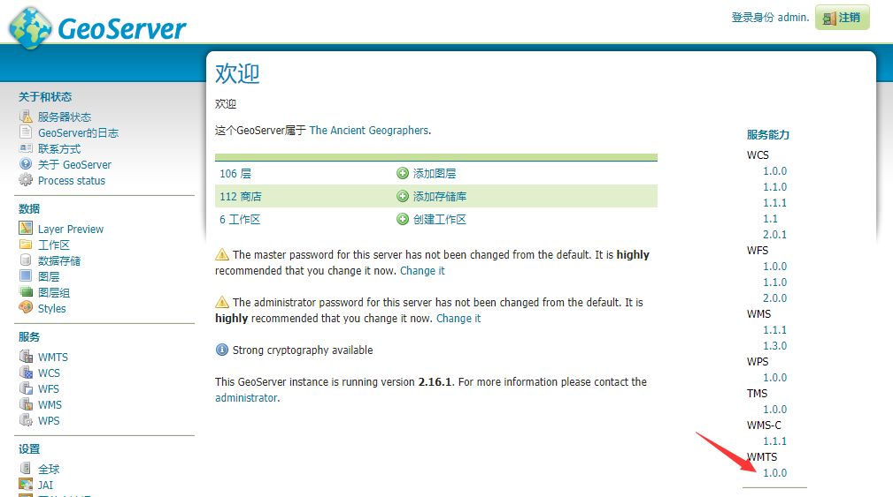
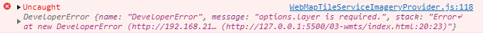
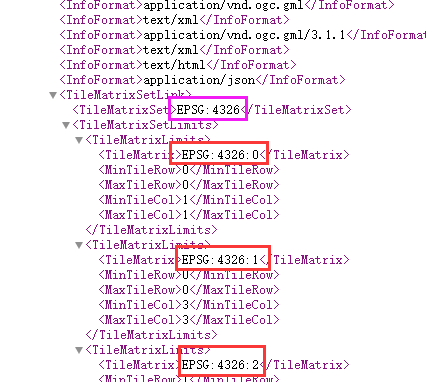
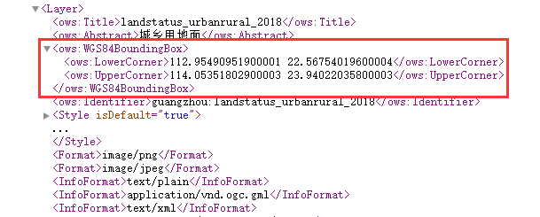

# Cesium WMTS(GeoServer GWC)

基本代码：

``` JS
const url = `<待查找>`
viewer.imageryLayers.addImageryProvider(new Cesium.WebMapTileServiceImageryProvider({
    url: url,
    layer: `<待查找>`,
    style: '', // 空即可，空就会用默认的样式
    format: 'image/png', // 一般png就好
    tileMatrixSetID: `<待查找>`, //
    tileMatrixLabels: [`<待查找>`],
    tilingScheme: new Cesium.GeographicTilingScheme(), // 如果WMTS的坐标系是地理坐标系，必须写这个
    maximumLevel: 13,
    minimumLevel: 0
}))
```

## URL的查找

打开geoserver的wmts元数据页面，找到ResourceURL，复制粘贴即可

例如：



点击“1.0.0”这个版本号，进到GetCapabilities返回页面，找到想要加载的layer：


然后找到想要的格式的ResourceURL，获取其template即可。

## Layer查找

把上面那个ResourceURL的layer参数粘贴到构造函数里即可。

就算URL里有layer参数，构造函数也必须存在layer参数，否则会报错误：



## tileMatrixSetID和tileMatrixLabels



tileMatrixSetID是XML中的紫色框框的值，tileMatrixLabels是数组，即红色框框的值。

``` JS
...
tileMatrixSetID: "EPSG:4326",
tileMatrixLabels: ['EPSG:4326:0', 'EPSG:4326:1', 'EPSG:4326:2', 'EPSG:4326:3', ...]
```

## tilingScheme

切片方案，根据坐标系而定，根据实践，如果WMTS是地理坐标系，那么这个参数是必须的。

``` JS
tilingScheme: new Cesium.GeographicTilingScheme()
```

GeographicTilingScheme默认的地理坐标系切片方案是WGS84。


## *获取切片报错原因

使用CesiumUnminified.js会报错：

``` 
An error occurred in "WebMapTileServiceImageryProvider": Failed to obtain image tile X: 105 Y: 22 Level: 6.
```

Cesium会按全世界范围加载WMTS，就算WMTS数据完全没有问题，如果没有瓦片的地方就会报错，控制台飘红+400.

GWC是按**“有数据的地方则切图，没数据的地方不切图”**的规则切图的。

如果有报错，指定`WebMapTileServiceImageryProvider`的`rectangle`参数即可。

这个值可以在上述XML中找到：

