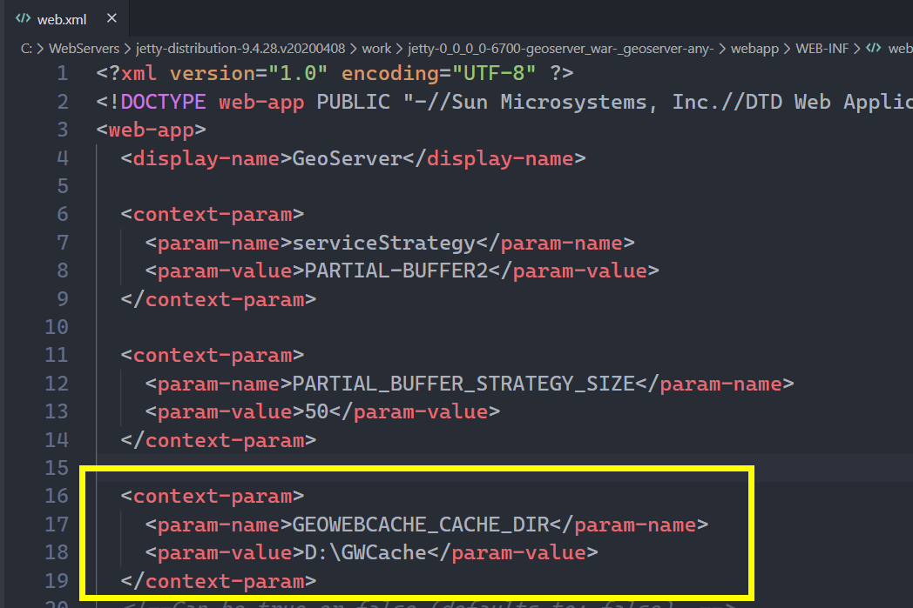

# [GeoServer2.17与Jetty9在Windows上的最佳安装实践](https://www.cnblogs.com/onsummer/p/12940750.html)

# 1 JDK的选择

我使用了adopted openjdk8.0.252，安装简便，只需添加2个环境变量（JAVA_HOME，JRE_HOME）即可。

我的安装路径：

`C:\SDKs\adoptopen-jdk8.0.252`

所以环境变量：

| 环境变量名  | 值                                 |
| ----------- | ---------------------------------- |
| `JAVA_HOME` | `C:\SDKs\adoptopen-jdk8.0.252\`    |
| `JRE_HOME`  | `C:\SDKs\adoptopen-jdk8.0.252\jre` |

# 2 Jetty 9

选择的理由是尝鲜，看看部署起来和tomcat有什么区别，虽然不是后端开发出身，不过喜欢体验新组合新事物。

安装路径：`C:\WebServers\jetty-distribution-9.4.28.v20200408`

## 修改端口

默认端口是8080，我打算改成6700

打开安装路径下的`start.ini`

找到注释行：

```ini
# jetty.http.port=8080
```

解开注释，修改端口：

``` INI
jetty.http.port=6700
```

## 作为Windows服务启动

不想每次都双击start.jar文件，Windows服务是一个不错的选择。

到github上下载一个叫`Winsw`的小工具，仓库地址：

```
https://github.com/winsw/winsw
```

到release页面下载合适的版本即可，把下载到的exe程序放到安装路径下，创建与exe文件名一样的xml文件：

``` XML
<!-- 假设exe文件名被我改成winsw.exe，那么这个xml的文件名就是winsw.xml -->
<service>
    <id>Jetty9</id>
    <name>Apache Jetty 9</name>
    <description>你的描述</description>
    <executable>java</executable>
    <arguments>-jar start.jar</arguments>
</service>
```

id、name、description都可以自己写，只要你认得就可以，id要唯一。

executable是可执行程序，arguments是可执行程序传入的参数，这里就是说用java.exe程序执行参数`-jar start.jar`。

当然，如果没有`JAVA_HOME`配置环境变量，那么就要写全java程序的绝对路径了。因为这个xml文件和start.jar同级，start.jar的路径就不需要绝对路径了。

然后打开cmd，定位到安装目录下，执行下列命令：

``` powershell
winsw.exe install
```

就能安装成Windows服务了：


# 3 war包安装geoserver

这一步很简单，下载stable版本的geoserver-war包，放到jetty安装目录下的webapps目录下，重启jetty服务，过一会儿，访问这个路径就可以了：

```
http://localhost:6700/geoserver
```

# 4 跨域和gwc、默认数据路径配置

jetty9有个和tomcat9不太一样的地方，就是war包不会解压到webapps下，会解压到一个系统临时目录去。

这对于要增加geoserver插件、修改geoserver配置的任务来说，有点不对劲。

查了查资料，jetty和tomcat对war包的处理方式并不一样。

[引用资料](https://www.iteye.com/blog/weifly-1772051)

> jetty中处理war包解压的代码是：org.eclipse.jetty.util.resource.JarResource。使用JarInputStream来读取war文件，JarInputStream是首先处理可选的META-INF/MANIFEST.MF文件，也就是说getNextJarEntry方法不可能处理META-INF/MANIFEST.MF文件了，因此jetty会在处理完所有的JarEntry后，自己处理META-INF/MANIFEST.MF文件。但是，这样做的后果就是，不能设置解压出来的META-INF/MANIFEST.MF文件的最后修改时间。
>
> tomcat中处理war包解压的代码：org.apache.catalina.startup.ExpandWar。使用JarFile来读取war文件，这样可以获得war中所有的JarEntry，不需要自己去处理META-INF/MANIFEST.MF文件。
>
> 显然，tomcat的做法更合理一些，其保证了解压出来的文件具有和war中文件一样的最后修改时间。

## 解压到jetty安装目录

在jetty安装目录下创建`work`文件夹，重启jetty后就能看到war包解压的文件了。


点进去就能找到`WEB-INF/web.xml`文件了，也能加jar包扩展geoserver了。

跨域很好解决，把`WEB-INF/web.xml`内有关的配置解开注释即可，与tomcat配置法相同，不再赘述（需要添加额外的jar包请自己下载）。

## gwc缓存路径设置

打开`WEB-INF/web.xml`后，添加一项：



重启后，GWC的缓存路径就重新定向了，妈妈再也不用担心我的webapp越来越肥。

GEOSERVER_DATADIR也一样。

