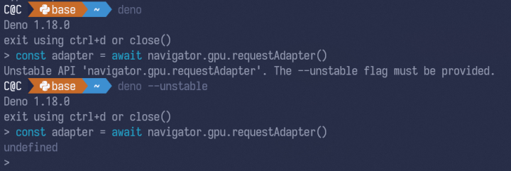
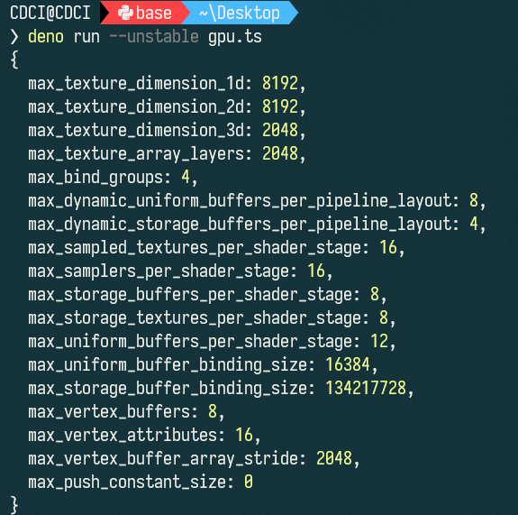
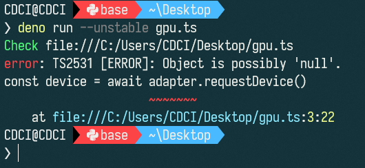

支持 WebGPU API 的环境，可不止浏览器一个。

虽说 NodeJS 没什么消息说要支持，但是 Deno 这个 js/ts 运行时老早就支持了，能脱离浏览器直接在控制台访问 GPU，感觉十分有趣。

## 确保 Deno 版本

至少要高于 1.8，最好装最新

```
> deno --version

deno 1.18.0 (release, x86_64-pc-windows-msvc)
v8 9.8.177.6
typescript 4.5.2
```

## 命令行交互式获取 GPUDevice

发文时，WebGPU 尚未正式公布，仍需要加上不安全标记来运行命令行交互式环境：




随后就可以轻松地获取 GPUDevice 了，只需两行代码（假如不检查错误情况）：

```
const adapter = await navigator.gpu.requestAdapter()
const device = await adapter.requestDevice()
```

## 代码文件获取 GPUDevice

源码非常简单

```
navigator.gpu.requestAdapter().then((adapter) => {
  if (adapter === null) {
    console.log('GPUAdapter 请求失败')
    Deno.close(0)
  } else {
    return adapter.requestDevice()
  }
}).then((device) => {
  if (!device) {
    console.log('GPUDevice 请求失败')
    Deno.close(0)
  } else {
    console.log(device.limits)
  }  
})
```

然后运行之：




## Top-level Await 不生效

对于顶级 await 获取的方式貌似不可行，不知道是不是 deno 的问题。

```
// gpu.ts
const adapter = await navigator.gpu.requestAdapter()
const device = await adapter.requestDevice()
console.log(device.limits)
```




