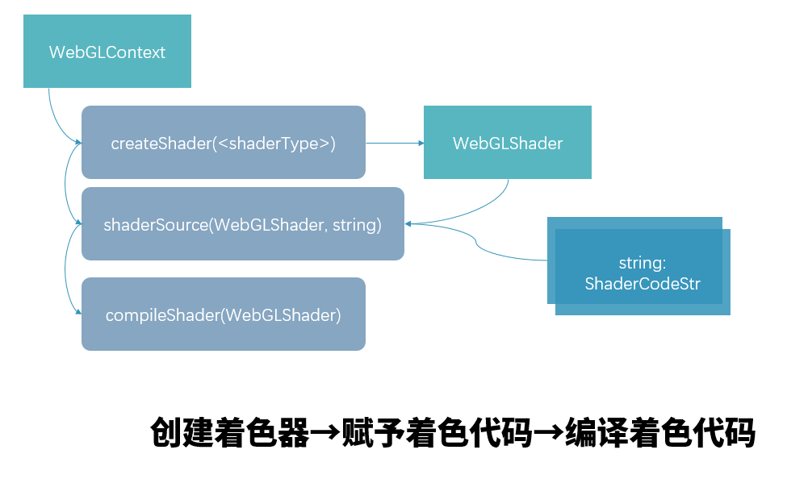
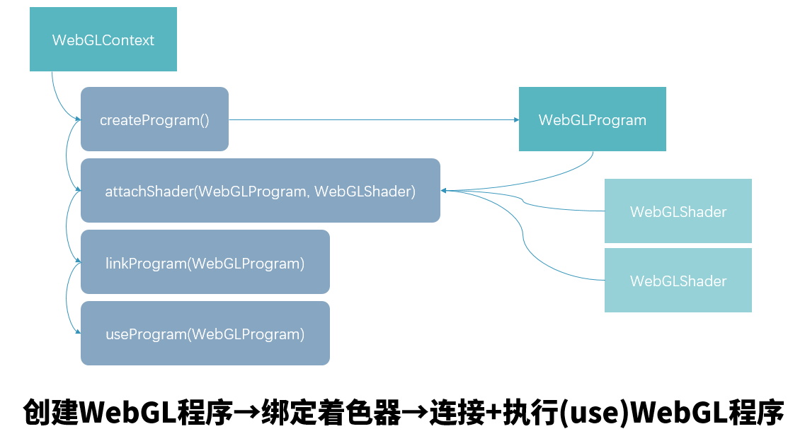
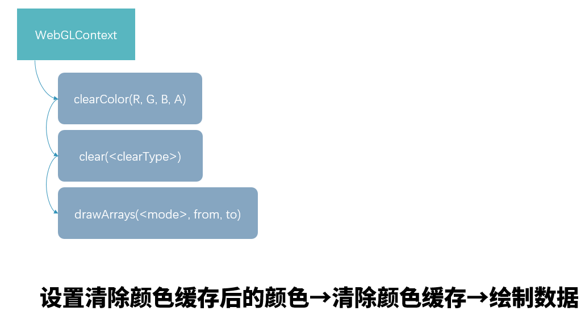

> 人总是爱折腾的吧。——鲁迅

# 1 代码

``` html
<canvas id="webgl-canvas" style="width: 1000px; height: 800px;"></canvas>
```

``` javascript
const canvas = document.getElementById('webgl-canvas')
resize(canvas)
const gl = canvas.getContext('webgl')

// shader
const vertexShader = gl.createShader(gl.VERTEX_SHADER)
gl.shaderSource(vertexShader, vs_source)
gl.compileShader(vertexShader)
const fragmentShader = gl.createShader(gl.FRAGMENT_SHADER)
gl.shaderSource(fragmentShader, fs_source)
gl.compileShader(fragmentShader)

// program
const glProgram = gl.createProgram()

gl.attachShader(glProgram, vertexShader)
gl.attachShader(glProgram, fragmentShader)
gl.linkProgram(glProgram)
gl.useProgram(glProgram)

// draw
gl.clearColor(0.5, 0.2, 0.5, 1.0)
gl.clear(gl.COLOR_BUFFER_BIT)
gl.drawArrays(gl.POINTS, 0, 1)

function resize(canvas) {
    canvas.width = canvas.width != canvas.clientWidth ? canvas.clientWidth : canvas.width;
    canvas.height = canvas.height != canvas.clientHeight ? canvas.clientHeight : canvas.height;
}
```

乍一看非常长，确实很长，那就画图

## 步骤一：着色器对象(Shader)创建与编译



## 步骤二：WebGL程序的创建+绑定着色器



## 步骤三：清除颜色缓存+绘制着色器处理的数据



# 2 理思路

html css 的组织就不说了，重点在 js代码。

shader的代码必须转换成字符串，这是前提。

## ① 三个关键类

- WebGLContext
- WebGLShader
- WebGLProgram

`WebGLContext` 即代码中的 `gl` 对象，由 `canvas.getContext('webgl')` 返回。它负责掌管与WebGL渲染绝大部分的功能。

`WebGLShader` 是着色器对象。

`WebGLProgram` 是运行在 GPU 中图形程序的一个抽象，可以理解为一个帮我们与显卡打交道的对象。

## ② 路线

获取 `WebGLContext` 

→ 由 `WebGLContext` 创建 `WebGLShader`，并赋予着色器代码文本，并编译着色器代码

→ 由 `WebGLContext` 创建 `WebGLProgram`，并绑定着色器，随后令GPU链接、编译 `WebGLProgram`，并使用（或者叫启动）它

→ 由 `WebGLContext` 设置颜色缓存区（即将颜色整体赋予给颜色缓存，缓存有很多种，以后慢慢讲），随后使用 `clear()` 清除当前颜色缓存，随后使用 `drawArrays()` 向 `WebGLProgram` 发出绘制指令，最终完成绘制

其中，设置颜色缓存区 `gl.clearColor()` 并不是必须的，不设置背景色就是白色的而已。

# 3 窗口尺寸问题

`canvas` 的 `width` 和 `height` 属性与其 CSS 属性：`width`、`height` 其实并不是一个东西

CSS中宽和高代表的是HTML在屏幕（浏览器窗口）中的大小，而 `canvas` 自己的宽高是 **WebGL在 `canvas` 上绘制一帧的帧分辨率大小。**

如果 `canvas` 的宽高与 CSS 的宽高不一致，那么就会缩放到 CSS 指定的宽高上，有时候会出现模糊等问题。

## gl.viewport()

这个还不知道是什么，后续学到视窗的时候再说吧。