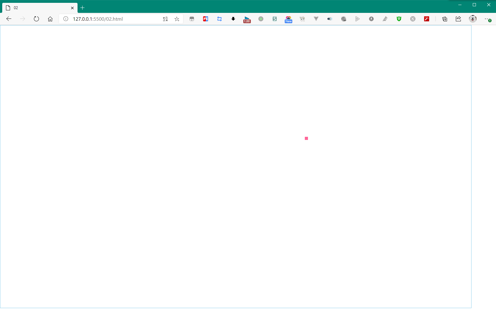
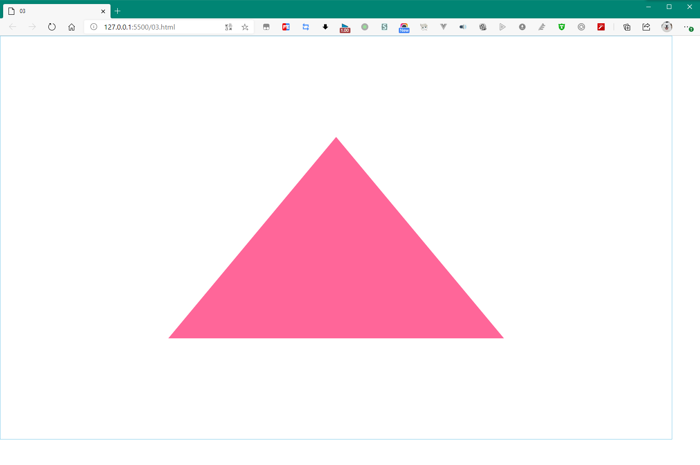

第一篇介绍了启动 webgl 程序的流程，其中就包括 WebGLProgram 绑定、编译  GLSL 着色器源代码的步骤。

第一篇绘制的是一个点，通过修改着色器源代码，可以改点的颜色、尺寸、大小，那么如何从 js 中传递数据呢？

先看看画出来啥样（canvas元素加了个外框）：



偌大个浏览器界面，画了个玫红色的点...


# 1. “接住”

既然传递数据，那么 GLSL 源代码中肯定有接收器，是上一篇提到的 被 `attribute`、`uniform`、`varying` 修饰的那些变量

`attribute` 变量，在顶点着色器用于 接受 每个顶点 相关的数据，例如 坐标 `vec4`、uv `vec2`、法线 `vec3`、顶点颜色 `vec4` 等

`uniform` 变量，在顶点着色器或片元着色器 接受 普通数据，例如 转换矩阵 `mat234` 、固定颜色 `vec4` 等

`varying` 变量，用于顶点着色器和片元着色器之间传输数据，现在还用不到


## 顶点着色器

``` GLSL
/* GLSL */
attribute vec4 point;
void main() {
    gl_Position = point;
    gl_PointSize = 10.0;
}
```

## 片元着色器

``` GLSL
/* GLSL */
// 指定数值精度
precision mediump float;
uniform vec4 fragColor;
void main() {
    gl_FragColor = fragColor;
}
```


# 2. 传过去

上面已经有两个坑接收数据了：`attribute vec4 point` 和 `uniform vec3 fragColor`

那么如何传递数据到这两个坑里呢？


``` JS
/* JavaScript */

const gl = initShader(canvas, vs, fs) // 我嫌创建 上下文、program，绑定、编译着色器等步骤繁杂，封装了一个函数，下面会给出

let pointLocation = gl.getAttribLocation(gl.program, 'point')
let pointColorLocation = gl.getUniformLocation(gl.program, 'fragColor')
gl.vertexAttrib3f(pointLocation, 0.3, 0.2, 0.0)
gl.uniform4f(pointColorLocation, 1.0, 0.4, 0.6, 1.0)

gl.clear(gl.COLOR_BUFFER_BIT)
gl.drawArrays(gl.POINTS, 0, 1) // 绘制 点 ，从 0 开始，画 1 个
```

这便是最核心的代码了，首先使用两个变量记录 glsl 中那两个坑的位置，方便传递数据，用了两个方法：

- `WebGLRenderingContext.getAttribLocation(WebGLProgram, string)` 返回值是 `number`，若＜0代表不存在

- `WebGLRenderingContext.getUniformLocation(WebGLProgram, string)` 返回值是 `WebGLUniformLocation`，若为null代表不存在

> 注意，尽管 `initShader()` 函数返回的是 `WebGLRenderingContext` 对象，但是在 MDN 中这个类并没有 `program` 这个 类为 `WebGLProgram` 的属性，是我在 `initShader ` 函数中返回 gl 对象前绑定的。

接着，通过两个方法把顶点、颜色数据传递到这两个坑：

`WebGLRenderingContext.vertexAttrib3f(attributeLocation:number, x:number, y:number, z:number)`

`WebGLRenderingContext.uniform4f(attributeLocation:WebGLUniformLocation, x:number, y:number, z:number, w:number)`

> 函数签名习惯用 typescript 的风格了。

最后调用 clear() 清除绘图缓存，调用 drawArrays() 绘制传入的数据。

## (＾Ｕ＾)：initShader() 源码

``` JS
function initShader(canvas, vsSource, fsSource){
    if (!(canvas instanceof HTMLElement))
        return
    if (typeof vsSource != "string" && typeof fsSource != "string")
        return

    // resize(canvas);
    let gl = canvas.getContext('webgl')
    
    const vertexShader = gl.createShader(gl.VERTEX_SHADER)
    const fragmentShader = gl.createShader(gl.FRAGMENT_SHADER)
    gl.shaderSource(vertexShader, vsSource)
    gl.shaderSource(fragmentShader, fsSource)
    gl.compileShader(vertexShader)
    gl.compileShader(fragmentShader)

    const glProgram = gl.createProgram()
    gl.attachShader(glProgram, vertexShader)
    gl.attachShader(glProgram, fragmentShader)
    gl.linkProgram(glProgram)
    gl.useProgram(glProgram)

    gl.program = glProgram // 绑定 program 到 gl 变量上，方便读取

    return gl
}
```

注意返回 gl 前绑定的 program。


# 3. 从外部传入点数据总结

## ① 核心方法

- **`WebGLRenderingContext.getAttribLocation(WebGLProgram, string)` ** ：获取 attribute 类型的变量位置，返回 number
- **`WebGLRenderingContext.getUniformLocation(WebGLProgram, string)`** ：获取 uniform 类型的变量位置，返回 WebGLUniformLocation
- **`WebGLRenderingContext.vertexAttrib3f(attributeLocation:number, x:number, y:number, z:number)`** ：设置 attribute vec3 类型 的数据
- **`WebGLRenderingContext.uniform4f(attributeLocation:WebGLUniformLocation, x:number, y:number, z:number, w:number)`** ：设置 uniform vec4 类型的数据

上两个获取变量位置，下两个传递数据

## ② 思考

既然 program 和 shader 代码都完成编译、链接了，那么只能说明一件事：

shader，也即着色器代码，在初始化的时候是固化在 GPU 中，后续还能传递什么数据，完全靠 shader 源代码控制。

这与普通的 可执行程序 思路是一样的，都是 源代码 👉 程序，然后 程序调用 👉 传值进去。


# 4. 绘制三角形：使用 TypedArray

不能再愚蠢地一个一个点绘制了，这次要一次画三个点，并绘制出这三个点构成的三角形区域。

着色器仍然不变，看看绘制三角形需要什么代码：

``` JS
/* JavaScript */

const gl = initShader(canvas, vs, fs)

// TODO 绘制三角形的代码，下面再给

gl.clear(gl.COLOR_BUFFER_BIT)
gl.drawArrays(gl.TRIANGLES, 0, 3) // 画三角形，从第 0 个开始， 画 3 个点，构成 三角形
```

注意最后一个 `drawArrays`，第一个参数已经从 `gl.POINTS`，变成了 `gl.TRIANGLES`，number 出来就是 4，POINTS 是0.

这个参数，诠释了为什么绘制的函数叫 `drawArrays()` 而不是 `drawPoints`、`drawPolygon`，因为太多了还不如用一个参数指定，减少对外的API。

`drawArray()` 其实就是绘制 程序内的顶点用的，至于顶点怎么绘制，第一个参数指定。

感兴趣的可以去看看 `WebGLRenderingContext.POINTS/TRIANGLES` 等的含义，它们是一些常数，代表了顶点如何被绘制，绘制成点，线，还是三角形，是三角形的话，三角形如何拼接等。我们这里用的是 `gl.TRIANGLES`。

注意，如果传入的点数不是3的倍数，最后余下的点被忽略。

见下图：


扯远了，看看画三角形的核心代码：

``` JS
let vertexBuffer = new Float32Array([0, 0.5, -0.5, -0.5, 0.5, -0.5]) // 二维坐标的三个点，占 6 × 4(8bit eq. 1byte) = 24bytes

/** 开辟显存，绑定数据，赋予js内的数据 */
let buffer = gl.createBuffer()
gl.bindBuffer(gl.ARRAY_BUFFER, buffer)
gl.bufferData(gl.ARRAY_BUFFER, vertexBuffer, gl.STATIC_DRAW)

/** 获取attribute，并解析buffer内的数据 */
let pointLocation = gl.getAttribLocation(gl.program, 'point') // 获取顶点着色器内 attribute 变量 point 的指针
gl.vertexAttribPointer(pointLocation, 2, gl.FLOAT, false, 0, 0)
gl.enableVertexAttribArray(pointLocation)
```

## ① 创建内存数组

使用普通 JavaScript 数组性能不够，HTML5规范中为了支持文件读写、文件流的操作、webgl所需的高性能，推出了类型数组的API。

其中，`Float32Array` 就是一种类型数组，它真实的数据是 `Float32Array.buffer` 中存储的，有兴趣可以看看。

这里传递了 6 个数字，代表了二维中的三个点，那么 webgl 如何知道我这连续两个取为一个点呢？倒数第二行就有个2看到了吗？待会再解释。

## ② 开辟一块显存并绑定内存数组

中间的三行：

- 通过 `WebGLRenderingContext.createBuffer()` 方法申请一块显存（此时显存 要存放 什么数据 不知道），显存用于与内存进行交互数据，注意这个方法在失败时会返回null。
- 然后通过 `WebGLRenderingContext.bindBuffer()` 指定这块显存的类型是 `WebGLRenderingContext.ARRAY_BUFFER`，这是个常数来着的，34962，GLTF格式中常见，这个常数的意思是，这块显存要存储顶点有关的数据。如果指定 `WebGLRenderingContext.ELEMENT_ARRAY_BUFFER`，即 34963，那么存储的是顶点的索引数据。
- 最后通过 `WebGLRenderingContext.bufferData()` 将内存数组存放的数据绑定到申请的内存上。

我比较感兴趣最后一个方法的参数，摘抄 《WebGL编程指南》如下：

WebGLRenderingContext.bufferData(target, data, usage)

| 参数   | 值类型或可选值                                               | 意义                                                         |
| ------ | ------------------------------------------------------------ | ------------------------------------------------------------ |
| target | WebGLRenderingContext.ARRAY_BUFFER 或 WebGLRenderingContext.ELEMENT_ARRAY_BUFFER | 和 `bindBuffer` 的那个参数意义一样                           |
| data   | Float32Array等类型数组                                       | 写入这块显存的数据                                           |
| usage  | WebGLRenderingContext.STATIC_DRAW/STREAM_DRAW/DYNAMIC_DRAW   | STATIC_DRAW是只写入一次显存，但要绘制多次；STREAM_DRAW是只写入一次显存，绘制有限次；DYNAMIC_DRAW是写入多次，绘制多次 |

到第二步这三行结束，内存的工作就完成了，现在数据已经到显存中。

## ③ 获取glsl中预留的顶点坑位，传入显存中的数据到 gl 程序

- `WebGLRenderingContext.getAttribLocation()`  获取 attribute 类型的坑位，上面有详解不说了
- `WebGLRenderingContext.vertexAttribPointer()` ：告诉 gl 程序如何解析数据
- `WebGLRenderingContext.enableVertexAttribArray()`  ：启用 attribute 变量 与 显存数据 的连接

后面这个俩方法很关键，看看它们的函数签名：

`vertexAttribPointer(location: number, size: number, type: enum, normalize: bool, stride: number, offset: number)`

| 参数      | 值类型或可选值                                               | 意义                                                         |
| --------- | ------------------------------------------------------------ | ------------------------------------------------------------ |
| location  | 由 getAttribLocation() 返回的值，即 attribute 变量在 gl 程序中的地址 | /                                                            |
| size      | 1~4                                                          | 类型数组中多少个值为一组，如果 size 比 attribute 变量的数值类型小，那么默认按 attribute 变量的长度补齐，补0位；例如，size = 2，但是attribute 是vec4，那么第3、4分量为0. |
| type      | gl.UNSIGNED_BYTE/SHORT/UNSIGNED_SHORT/INT/UNSIGNED_INT/FLOAT | 数字的值类型                                                 |
| normalize | true false                                                   | 如果传入的数据值域超过 [0,1] 或 [-1, 1]，那么填入false 可以归一化数据 |
| stride    | 默认0                                                        | 前一个和后一个 attribute 数据中间夹多少个字节                |
| offset    | 默认0                                                        | 当前attribute 变量从第几字节开始存储数据                     |

此方法的意义是，告诉 gl 程序那块位置的显存要按啥方式读取，gl 程序就会按传入的这些参数解析显存上的 attribute 类型数据。在代码中，自然指定的就是 每 2 个 gl.FLOAT 数据为一个坐标的顶点数据啦，这个数据存储在 名为 ‘point’ 的 attribute 变量中（见 shader代码）。

`enableVertexAttribArray(location: number)`：参数和上面这个方法的第一个参数意义一致。这个方法意义是，启用 attribute 变量，**建立显存与 gl 程序中 attribute 变量的连接。**

