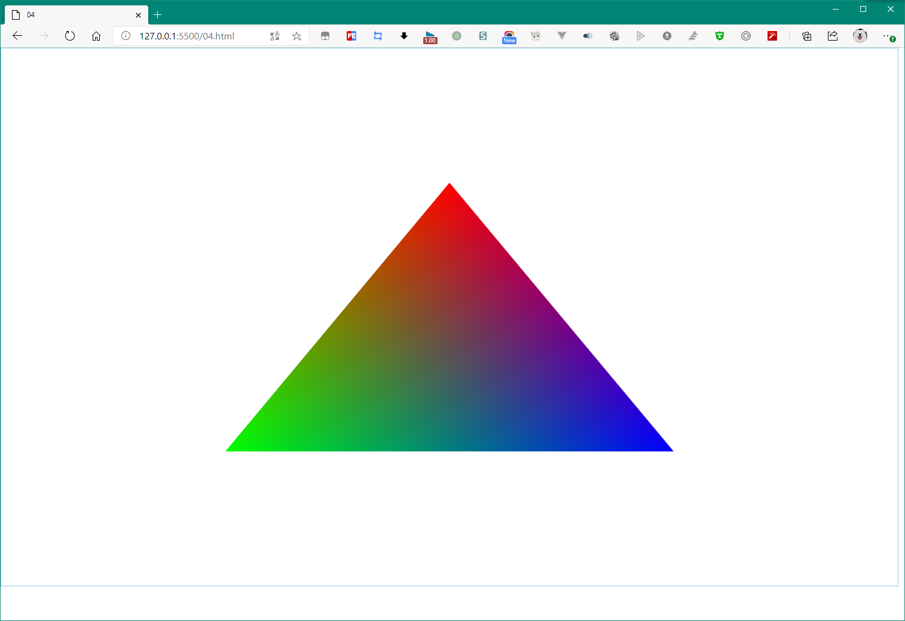

上两节都是在撸 顶点，顶点着色器一直在秀，现在该到 片元着色器秀的时候了。

在 图形学编程中，顶点是允许有颜色的，如果绘制的是三角形，那么三角形的面颜色就由顶点颜色插值而来。



# 1. 祭出着色器代码

## ① 顶点着色器

``` GLSL
attribute vec4 pointPosition;
attribute vec4 pointColor;
varying vec4 vColor;
void main() {
    gl_Position = pointPosition;
    vColor = pointColor;
}
```

## ② 片元着色器

``` GLSL
precision mediump float;
varying vec4 vColor;
void main() {
    gl_FragColor = vColor;
}
```

## ③ 解释

在顶点着色器中，通过 attribute 变量 `pointColor`，传递每个点的颜色到 桥梁变量 `varying vec4 vColor` ：`vColor = pointColor;`

然后，在片元着色器，便可通过同名变量（必须同名）获取到这个桥梁变量 `varying vec4 vColor`，传递给片元颜色 `gl_FragColor`

传递过来的 `vColor` 并不是顶点着色器中的 `pointColor`，而是顶点之间栅格像素的颜色，是插值得到的颜色。

就这么说吧，`pointColor` 是顶点的颜色，`vColor` 是顶点之间插值的颜色，只不过在顶点着色器中这么写，就让人误以为是顶点的颜色了。

# 2. 仍然是对类型数组的拼拼凑凑拆拆组组

现在，用5个数字构造一个顶点的二维坐标、三个颜色分量：[float x, float y, float red, float green, float blue]

既然都是 `float` 数据，那么一个顶点的信息，包括坐标和颜色，体积就是 5 × sizeof(float) = 5 × 4 = 20 bytes.

现在，构造一个三角形，每个顶点都有自己的颜色：

``` JS
let vertex_color_Buffer = new Float32Array([
    0.0,  0.5,  1.0,  0.0,  0.0, 
    -0.5, -0.5,  0.0,  1.0,  0.0, 
    0.5, -0.5,  0.0,  0.0,  1.0, 
])
```

不难观察，三个点的颜色是正红、正绿、正蓝。

给出全代码：

``` JS
const canvas = document.getElementById("board")
const gl = initShader(canvas, vs, fs)

let vertex_color_Buffer = new Float32Array([
    0.0,  0.5,  1.0,  0.0,  0.0, 
    -0.5, -0.5,  0.0,  1.0,  0.0, 
    0.5, -0.5,  0.0,  0.0,  1.0, 
])

let buffer = gl.createBuffer()
gl.bindBuffer(gl.ARRAY_BUFFER, buffer)
gl.bufferData(gl.ARRAY_BUFFER, vertex_color_Buffer, gl.STATIC_DRAW)

let pointLocation = gl.getAttribLocation(gl.program, 'pointPosition')
gl.vertexAttribPointer(pointLocation, 2, gl.FLOAT, false, 20, 0)
gl.enableVertexAttribArray(pointLocation)

let colorLocation = gl.getAttribLocation(gl.program, 'pointColor')
gl.vertexAttribPointer(colorLocation, 3, gl.FLOAT, false, 20, 8)
gl.enableVertexAttribArray(colorLocation)

gl.clear(gl.COLOR_BUFFER_BIT)
gl.drawArrays(gl.TRIANGLES, 0, 3)
```

与上篇绘制三角形一样，也需要对其 顶点坐标的 attribute 变量进行赋值，注意观察，因为类型数组多了颜色信息，那么就需要对其 颜色的 attribute 变量进行赋值：

``` js
// ...
let pointLocation = gl.getAttribLocation(gl.program, 'pointPosition')
gl.vertexAttribPointer(pointLocation, 2, gl.FLOAT, false, 20, 0)
gl.enableVertexAttribArray(pointLocation)

let colorLocation = gl.getAttribLocation(gl.program, 'pointColor')
gl.vertexAttribPointer(colorLocation, 3, gl.FLOAT, false, 20, 8)
gl.enableVertexAttribArray(colorLocation)
```

观察得知，除了 attribute 变量的名称发生了变化，就是两个 `vertexAttribPointer()` 方法的参数变化了。

## 解析顶点的坐标数据：2个数字一组

`gl.vertexAttribPointer(pointLocation, 2, gl.FLOAT, false, 20, 0)`

倒数第二个数字是20，意思与上文提及的 “一个顶点的信息，包括坐标与颜色，一共是20bytes”一致；

倒数第一个数字是0，代表从这20byte里，从第 **0** 个字节开始，取 **参数二 “2”** 个，每个数字的类型是 **参数三 “gl.FLOAT”**（4字节）。

## 解析顶点的颜色数据：3个数字一组

`gl.vertexAttribPointer(colorLocation, 3, gl.FLOAT, false, 20, 8)`

倒数第二个数字是20，意思与上文提及的 “一个顶点的信息，包括坐标与颜色，一共是20bytes”一致；

倒数第一个数字是8，代表从这20byte里，从第 **8** 个字节开始，取 **参数二 “2”** 个，每个数字的类型是 **参数三 “gl.FLOAT”**（4字节）。

# 附：报错信息

- WebGL: INVALID_VALUE: vertexAttribPointer: index out of range

  原因：gl.getAttribLocation() 变量取不到值。变量名对不上请仔细对照定义的变量名。

- INVALID_OPERATION: useProgram: program not valid

  原因：着色器变量赋值有问题导致program不能正常使用，是否写错变量名，是否变量与变量的类型不同（写反了之类）？

- 其他：https://blog.csdn.net/github_38108899/article/details/90443260

