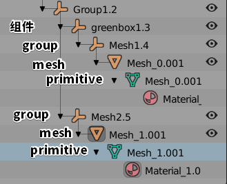

# 0. 技术路线

转三角化的 fbx，通过 Windows 3D 查看器观察绘图调用次数。

# 1. 组合

即 `Group`，对应 glTF 中的 node

如果组合下还有组合，即 node 下 还有 node

如果组合内存在图元，则引用至 mesh，至于 mesh 如何划分 primitive，看图元的材质个数。

## 一个 Group 里有多个图元

### ① 均为同一种材质

那么该 Group 就是单 Primitive 的 Mesh 的 Node

### ② 有 n 种材质

那么该 Group 就是 n 图元的 Mesh 

## 一个 Group 里有单个物体

如果该物体有多个材质，分为多 Primitive，构成单 Mesh

否则为 单 Primitive 的 Mesh

## 一个 Group 里有组件也有图元

不推荐

# 2. 组件

即 `Component`，仅对模型数据进行复用，不减少 drawcall

组件会作为一个包住一个 group 的 node 转换为 gltf。

group 一般就是引用 mesh 的 node 了。

证实：~fbx~（blender）gltf后，每个组件实例都独立成一个 Mesh，使用非重复引用 mesh 的 node 来区分层级。

每个 node 先是组件实例，下面一级子 node 是 再包了一层 node（我猜测是考虑到这一层 node 作为 su 组件的容器使用），才到真正引用 mesh 的 node。

# 3. 材质

见 1.

# 结论

直接推拉出来的所有图形均为图元（Primitive），如果材质相同，就是同一个 Primitive；如果材质不同，就创建多个 Primitive

默认场景是一个 node

