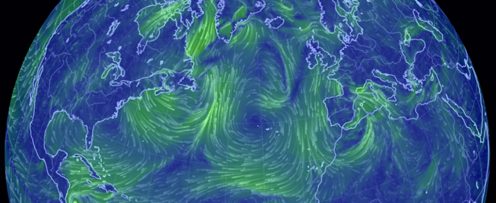
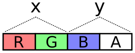
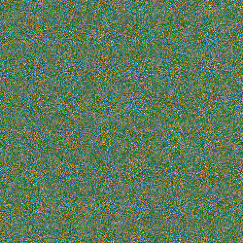
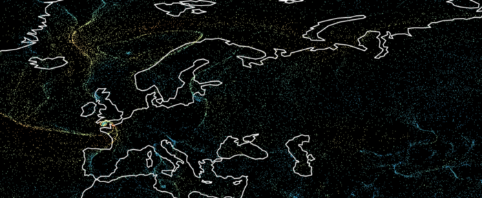
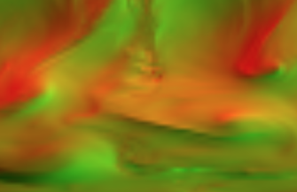
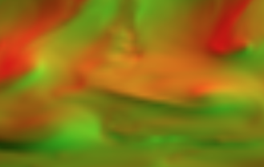

我如何使用 WebGL 来创建一个风向地图？

> 翻译：@四季留歌
>
> 部分翻译。

# 使用 CPU 进行风向可视化

有很多风力可视化在线网站，最出名的莫过于 [earth.nullschool.net](https://earth.nullschool.net/)。它并不是开源的，但是它有一个开源的旧版本，大多数现有方案都基于此实现。



通常，这种可视化依赖于 `Canvas 2D API`，大致的逻辑是这样的：

1. 生成一组随机粒子并绘制它们
2. 对于每个粒子，查询其位置上的风力值，并用此风力值移动此粒子
3. 将一小部分粒子重置，这样能保证粒子所覆盖的区域看起来比较丰满
4. 淡化当前帧，并在其上一层绘制新的一帧

这是有性能限制的：

- 风粒子数量不能太多，大约 5000 个
- 每次更新数据或者视图都会有很大的延迟，因为处理这些数据所用的 JavaScript 运行在 CPU 上，相当耗时

原作者在文章中提出一种使用 WebGL 的新绘制逻辑，这样速度很快，能画上百万个粒子，而且打算和 Mapbox GL 进行结合展示。

原作者找到了 Chris Wellons 写的关于如何使用 WebGL 粒子物理学的[绝棒教程](http://nullprogram.com/blog/2014/06/29/)，认为风力可视化可以使用类似的方。

# OpenGL 基础

简单概括原文就是，OpenGL 等图形技术就是在画三角形，虽然也能画点和线，但是用的比较少。

这节的重点是，在顶点着色器或者片元着色器添加一个纹理参数，然后在这个纹理上查找颜色。

这是本文关于风力可视化的重中之重。

# 获取风力数据

美国国家气象局每 6 个钟发布全球天气数据，这种数据叫做 `GFS`，大概就是经纬度的网格携带了有关的数据值。这种数据称为 GRIB，是一种特殊的二进制格式。可以用一些其他的工具解析为人类可读的 JSON（[工具](https://software.ecmwf.int/wiki/display/GRIB/Releases)）。

原作者写了一些脚本，将风力数据下载下来并转为 PNG 图像，风速编码为 RGB 色彩灰度值 —— 像素坐标代表经纬度，红色灰度值代表水平风速，绿色灰度值代表垂直风速。大概长这样：


分辨率可以更大，但是原作者认为全球可视化来说，这个分辨率够用了。

# 使用 GPU 移动粒子

风粒子是存在 JavaScript 数组中的，如何通过 GPU 运算去操作这些粒子对象？或许可以上计算着色器，但是设备兼容性会成大问题。

所以只能是这个选择：使用纹理。

OpenGL 规范不仅仅可以把 GPU 计算的结果画到屏幕上，还能把它画到纹理上（这个纹理有个特别的名字，叫帧缓存）。

因此，可以把粒子的坐标编码为 RGBA 值，然后传递到渲染管线中进行计算，计算完毕后，再编码到 RGBA 并绘制为新的图像。



为了满足 X 和 Y 坐标的精度，物尽其用，R和G通道这两个字节存储 X，B和A通道则存储 Y。那么，$2^{16}=65536$​ 个数字给到每个数字，应该够了。

一张分辨率为 500×500 的图像可以存储 25w 个粒子：



在片元着色器里操作这些像素代表的粒子即可。

下列是从 RGBA 四个通道灰度值解码、编码的 glsl 代码：

``` glsl
// 从粒子坐标纹理中取色值
vec4 color = texture2D(u_particles, v_tex_pos);

// 从 rgba 灰度值解码成坐标
vec2 pos = vec2(
	color.r / 255.0 + color.b,
  color.g / 255.0 + color.a
);

// ... 此处可以写移动粒子的坐标

// 编码坐标成 RGBA 灰度值
gl_FragColor = vec4(
	fract(pos * 255.0),
  floor(pos * 255.0) / 255.0
);
```

在下一帧，就可以绘制出这一个图像来。

每一帧，重复这个过程，即，只需两个纹理对象，交替计算和绘制就可以实现将风场模拟计算转移到 GPU 上来。

在极点附近的粒子和赤道附近的粒子相比，沿着 X 轴移动的速度会快得多，因为同样经度（X轴是纬线）跨度，赤道跨过的距离和极点跨过的距离是不一样的。

通过下列着色器进行改进：

``` glsl
float distortion = cos(radians(pos.y * 180.0 - 90.0));
// 这样，使用向量 (velocity.x / distortion, velocity.y) 移动粒子即可
```


# 绘制粒子

虽然 WebGL 大多数时候适合绘制三角形，但是这个场景下，绘制点就很合适了。

在顶点着色器中，对粒子纹理进行采样，以获取其坐标，然后，在风速纹理上采样获取 u 和 v 值，计算其风速（$speed^2=u^2+v^2$），然后将这个风速映射到渐变色带上，以进行着色。

此时，大概是这样的：



还行。看起来有点空空的，没有风的感觉，需要绘制轨迹线来完成可视化。

# 绘制粒子轨迹

绘制粒子到一个纹理上，然后在下一帧时，将其作为背景（略微变暗），并将另一张在上一帧已经用完的纹理设为本帧的绘制目标，实现交换绘制。


# 插值以获取风力值

风速数据是经纬网格上特定格网点的一些正北正东向的速度值。例如 `(50°N, 30°E)`、`(51°N, 30°E)`、`(50°N, 31°E)`、`(51°N, 31°E)` 等。那么，如何获取位于这四个点之间的中间值，例如 `(50.123°N, 30.744°E)`？

使用 `texture2D` 函数采样时，OpenGL 会帮你完成这事儿。

但是，风速数据那张纹理图片放大后锯齿、马赛克效应很明显，大概这样：



使用 **双线性插值** 算法，额外获取某个点附近的 4 个点，可以插值得到比较平滑的结果，这个可以在片元着色器上完成，效果如下：



# 使用 GPU 上的伪随机算法

在着色器程序中还有一个棘手的逻辑要实现，那就是粒子绘制完后，要重置它，如何随机重置呢？

先说明，着色器程序是没有内置的随机数生成器的。但是在 StackOverflow 上有一个用于生成伪随机数的函数：

``` glsl
float rand(const vec2 co) {
  float t = dot(vec2(12.9898, 78.233), co);
  return fract(sin(t) * (4375.85453 + t));
}
```

有了这个函数，可以做这样的事情：

``` glsl
if (rand(some_numbers) > 0.99) 
    reset_particle_position();
```


# 展望