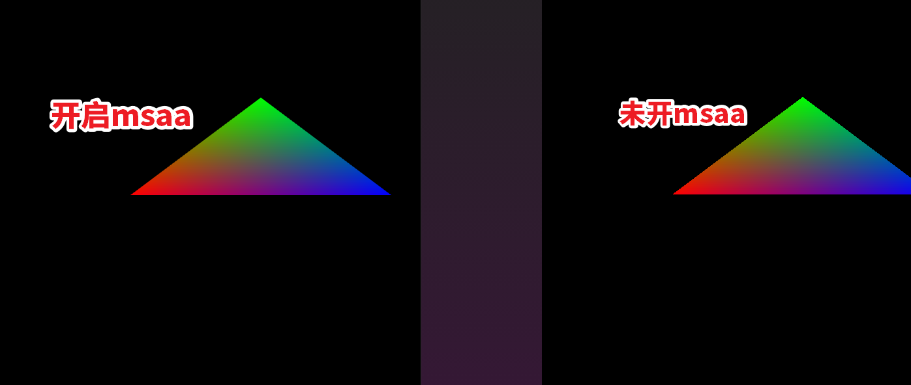

> 代码见：https://github.com/onsummer/my-dev-notes/tree/master/webgpu-Notes/03-msaa
> 更新日 2021年5月6日。 




指定重采样次数为 4 次，测试中除了 1 和 4 其他均不支持（可能是我没找对方法）。

``` js
  const sampleTimes = 4
```


# 修改 02 篇的代码以支持多重采样抗锯齿

> msaa，多重采样抗锯齿，根据修改的代码看，是先绘制到一个 texture 上然后再绘制到交换链的 texture 上。

首先，在创建渲染管线时增加 `GPUMultiSampleState` 项 `multisample`：

``` js
const pipeline = device.createRenderPipeline({
  vertex: // ... ,
  fragment: // ... ,
  primitive: // ... ,
  multisample: {
    count: sampleTimes
  }
})
```

然后，使用 `device.createTexture()` 方法创建一个纹理，并获取其访问视图

```JS
const texture = device.createTexture({
  size: {
    width: canvas.width,
    height: canvas.height,
  },
  sampleCount: sampleTimes,
  format: swapChainFormat,
  usage: GPUTextureUsage.RENDER_ATTACHMENT,
})
const msaa_textureView = texture.createView()
将 renderPassDescriptor 中 colorAttachments 中的 attachment 设为此 texture 的 view
将 renderPassDescriptor 中 colorAttachments 中的 resolveTarget 设为交换链的 texture 的 view
```

修改 `renderPassDescriptor` 中的 `colorAttachments`：

``` js
// 原来的
const textureView = swapChain.getCurrentTexture().createView()
const renderPassDescriptor = {
  colorAttachments: [
    {
      view: textureView,
      loadValue: {...}
    }
  ]
}
    
// 修改后的
const textureView = swapChain.getCurrentTexture().createView()
const renderPassDescriptor = {
  colorAttachments: [
    {
      view: msaa_textureView, // 注意此处变化
      resolveTarget: textureView, // 原来交换链的 textureView 被移到了 resolveTarget 项
      loadValue: {...}
    }
  ]
}  
```

最后抗锯齿的效果就出来了