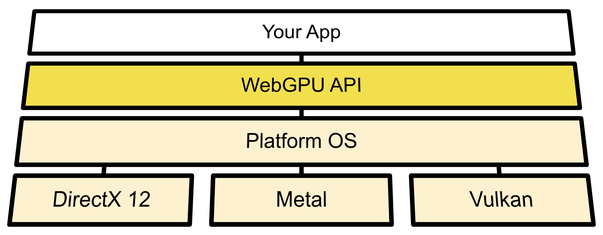

文章出处 https://web.dev/gpu/

| 文章发布时间  | 文章最后更新时间 | 翻译时间      | 翻译人   |
| ------------- | ---------------- | ------------- | -------- |
| 2021年8月26日 | 2021年9月6日     | 2021年9月10日 | 四季留歌 |

版权归原作者所有。转载翻译稿请带连接与翻译者。

WebGPU 支持 Web 端高性能 3D 图形显示和并行计算。

# 什么是 WebGPU？

WebGPU 是一个暴露了现代计算机图形能力（例如 D3D12，Metal，Vulkan）的 webAPI，使用 GPU 来进行渲染和计算操作。



> 译者注：上图很清晰地展示了 WebGPU 的定位，它高于操作系统，能调用具体操作系统对应的现代图形编程技术。

它的目标有点类似 WebGL，但是 WebGPU 允许使用更高级的现代 GPU 特性。WebGL 主要用于绘制图形图像，虽然可以费大力气来完成其他类型的计算，但是比起这种成本来说，WebGPU 直接支持普通 GPU 计算显得更棒。

经过 W3C 的 “GPU for the Web”社区组四年的开发，WebGPU 现在已经准备好让开发人员在 Chrome 中试用并提供反馈渠道。

Three.js 和 Babylon.js 的作者都点赞了 WebGPU，Babylon.js 的作者还尤其点到了 计算着色器 的威力，并给了一个简单的视频（需要翻墙才能看）

<video src="https://storage.googleapis.com/web-dev-uploads/video/vvhSqZboQoZZN9wBvoXq72wzGAf1/Xb7LvsJ5e8efTssp94c6.mov"></video>

使用 WebGPU 的计算着色器功能模拟动态大海水面。

# 当前状态

| 日程                   | 状态                                                         |
| ---------------------- | ------------------------------------------------------------ |
| 1. 写解释文档          | 完成，[WebGPU Explainer](https://gpuweb.github.io/gpuweb/explainer/) |
| 2. 写规范初始稿        | 进行中 [WebGPU Spec](https://gpuweb.github.io/gpuweb/)       |
| 3. 收集反馈 & 迭代设计 | 进行中 [点我参与反馈](https://web.dev/gpu/#feedback)         |
| 4. 试验                | 进行中                                                       |
| 5. 发布                | 没开始                                                       |

# 怎么使用 WebGPU

## ① 在 `://flags` 中启用

如果浏览器没开启 WebGPU 的标记，需要到 `://flags` 页面中启用 `#enable-unsafe-webgpu` 标记。

## ② 在试用阶段尝尝鲜

在 Chrome 94 版本，WebGPU 将作为 Chrome 的原生功能进行试用。

试用期到 2022 年 1 月 26 日 Chrome 97 版本发布为止。

# 检测 WebGPU 的支持情况

使用代码：

``` js
if ("gpu" in navigator) {
  // WebGPU is supported!
}
```

# 起步

WebGPU 是一个底层 API，像 WebGL 一样。它很强大，写起来很枯燥、冗长，在写它的代码之前需要对相关概念进行学习。下面几个连接是一些高质量的文章博客，仅供参考：

- **[Get started with GPU Compute on the web](https://web.dev/gpu-compute/)**
- [A Taste of WebGPU in Firefox](https://hacks.mozilla.org/2020/04/experimental-webgpu-in-firefox/)
- [WebGPU for Metal Developers, Part One](https://metalbyexample.com/webgpu-part-one/)
- **[Learn what key data structures and types are needed to draw in WebGPU](https://alain.xyz/blog/raw-webgpu)**
- [WebGPU Explainer](https://gpuweb.github.io/gpuweb/explainer/)

# 浏览器支持情况

ChromeOS、macOS、Windows10 上的 Chrome 94 以及众多显卡已经能用 WebGPU 了。

Linux 系统需要启动 Chrome 时带上 `--enable-features=Vulkan` 参数。

更多平台在计划。

撰写本文时，Safari 和 Firefox 对 WebGPU 的支持正在计划中。

# 平台支持

和 WebGL 生态类似，这里有一些实现了 WebGPU 规范的库：

- [Dawn](https://dawn.googlesource.com/dawn) - 一个 C++ 版本的 WebGPU 实现，在 Chromium 项目中使用到了。它能在 C 和 C++ 代码中使用 WebGPU，然后通过 `Emscripten` 移植为 WebAssembly 并在浏览器中使用。
- [Wgpu](https://sotrh.github.io/learn-wgpu/#what-is-wgpu) - 一个 Rust 版本的 WebGPU 实现，在 Firefox 中使用了。在 Rust 程序里可以调用 WebGPU 相关的代码进行 GPU 应用程序开发，例如 [Veloren](https://veloren.net/devblog-125/)

# 示例代码

- [WebGPU Samples](https://austin-eng.com/webgpu-samples/)
- [Metaballs rendered in WebGPU](https://toji.github.io/webgpu-metaballs/)
- [WebGPU Clustered Forward Shading](https://toji.github.io/webgpu-clustered-shading/)

