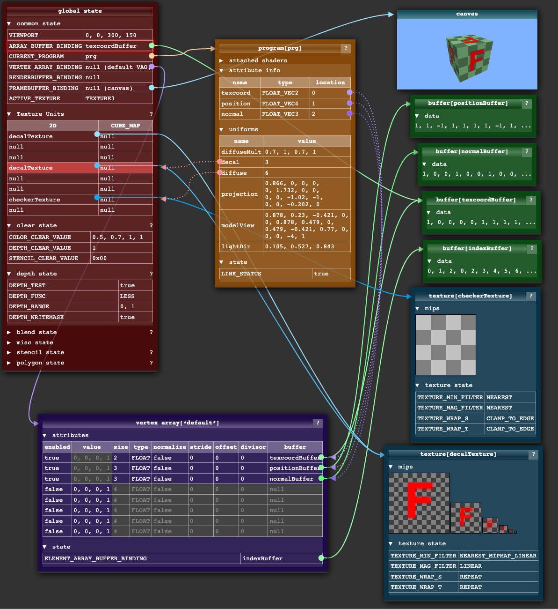
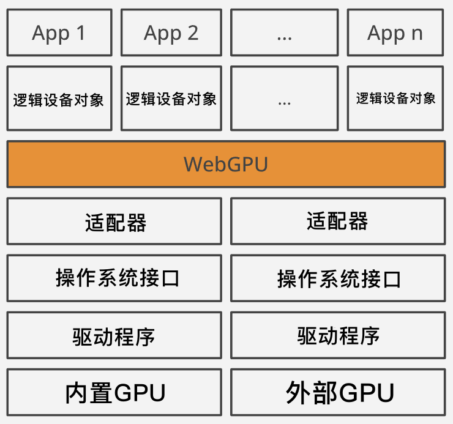
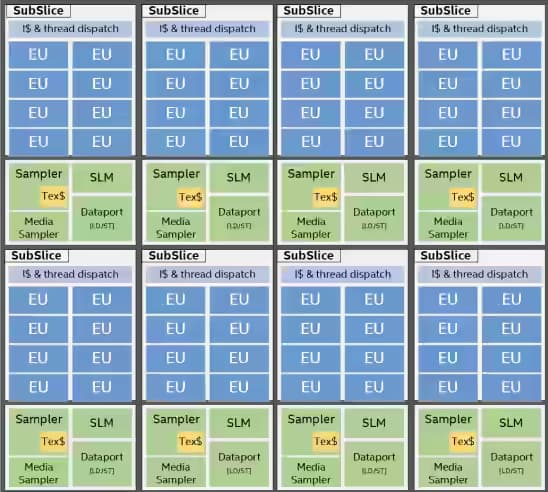
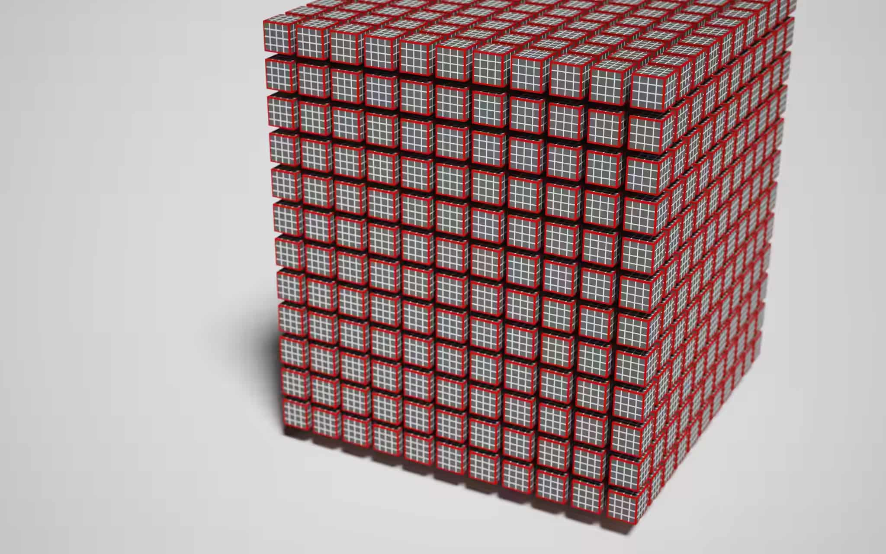
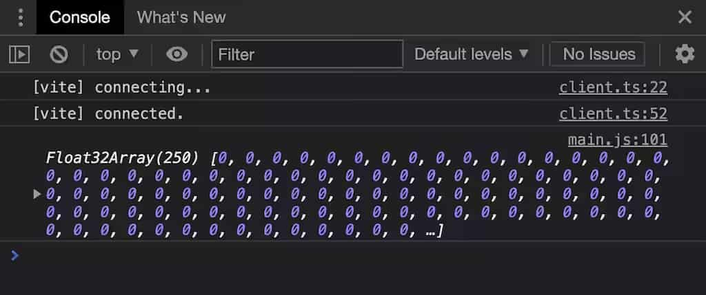
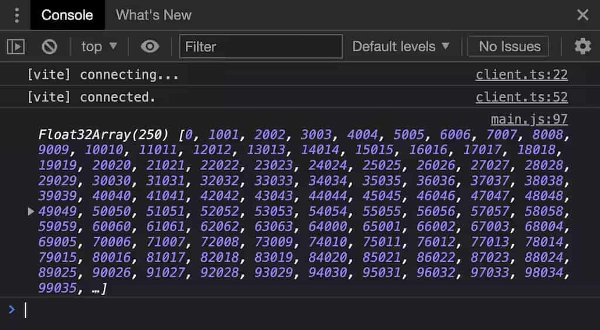
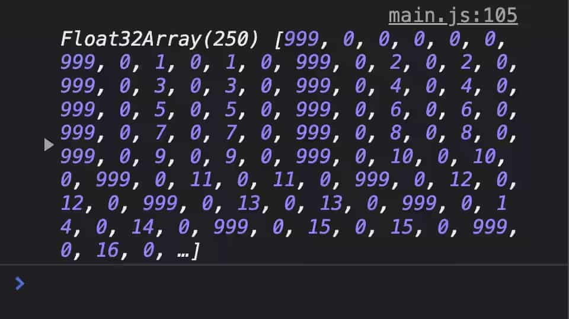

> 原文译名：WebGPU - 专注于处理核心（GPU Cores），而不是绘图画布（Canvas）

原文发布于 2022年3月8日，传送门 https://surma.dev/things/webgpu

这篇东西非常长，不计代码字符也有1w字，能比较好理解 WebGPU 的计算管线中的各个概念，并使用一个简单的 2D 物理模拟程序来理解它，本篇重点是在计算管线和计算着色器，绘图部分使用 Canvas2D 来完成。

---

WebGPU 是即将推出的 WebAPI，你可以用它访问图形处理器（GPU），它是一种底层接口。

原作者对图形编程没有多少经验，他是通过研究 OpenGL 构建游戏引擎的教程来学习 WebGL 的，还在 ShaderToy 上学习 [Inigo Quilez](https://twitter.com/iquilezles) 的例子来研究着色器。因此，他能在 PROXX 中创建背景动画之类的效果，但是他表示对 WebGL 并不太满意。别急，下文马上会解释。

当作者开始注意 WebGPU 后，大多数人告诉他 WebGPU 这东西比 WebGL 多很多条条框框。他没考虑这些，已经预见了最坏的情况，他尽可能找了一些教程和规范文档来看，虽然彼时并不是很多，因为他找的时候 WebGPU 还在早期制定阶段。不过，他深入之后发现 WebGPU 并没有比 WebGL 多所谓的“条条框框”，反而是像见到了一位老朋友一样熟悉。

所以，这篇文章就是来分享学到的东西的。

作者明确指出，他 **不会** 在这里介绍如何使用 WebGPU 绘制图形，而是要介绍 WebGPU 如何调用 GPU 进行它本身最原始的计算（译者注：也就是通用计算）。

他觉得已经有很多资料介绍如何用 WebGPU 进行绘图了，例如 austin 的[例子](https://austin-eng.com/webgpu-samples)，或许他考虑之后也写一些绘图方面的文章。

他在这里会讨论得比较深入，希望读者能正确、有效地使用 WebGPU，但是他不保证你读完就能成为 GPU 性能专家。

絮絮叨叨结束后，准备发车。


# 1. WebGL

WebGL 是 2011 年发布的，迄今为止，它是唯一能在 Web 访问 GPU 的底层 API，实际上它是 OpenGL ES 2.0 的简易封装版以便能在 Web 中使用。WebGL 和 OpenGL 都是科纳斯组标准化的，这个工作组是图形界的 W3C，可以这么理解。

OpenGL 本身是一个颇具历史的 API，按今天的标准看，它不算是一个很好的 API，它以内部全局状态对象为中心。这种设计可以最大限度减少特定调用的 GPU 的 IO 数据量。但是，这种设计有很多额外的开销成本。



上图：WebGL 内部全局状态对象的可视化，源自 [WebGL Fundamentals](https://webglfundamentals.org/webgl/lessons/resources/webgl-state-diagram.html)

内部状态对象，说白了，大多数都是一些指针。调用 OpenGL API 会改变这些指针的指向，所以改变状态的顺序相当重要，这导致了抽象和写库的困难程度大大增加。你必须非常清楚地知道你现在马上要进行的 API 调用需要准备什么状态，调用完了还得恢复到之前的值。

他说，他经常会看到一个黑色的画布（因为 WebGL 报错大多数时候就这样），然后得狂躁地找没调用哪些 API 没有正确设置全局状态。

他承认，他不知道 ThreeJS 是如何做到状态管理架构的，但是的确做的不错，所以大多数人会使用 ThreeJS 而不是原生 WebGL，这是主要的原因了。

> “不能很好认同 WebGL”这只是对原作者他自己说的，而不是读者们。他表示，比他聪明的人用 WebGL 和 OpenGL 已经做了不少 nice 的东西，但是他一直不满意罢了。

随着机器学习、神经网络以及加密货币的出现，GPU 证明了它可以干除了画三角形之外的事情。使用 GPU 进行任意数据的计算，这种被称为 GPGPU，但是 WebGL 1.0 的目的并不在于此。如果你在 WebGL 1.0 想做这件事，你得把数据编码成纹理，然后在着色器中对数据纹理进行解码、计算，然后重新编码成纹理。WebGL 2.0 通过 [转移反馈]() 让这摊子事情更容易了一些，但是直到 2021 年 9 月，Safari 浏览器才支持 WebGL 2.0（大多数浏览器 2017 年 1 月就支持了），所以 WebGL 2.0 不算是好的选择。

尽管如此，WebGL 2.0 仍然没有改变 WebGL 的本质，就是全局状态。


# 2. WebGPU

在 Web 领域外，新的图形 API 已经逐渐成型。它们向外部暴露了一套访问显卡的更底层的接口。这些新的 API 改良了 OpenGL 的局促性。

> 主要就是指 DirectX 12、Vulkan、Metal

一方面来说，现在 GPU 哪里都有，甚至移动设备都有不错的 GPU 了。所以，现代图形编程（3D渲染、光追）和 GPGPU 会越来越普遍。

另一方面来看，大多数设备都有多核处理器，如何优化多线程与 GPU 进行交互，是一个重要的课题。

WebGPU 标准制定者注意到了这些现状，在预加载 GPU 之前要做好验证工作，这样才能给 WebGPU 开发者以更多精力专注于压榨 GPU 的性能。

下一代最受欢迎的 GPU API 是：

- 科纳斯组的 Vulkan
- 苹果的 Metal
- 微软的 DirectX 12

为了把这些技术融合并带到 Web，WebGPU 就诞生了。

WebGL 是 OpenGL 的一个浅层封装，但是 WebGPU 并没这么做。它引入了自己的抽象概念体系，汲取上述 GPU API 的优点，而不是继承自这些更底层的 API.

原因很简单，这三个 API 并不是全部都是全平台通用的，而且有一些他们自己的非常底层的概念，对于 Web 这个领域来说显得不那么合理。

相反，WebGPU 的设计让人感觉“哇，这就是给 Web 设计的”，但是它的的确确又基于你当前机器的 GPU API，抽象出来的概念被 W3C 标准化，所有的浏览器都得实现。由于 WebGPU 相对来说比较底层，它的学习曲线会比较陡峭，但是作者表示会尽可能地分解。


## 2.1. 适配器（Adapter）和设备（Device）

最开始接触到的 WebGPU 抽象概念是适配器（Adapter）和设备（Device）。



上图：抽象层，从物理 GPU 到逻辑设备。

物理设备就是 GPU 本身，有内置的 GPU（核芯显卡）和外部 GPU（独立显卡）两种。通常，某个设备一般只有一个 GPU，但是也有两个或者多个的情况。例如，微软的 Surface 笔记本就具备双显卡，以便操作系统在不同的情况进行切换。

操作系统使用显卡厂商提供的驱动程序来访问 GPU；反过来，操作系统也可以用特定的 API（例如 Vulkan 或者 Metal）向外暴露 GPU 的功能。

GPU 是共享资源，它不仅要被各种程序调用，还要负责向显示器上输出。这看起来需要一个东西来让多个进程同时使用 GPU，以便每个进程把自己的东西画在屏幕上。

对于每个进程来说，似乎看起里他们对 GPU 有唯一的控制权，但是那只是表象，实际上这些复杂逻辑是驱动程序和操作系统来完成调度的。

**适配器（Adapter）** 是特定操作系统的 API 与 WebGPU 之间的中介。

但是，由于浏览器又是一个可以运行多个 Web 程序的“迷你操作系统”，因此，在浏览器层面仍需要共享适配器，以便每个 Web 程序感觉上就像唯一控制 GPU 一样，所以，每个 Web 程序就获得了再次抽象的概念：**逻辑设备（Logical Device）**。

要访问适配器对象，请调用 `navigator.gpu.requestAdapter()`，在写本文时，这个方法的参数比较少，能让你选请求的是高性能的适配器（通常是高性能独显）还是低功耗适配器（通常是核显）。

> 译者注：本篇讨论 WebGPU 的代码，没特殊指明，均为浏览器端的 WebGPU JavaScript API.

> 软渲染：一些操作系统（诸如小众 Linux）可能没有 GPU 或者 GPU 的能力不足，会提供“后备适配器（Fallback Adapter）”，实际上这种适配器是纯软件模拟出来的，它可能不是很快，可能是 CPU 模拟出来的，但是能基本满足系统运作。

若能请求到非空的适配器对象，那么你可以继续异步调用 `adapter.requestDevice()` 来请求逻辑设备对象。下面是示例代码：

```js
if (!navigator.gpu) throw Error("WebGPU not supported.");

const adapter = await navigator.gpu.requestAdapter();
if (!adapter) throw Error("Couldn’t request WebGPU adapter.");

const device = await adapter.requestDevice();
if (!device) throw Error("Couldn’t request WebGPU logical device.");
```

如果没有任何请求设备的参数，那么 `requestDevice()` 会返回一个不匹配任何设备功能要求的设备，即 WebGPU 团队认为是合理且对于所有 GPU 都通用的设备对象。

请求设备对象过程中的“限制”见 [规范](https://gpuweb.github.io/gpuweb/#limit)。

举个例子，即使我的 GPU 可以轻易处理 4GB 的数据，返回的设备对象也只允许最大 1GB 的数据，你请求再多也只会返回最大允许 1GB，这样就算你切换到别的机器上跑代码，就不会有太多问题。

你可以访问 `adapter.limits` 查看物理 GPU 的实际限制情况。也可以在请求设备对象时，传递你所需要检验的更高限制参数。


## 2.2. 着色器（Shaders）

如果你用过 WebGL，那么你应该熟悉顶点着色器和片元（片段）着色器。其实也没多复杂，常规技术路线就是上载三角形缓冲数据到 GPU，告诉 GPU 缓冲数据是如何构成三角形的。顶点缓冲的每个顶点数据描述了顶点的位置，当然还包括颜色、纹理坐标、法线等其它辅助内容。每个顶点都要经过顶点着色器处理，以完成平移、旋转、透视变形等操作。

> 让原作者感到困惑的是“着色器”这个词，因为它除了着色之外还有别的作用。但是在很久以前（1980年代后期）来看，这个词非常合适，它在 GPU 上的功能就是计算出像素的颜色值。而如今，它泛指在 GPU 上运行的任何程序。

GPU 会对三角形进行光栅化处理，计算出每个三角形在屏幕上占据的像素。每个像素，则交由片段着色器处理，它能获取像素坐标，当然也可以加入一些辅助数据来决定该像素的最终着色。如果使用得当，就能绘制出令人惊叹的 3D 效果。

将缓冲数据传递到顶点着色器，然后继续传送到片段着色器，最终输出到屏幕上这一过程，可以简单的称之为管道（或管线，Pipeline），在 WebGPU 中，必须明确定义 Pipeline.


## 2.3. 管线（Pipeline）

目前，WebGPU 支持两大管线：

- 渲染管线
- 计算管线

顾名思义，渲染管线绘制某些东西，它结果是 2D 图像，这个图像不一定要绘制到屏幕上，可以直接渲染到内存中（被称作帧缓冲）。计算管线则更加通用，它返回的是一个缓冲数据对象，意味着可以输出任意数据。

在本文的其它部分会专注于计算管线的介绍，因为作者认为渲染管线算是计算管线的一种特殊情况。

现在开始算开历史倒车，计算管线原来其实是为了创建渲染管线而先做出来的“基础”，这些所谓的管线在 GPU 中其实就是不同的物理电路罢了。

基于上述理解，倘若未来向 WebGPU 中添加更多类型的管线，例如“光追管线”，就显得理所当然了。

使用 WebGPU API，管线由一个或多个可编程阶段组成，每个阶段由一个着色器模块和一个入口函数定义。计算管线拥有一个计算着色阶段，渲染管线有一个顶点着色阶段和一个片段着色阶段，如下所示是一个计算着色模块与计算管线：

``` js
const module = device.createShaderModule({
  code: `
    @stage(compute) @workgroup_size(64)
    fn main() {
      // ...
    }
  `,
})

const pipeline = device.createComputePipeline({
  compute: {
    module,
    entryPoint: "main",
  },
})
```

这是 WebGPU 的着色语言（WGSL，发音 `/wig-sal/`）的首次登场。

WGSL 给作者的初印象是 `Rust + GLSL`，它有很多类似 Rust 的语法，也有类似 GLSL 一样的全局函数（如 `dot()`、`norm()`、`len()` 等），以及类型（`vec2`、`mat4x4` 等），还有 `swizzling` 语法（例如 `some_vec.xxy`）。

浏览器会把 WGSL 源码编译成底层系统的着色器目标程序，可能是 `D3D12` 的 `HLSL`，也可能是 `Metal` 的 `MSL`，或者 `Vulkan` 的 `SPIR-V`.

> SPIR-V：是科纳斯组标准化出来的开源、二进制中间格式。你可以把它看作并行编程语言中的 `LLVM`，它支持多种语言编译成它自己，也支持把自己翻译到其它语言。

在上面的着色器代码中，只创建了一个 `main` 函数，并使用 `@stage(compute)` 这个特性（Attribute，WGSL 术语）将其标记为计算着色阶段的入口函数。

你可以在着色器代码中标记多个 `@stage(compute)`，这样就可以在多个管线中复用一个着色器模块对象了，只需传递不同的 `entryPoint` 选择不同的入口函数即可。

但是，`@workgroup_size(64)` 特性是什么？


## 2.4. 并行（Parallelism）

GPU 以延迟为代价优化了数据吞吐量。想深入这点必须看一下 GPU 的架构，但是作者没信心讲好这块，所以建议看一看 [Fabian Giesen](https://twitter.com/rygorous) 的 [文章](https://fgiesen.wordpress.com/2011/07/09/a-trip-through-the-graphics-pipeline-2011-index/)。

众所周知，GPU 有非常多个核心构成，可以进行大规模的并行运算。但是，这些核心不像 CPU 并行编程一样相对独立运作。首先，GPU 处理核心是分层分组的，不同厂商的 GPU 的设计架构、API 不尽一致。Intel 这里给了一个不错的文档，对他们的架构进行了高级的描述。

在 Intel 的技术中，最小单元被称作“执行单元（Execution Unit，EU）”，每个 EU 拥有 7 个 [SIMT](https://en.wikipedia.org/wiki/Single_instruction,_multiple_threads) 内核 —— 意思是，它有 7 个以“锁步”（Lock-step）的方式运行同一个指令的并行计算核。每个内核都有自己的寄存器和调度缓存的指针，尽管执行着相同的操作，但是数据可以是不同的。

所以有时候不推荐在 GPU 上执行 `if/else` 判断分支，是因为 EU 的原因。因为 EU 遇到分支逻辑的时候，每个内核都要进行 `if/else` 判断，这就失去了并行计算的优势了。

对于循环也是如此。如果某个核心提前完成了计算任务，那它不得不假装还在运行，等待 EU 内其它核心完成计算。

尽管内核的计算频率很高，但是从内存中加载数据或者从纹理中采样像素的时间明显要更长 —— Fabian 同志说，这起码要耗费几百个时钟周期。这些时间显然可以拿来算东西。为了充分利用这些时钟周期，每个 EU 必须负重前行。

EU 空闲的时候，譬如在等内存的食物过来的时候，它可不会就一直闲下去，它会立马投入到下一个计算中，只有这下一个计算再次进入等待时，才会切换回来，切换的过程非常非常短。

GPU 就是以这样的技术为代价换来吞吐量的优化的。GPU 通过调度这些任务的切换机制，让 EU 一直处于忙碌状态。



上图：Intel 锐炬 Xe 显卡芯片架构。它被分成 8 个子块，每个子块有 8 个 EU；每个 EU 拥有 7 个 SIMT 内核。

不过，根据上图来看，EU 只是 Intel 显卡设计架构层级最低的一个，多个 EU 被 Intel 分为所谓的“子块（SubSlice）”，子块中所有的 EU 都可以访问共有的局部缓存（Shared Local Memory，SLM），大概是 64KB，如果所运行的程序有同步指令，那么就必须在同一个子块中运行，因为这样才能共享内存。

再往上，子块就构成了块（Slice），构成 GPU；对于集成在 CPU 中的 GPU，大约有 170 ~ 700 个内核。对于独立显卡，则会有 1500 或以上个内核。

其它厂商也许会用其它的术语，但是架构基本上可以这么类比理解。

为了充分利用 GPU 的架构优势，需要专门写程序调用，这样就可以最大限度地压榨 GPU 的性能。所以，图形 API 得向外暴露类似的线程模型来调用计算任务。

在 WebGPU API 中，这种线程模型就叫做“工作组（Workgroup）”。


## 2.5. 工作组（Workgroup）

每个顶点都会被顶点着色器处理一次，每个片元则会被片元着色器处理一次（当然，这是简单说法，忽略了很多细节）。

而在 GPGPU 中，与顶点、片元类似的概念是需要开发者自己定义的，这个概念叫做 **计算项**，计算项会被计算着色器处理。

一组计算项就构成了“工作组”，作者称之为“工作负载”。工作组中的每个计算项会被同时运行的计算着色器作用。在 WebGPU 中，工作组可以想象成一个三维网格，最小层级的是计算项，计算项构成稍大级别的是工作组，再往上就构成规模更大的工作负载。



上图：这是一个工作负载，其中红色小立方体由 4³ 个白色小立方体构成，白色小立方是计算项，而红色小立方体则由这 64 个白色小立方构成，即工作组。

基于上述概念，就可以讨论 WGSL 中的 `@workgroup_size(x, y, z)` 特性了，它的作用很简单，就是告诉 GPU 这个计算着色器作用的工作组有多大。用上面的图来说，其实就是红色小立方的大小。`x*y*z` 是每个工作组的计算项个数，如果不设某个维度的值，那默认是 1，因此，`@workgroup_size(64)` 等同于 `@workgroup_size(64, 1, 1)`.

当然，实际 EU 的架构当然不会是这个 3D 网格里面的某个单元。使用这个图来描述计算项的目的是凸显出一种局部性质，即假设相邻的工作组大概率会访问缓存中相似的区域，所以顺次运行相邻的工作组（红色小立方）时，命中缓存中已有的数据的几率会更高一些，而无需在再跑去显存要数据，节省了非常多时间周期。

然而，大多数硬件依旧是顺序执行工作组的，所以设置 `@workgroup_size(64)` 和 `@workgroup_size(8, 8)` 的两个不同的着色器实际上差异并不是很大。所以，这个设计上略显冗余。

工作组并不是无限维度的，它受设备对象的限制条件约束，打印 `device.limits` 可以获取相关的信息：

``` js
console.log(device.limits)

/*
{
  // ...
  maxComputeInvocationsPerWorkgroup: 256,
  maxComputeWorkgroupSizeX: 256,
  maxComputeWorkgroupSizeY: 256,
  maxComputeWorkgroupSizeZ: 64,
  maxComputeWorkgroupsPerDimension: 65535,
  // ...
}
*/
```

可以看到，每个维度上都有最大限制，而且累乘的积也有最大限制。

> 提示：避免申请每个维度最大限制数量的线程。虽然 GPU 由操作系统底层调度，但如果你的 WebGPU 程序霸占了 GPU 太久的话，系统有可能会卡死。

那么，合适的工作组大小建议是多少呢？这需要具体问题具体分析，取决于工作组各个维度有什么指代含义。作者认为这答案很含糊，所以他引用了 [Corentin](https://twitter.com/dakangz) 的话：“用 64 作为工作组的大小（各个维度累乘后），除非你十分清楚你需要调用 GPU 干什么事情。”

64 像是个比较稳妥的线程数，在大多数 GPU 上跑得还可以，而且能让 EU 尽可能跑满。


## 2.6. 指令（Command）

到目前为止，已经写好了着色器并设置好了管线，剩下的就是要调用 GPU 来执行。由于 GPU 可以是有自己内存的独立显卡，所以可以通过所谓的“指令缓冲”或者“指令队列”来控制它。

指令队列，是一块内存（显示内存），编码了 GPU 待执行的指令。编码与 GPU 本身紧密相关，由显卡驱动负责创建。WebGPU 暴露了一个“CommandEncoder”API 来对接这个术语。

``` js
const commandEncoder = device.createCommandEncoder()
const passEncoder = commandEncoder.beginComputePass()
passEncoder.setPipeline(pipeline)
passEncoder.dispatch(1)
passEncoder.end()
const commands = commandEncoder.finish()
device.queue.submit([commands])
```

`commandEncoder` 对象有很多方法，可以让你把某一块显存复制到另一块，或者操作纹理对应的显存。它还可以创建 `PassEncoder`（通道编码器），它可以配置管线并调度编码指令。

在上述例子中，展示的是计算管线，所以创建的是计算通道编码器。调用 `setPipeline()` 设置管线，然后调用 `dispatch()` 方法告诉 GPU 在每个维度要创建多少个工作组，以备进行计算。

换句话说，计算着色器的调用次数等于每个维度的大小与该维度调用次数的累积。

例如，一个工作组的三个维度大小是 `2, 4, 1`，在三个维度上要运行 `4, 2, 2` 次，那么计算着色器一共要运行 `2×4 + 4×2 + 1×2 = 18` 次。

顺便说一下，通道编码器是 WebGPU 的抽象概念，它就是文章最开始时作者抱怨 WebGL 全局状态机的良好替代品。运行 GPU 管线所需的所有数据、状态都要经过通道编码器来传递。

> 抽象：指令缓冲也只不过是显卡驱动或者操作系统的钩子，它能让程序调用 GPU 时不会相互干扰，确保相互独立。指令推入指令队列的过程，其实就是把程序的状态保存下来以便待会要用的时候再取出，因为硬件执行的速度非常快，看起来就是各做各的，没有受到其它程序的干扰。

跑起代码，因为 `workgroup_size` 特性显式指定了 64 个工作组，且在这个维度上调用了 1 次，所以最终生成了 64 个线程，虽然这个管线啥事儿都没做（因为没写代码），但是至少起作用了，是不是很酷炫？

随后，我们搞点数据来让它起作用。


# 3. 数据交换

如文章开头所言，作者没打算直接用 WebGPU 做图形绘制，而是打算拿它来做物理模拟，并用 Canvas2D 来简单的可视化。虽然叫是叫物理模拟，实际上就是生成一堆圆几何，让它们在平面范围内随机运动并模拟他们之间相互碰撞的过程。

为此，要把一些模拟参数和初始状态传递到 GPU 中，然后跑计算管线，最后读取结果。

这可以说是 WebGPU 最头皮发麻的的一部分，因为有一堆的数据术语和操作要学。不过作者认为恰好是这些数据概念和数据的行为模式造就了 WebGPU，使它成为了高性能的且与设备无关的 API.


## 3.1. 绑定组的布局（GPUBindGroupLayout）

为了与 GPU 进行数据交换，需要一个叫绑定组的布局对象（类型是 `GPUBindGroupLayout`）来扩充管线的定义。

首先要说说绑定组（类型是 `GPUBindGroup`），它是某种管线在 GPU 执行时各个资源的几何，资源即 Buffer、Texture、Sampler 三种。

而先于绑定组定义的绑定组布局对象，则记录了这些资源的数据类型、用途等元数据，使得 GPU 可以提前知道“噢，这么回事，提前告诉我我可以跑得更快”。

下列创建一个绑定组布局，简单起见，只设置一个存储型（`type: "storage"`）的缓冲资源：

``` js
const bindGroupLayout = device.createBindGroupLayout({
  entries: [{
    binding: 1,
    visibility: GPUShaderStage.COMPUTE,
    buffer: {
      type: "storage",
    }
  }]
})

// 紧接着，传递给管线
const pipeline = device.createComputePipeline({
  layout: device.createPipelineLayout({
    bindGroupLayouts: [bindGroupLayout]
  }),
  compute: {
    module,
    entryPoint: 'main'
  }
})
```

`binding` 这里设为了 `1`，可以自由设定（当然得按顺序），它的作用是在 WGSL 代码中与相同 binding 值的 buffer 变量绑定在一起。

``` wgsl
@group(0) @binding(1)
var<storage, write> output: array<f32>;
```

`type` 字段是 `"storage"`，即说明这个 Buffer 的类型是存储型。它还可以设置为其它的选项，其中 `"read-only-storage"` 即“只读存储型”，即着色器只能读，但是不能写这个 Buffer，只读型缓冲可以优化一些读写同步的问题；而 `"uniform"` 则说明 Buffer 类型是统一数据（Uniform），作用和存储型差不多（在着色器中值都一样）。

至此，绑定组布局对象创建完毕，然后就可以创建绑定组了，这里就不写出来了；一旦创建好了对应的绑定组和存储型 Buffer，那么 GPU 就可以开始读取数据了。

但是，在此之前，还有一个问题要讨论：暂存缓冲区。


## 3.2. 暂存缓冲区（Staging Buffer）

这个小节的内容略长，请耐心阅读。

作者再次强调：GPU 以延迟为代价，高度优化了数据 IO 性能。GPU 需要相当快的速度向内核提供数据。在 Fabian 他 2011 年的博客中做了一些[计算](https://fgiesen.wordpress.com/2011/07/04/a-trip-through-the-graphics-pipeline-2011-part-4/#:~:text=that%E2%80%99s%203.3%20GB/s%20just%20for%20texture%20request%20payloads.%20Lower%20bound%2C)，得出的结论是 GPU 需要维持 3.3 GB/s 的速度才能运行 1280×720 分辨率的纹理的采样计算。

为了满足现在的图形需求，GPU 还要再快。只有 GPU 的内核与缓冲存储器高度集成才能实现，这意味着也就难以把这些存储区交由 CPU 来读写。

我们都知道 GPU 有自己的内存，叫显存，CPU 和 GPU 都可以访问它，它与 GPU 的集成度不高，一般在电路板的旁边，它的速度就没那么快了。

**暂存缓冲区（Staging buffers）**，是介于显存和 GPU 之间的缓存，它可以映射到 CPU 端进行读写。为了读取 GPU 中的数据，要先把数据从 GPU 内的高速缓存先复制到暂存缓冲区，然后把暂存缓冲区映射到 CPU，这样才能读取回主内存。对于数据传递至 GPU 的过程则类似。

回到代码中，创建一个可写的 Buffer，并添加到绑定组，以便计算着色器可以写入它；同时还创建一个大小一样的 Buffer 以作为暂存。创建这些 Buffer 的时候，要用位掩码来告知其用途（`usage`），GPU 会根据参数申请、创建这些缓冲区，如果不符合 WebGPU 规则，则抛出错误：

``` js
const BUFFER_SIZE = 1000
const output = device.createBuffer({
  size: BUFFER_SIZE,
  usage: GPUBufferUsage.STORAGE | GPUBufferUsage.COPY_SRC
})
const stagingBuffer = device.createBuffer({
  size: BUFFER_SIZE,
  usage: GPUBufferUsage.MAP_READ | GPUBufferUsage.COPY_DST
})

const bindGroup = device.createBindGroup({
  layout: bindGroupLayout,
  entries: [{
    binding: 1,
    resource: {
      buffer: output
    }
  }]
})
```

注意，`createBuffer()` 返回的是 `GPUBuffer` 对象，不是 `ArrayBuffer`，创建完 Buffer 后还不能马上写入或者读取。为了实现读写 Buffer，需要有单独的 API 调用，而且 Buffer 必须有 `GPUBufferUsage.MAP_READ` 或 `GPUBufferUsage.MAP_WRITE` 的用途才能读或写。

> TypeScript 提示：在各开发环境还未加入 WebGPU API 时，想要获得 TypeScript 类型提示，还需要安装 Chrome WebGPU 团队维护的 `@webgpu/types` 包到你的项目中。

到目前为止，不仅有绑定组的布局对象，还有绑定组本身，现在需要修改通道编码器部分的代码以使用这个绑定组，随后还要把 Buffer 中计算好的数据再读取回 JavaScript：

``` js
const commandEncoder = device.createCommandEncoder();
const passEncoder = commandEncoder.beginComputePass();
passEncoder.setPipeline(pipeline)
passEncoder.setBindGroup(0, bindGroup)
passEncoder.dispatch(1)
passEncoder.dispatch(Math.ceil(BUFFER_SIZE / 64))
passEncoder.end()
commandEncoder.copyBufferToBuffer(
  output,
  0, // 从哪里开始读取
  stagingBuffer,
  0, // 从哪里开始写
  BUFFER_SIZE
)
const commands = commandEncoder.finish()
device.queue.submit([commands])

await stagingBuffer.mapAsync(
  GPUMapMode.READ,
  0, // 从哪里开始读，偏移量
  BUFFER_SIZE // 读多长
 )
const copyArrayBuffer = stagingBuffer.getMappedRange(0, BUFFER_SIZE)
const data = copyArrayBuffer.slice()
stagingBuffer.unmap()
console.log(new Float32Array(data))
```

稍前的代码中，管线对象借助管线布局添加了绑定组的局对象，所以如果在通道编码的时候不设置绑定组就会引起调用（dispatch）失败。

在计算通道 `end()` 后，指令编码器紧接着触发一个缓冲拷贝方法调用，将数据从 `output` 缓冲复制到 `stagingBuffer` 缓冲，最后才提交指令编码的指令缓冲到队列上。

GPU 会沿着队列来执行，没法推测什么时候会完成计算。但是，可以异步地提交 `stagingBuffer` 缓冲的映射请求；当 `mapAsync` 被 resolve 时，`stagingBuffer` 映射成功，但是 JavaScript 仍未读取，此时再调用 `stagingBuffer.getMappedRange()` 方法，就能获取对应所需的数据块了，返回一个 `ArrayBuffer` 给 JavaScript，这个返回的缓冲数组对象就是显存的映射，这意味着如果 `stagingBuffer` 的状态是未映射时，返回的 `ArrayBuffer` 也随之没有了，所以用 `slice()` 方法来拷贝一份。

显然，可以在控制台看到输出效果：



上图：凑合，但是说明了一个问题，那就是从 GPU 显存中把这堆 0 给拿下来了

或许，制造点 0 之外的数据会更有说服力。在进行高级计算之前，先搞点人工数据到 Buffer 中，以证明计算管线确实按预期在运行：

``` wgsl
@group(0) @binding(1)
var<storage, write> output: array<f32>;

@stage(compute) @workgroup_size(64)
fn main(

  @builtin(global_invocation_id)
  global_id : vec3<u32>,

  @builtin(local_invocation_id)
  local_id : vec3<u32>,

) {
  output[global_id.x] =
    f32(global_id.x) * 1000. + f32(local_id.x);
}
```

前两行声明了一个名为 `output` 的模块范围的变量，它是一个 f32 元素类型的数组。它的两个特性声明了来源，`@group(0)` 表示从第一个（索引为 0）绑定组中获取第 `1` 个绑定资源。`output` 数组是动态长度的，会自动反射对应 Buffer 的长度。

> WGSL 变量：与 Rust 不同，let 声明的变量是不可变的，如果希望变量可变，使用 var 声明

接下来看 main 函数。它的函数签名有两个参数 `global_id` 和 `local_id`，当然这两个变量的名称随你设定，它们的值取决于对应的内置变量 `global_invocation_id`、`local_invocation_id`，分别指的是 **工作负载** 中此着色器调用时的全局 x/y/z 坐标，以及 **工作组** 中此着色器调用时的局部 x/y/z 坐标。


上图：三个计算项，a、b、c，用绿色字母标注。

这张图中使用的工作组大小是 `@workgroup_size(4, 4, 4)`，使用图中的坐标轴顺序，那么对于图中的 a、b、c 计算项：

- a：`local_id = (x=0, y=0, z=0)`，`global_id = (x=0, y=0, z=0)`
- b：`local_id = (x=0, y=0, z=0)`，`global_id = (x=4, y=0, z=0)`
- c：`local_id = (x=1, y=1, z=0)`，`global_id = (x=5, y=5, z=0)`

而对于我们的例子来说，工作组的大小被设为 `@workgroup_size(64, 1, 1)`，所以 `local_id.x` 的取值范围是 `0 ~ 63`. 为了能检查 `local_id` 和 `global_id`，作者把这两个值进行编码，合成一个数字；注意，WGSL 类型是严格的，`local_id` 和 `global_id` 都是 `vec3<u32>`，因此要显式地转换为 `f32` 类型才能写入 output 缓冲区。



上图：GPU 写入的实际值，注意 `local_id` 是 63 为循环的终点，而 `global_id` 则仍旧在继续编码

上图证明了计算着色器确实向缓冲区输出了值，但是很容易发现这些数字看似是没什么顺序的，因为这是故意留给 GPU 去做的。


## 3.3. 过度调度

你可能会注意到，计算通道编码器的调度方法调度次数 `Math.ceil(BUFFER_SIZE / 64) * 64` 这个值，算出来就是 `1024`：

``` js
passEncoder.dispatch(Math.ceil(BUFFER_SIZE / 64))
```

这直接导致着色器代码中 `global_id.x` 的取值能取到 1024，大于 Buffer 的长度 1000.

不过还好，WGSL 是有保护超出数组索引范围的机制的，即一旦发生对数组索引越界的写入，那么总是会写入最后一个元素。这样虽然可以避免内存访问错误，但是仍有可能会生成一些无效数据。譬如，你把 JavaScript 端返回的 Float32Array 的最后 3 个元素打印出来，它们是 `247055`、`248056`、`608032`；如何避免因数组索引越界而可能发生的无效数据问题呢？可以用卫语句提前返回：

``` wgsl
fn main( /* ... */ ) {
  if (global_id.x >= arrayLength(&output)) {
    return;
  }
  
  output[global_id.x] = f32(global_id.x) * 100. + f32(local_id.x)
}
```

若读者感兴趣，可以运行这个[例子](https://surma.dev/things/webgpu/step1/index.html)看效果。


## 3.4. 麻烦的结构体（内存地址对齐问题）

还记得目标吗？是在 2D 的 Canvas 中移动一些圆，并让他们激情地碰撞。

所以，每个圆都要有一个半径参数和一个坐标参数，以及一个速度矢量。可以继续用 `array<f32>` 来表示上述数据，例如第一个数字是 x 坐标，第二个数字是 y 坐标，以此类推。

然而，这看起来有点蠢，WGSL 是允许自定义结构体的，把多条数据关联在一个结构内。

> 注意：如果你知道什么是内存对齐，你可以跳过本小节；如果你不知道，作者也没打算仔细解释，他打算直接展示为什么要这么做。

因此，定义一个结构体 `Ball`，表示 2D 中的圆，并使用 `array<Ball>` 表示一系列的 2D 圆球。

使用结构体，就不得不讨论内存对齐问题。

```wgsl
struct Ball {
  radius: f32;
  position: vec2<f32>;
  velocity: vec2<f32>;
}

@group(0) @binding(1)
var<storage, write> output: array<Ball>;

@stage(compute) @workgroup_size(64)
fn main(
  @builtin(global_invocation_id) global_id: vec3<u32>,
  @builtin(local_invocation_id) local_id: vec3<u32>,
) {
  let num_balls = arrayLength(&output);
  if (global_id.x >= num_balls) {
    return;
  }
  
  output[global_id.x].radius = 999.;
  output[global_id.x].position = vec2<f32>(global_id.xy);
  output[global_id.x].velocity = vec2<f32>(local_id.xy);
}
```

你可以运行这个[代码](https://surma.dev/things/webgpu/step2/index.html)，打开控制台可以看到：



上图：因为内存对齐的原因，这个 TypedArray 有明显的数据填充现象

着色器代码首先把数据 `999.0` 写入到结构体的第一个字段 `radius` 中，以便于观察两个结构的分隔界限；但是，这个打印的 `Float32Array` 中，两个 999 数字之间，实际上跨越了 6 个数字，譬如上图中 0~5 位数字是 `999, 0, 0, 0, 0, 0`，紧随其后的 6~11 位数字是 `999, 0, 1, 0, 1, 0`，这就意味着每个结构体都占据了 6 个数字，但是 `Ball` 结构体明明只需要 5 个数字即可存储：`radius`、`position.x`、`position.y`、`velocity.x` 和 `velocity.y`. 很明显，每个 `radius` 后面都塞多了一个 0，这是为什么呢？

原因就是内存对齐。每一种 WGSL 中的数据类型都要严格执行[对齐要求](https://gpuweb.github.io/gpuweb/wgsl/#alignment-and-size)。

若一个数据数据类型的对齐尺度是 N（字节），则意味着这个类型的数据值只能存储在 N 的倍数的内存地址上。举个例子，`f32` 的对齐尺度是 4（即 N = 4），`vec2<f32>` 的对齐尺度是 8（即 N = 8）.

假设 `Ball` 结构的内存地址是从 0 开始的，那么 `radius` 的存储地址可以是 0，因为 0 是 4 的倍数；紧接着，下个字段 `position` 是 `vec2<f32>` 类型的，对齐尺度是 8，问题就出现了 —— 它的前一个字段 `radius` 空闲地址是第 4 个字节，并非 `position` 对齐尺度 8 的倍数，为了对齐，编译器在 `radius` 后面添加了 4 个字节，也就是从第 8 个字节开始才记录 `position` 字段的值。这也就说明了控制台中看到 999 之后的数字为什么总是 0 的原因了。

现在，知道结构体在内存中是如何分布字节数据的了，可以在 JavaScript 中进行下一步操作了。


## 3.5. 输入输出

我们已经从 GPU 中读取到数据了，现在要在 JavaScript 中解码它，也就是生成所有 2D 圆的初始状态，然后再次提交给 GPU 运行计算着色器，让它“动起来”。初始化很简单：

``` js
let inputBalls = new Float32Array(new ArrayBuffer(BUFFER_SIZE))
for (let i = 0; i < NUM_BALLS; i++) {
  inputBalls[i * 6 + 0] = randomBetween(2, 10) // 半径
  inputBalls[i * 6 + 1] = 0 // 填充用
  inputBalls[i * 6 + 2] = randomBetween(0, ctx.canvas.width) // x坐标
  inputBalls[i * 6 + 3] = randomBetween(0, ctx.canvas.height) // y坐标
  inputBalls[i * 6 + 4] = randomBetween(-100, 100) // x 方向速度分量
  inputBalls[i * 6 + 5] = randomBetween(-100, 100) // y 方向速度分量
}
```


> 小技巧：如果你以后的程序用到了更复杂的数据结构，使用 JavaScript 拼凑这些字节码会非常麻烦，你可以用 Google 的 [buffer-backed-object](https://github.com/GoogleChromeLabs/buffer-backed-object) 库去创建复杂的二进制数据（类似序列化）。

还记得如何把 Buffer 传递给着色器吗？不记得的回去看看上文。只需要调整一下计算管线的绑定组布局即可接收新的 Buffer：

``` js
const bindGroupLayout = device.createBindGroupLayout({
  entries: [
    {
      binding: 0,
      visibility: GPUShaderStage.COMPUTE,
      buffer: {
        type: 'read-only-storage'
      }
    },
    {
      binding: 1,
      visibility: GPUShaderStage.COMPUTE,
      buffer: {
        type: 'storage'
      }
    }
  ]
})
```

然后创建一个新的绑定组来传递初始化后的 2D 圆球数据：

``` js
const input = device.createBuffer({
  size: BUFFER_SIZE,
  usage: GPUBufferUsage.STORAGE | GPUBufferUsage.COPY_DST
})

const bindGroup = device.createBindGroup({
  layout: bindGroupLayout,
  entries: [
    {
      binding: 0,
      resource: {
        buffer: input // 输入初始化数据
      }
    },
    {
      binding: 1,
      resource: {
        buffer: output
      }
    }
  ]
})
```

就像读取数据一样，从技术角度来看，为了输入初始化的 2D 圆球数据，要创建一个可映射的暂存缓冲区 `input`，作为着色器读取数据的容器。

WebGPU 提供了一个简单的 API 便于我们把数据写进 `input` 缓冲区：

``` js
device.queue.writeBuffer(input, 0, inputBalls)
```

就是这么简单，并不需要指令编码器 —— 也就是说不需要借助指令缓冲，`writeBuffer()` 是作用在队列上的。

> device.queue 对象还提供了一些方便操作纹理的 API.

现在，在着色器代码中要用新的变量来与这个新的 `input` 缓冲资源绑定：

``` wgsl
// ... Ball 结构体定义 ...

@group(0) @binding(0)
var<storage, read> input: array<Ball>;

// ... output Buffer 的定义

let TIME_STEP: f32 = 0.016;

@stage(compute) @workgroup_size(64)
fn main(
  @builtin(global_invocation_id)
  global_id: vec3<u32>
) {
  let num_balls = arrayLength(&output);
  if (global_id.x >= num_balls) {
    return;
  }
  
  // 更新位置
  output[global_id.x].position = 
    input[global_id.x].position +
    input[global_id.x].velocity * TIME_STEP;
}
```

希望大部分着色器代码你能看得懂。

<video src='./attachments/v1.webm'></video>

上面的视频：每一帧，WebGPU 都会更新 Ball 的位置（使用 Canvas 2D 来绘制）

最后要做的，只是把 `output` 缓冲再次读取回 JavaScript，写一些 Canvas2D 的可视化代码把 Ball 的运动效果展示出来（需要用到 requestAnimationFrame），你可以看示例效果：[demo](https://surma.dev/things/webgpu/step3/index.html)


# 4. 性能

3.5 小节最后演示的代码只是能让 Ball 运动起来，还没有特别复杂的计算。在进行性能观测之前，要在着色器中加一些适当的物理计算。

作者就不打算解释物理计算了，写到这里，博客已经很长了，但是他简单的说明了物理效果的核心原理：每个 Ball 都与其它的 Ball 进行碰撞检测计算。

如果你十分想知道，可以看看最终的演示代码：[final-demo](https://surma.dev/things/webgpu/step4/index.html)，在 WGSL 代码中你还可以找到物理计算的资料连接。

<video src='./attachments/v2.webm'></video>

作者并未优化物理碰撞算法，也没有优化 WebGPU 代码，即使是这样，在他的 MacBook Air（M1处理器）上表现得也很不错。

当超过 2500 个 Ball 时，帧数才掉到 60 帧以下，然而使用 Chrome 开发者工具去观测性能信息时，掉帧并不是 WebGPU 的问题，而是 Canvas2D 的绘制性能不足 —— 使用 WebGL 或 WebGPU 绘图就不会出现这个问题了。


上图：即使是 14000 个 Ball，WebGPU 在 M1 处理器的 MBA 笔记本上也才用了 16 毫秒的单帧计算时间

作者关闭了 Canvas2D 绘图，加入 `performance.measure()` 方法来查看 16毫秒之内究竟可以模拟多少个 Ball 的物理计算。

这性能表现还是没有优化过的，已经让作者为之陶醉。


# 5. 稳定性与可用性

WebGPU 已经开发了蛮久了，作者认为制定规范的人希望 API 是稳定的。

话是这么说没错，但是 WebGPU API 目前只能跑在 Chrome 类浏览器和 FireFox 浏览器上，对 Safari 保持乐观态度 —— 虽然写本文时，Safari TP（技术预览）还没什么东西能看。

在稳定性表现上，即使是写文章的这段时间里，也是有变化的。

例如，WGSL 着色器代码的特性语法，从双方括号改为 `@` 符号：

```
[[stage(compute), workgroup_size(64)]]
↓
@stage(compute) @workgroup_size(64)
```

对通道编码器结束的方法，Firefox 浏览器仍然是 `endPass()`，而 Chrome 类浏览器已经改为最新的 `end()`.

规范中还有一些内容也并不是完全实现在所有浏览器上的，用于移动设备的 API 以及部分着色器常量就是如此。

基本上，WebGPU 进入 `stable` 阶段后，不排除会发生很多重大变化。


# 总结

“在 Web 上能直接使用 GPU”这种现代的 API 看起来很好玩。在经历过最初的陡峭学习曲线后，作者认为真的可以使用 JavaScript 调用 GPU 进行大规模并行运算了。

[wgpu](https://github.com/gfx-rs/wgpu) 是使用 Rust 实现的 WebGPU，你可以在浏览器之外使用 Rust 语言调用 WebGPU 规范的 API；wgpu 还支持编译到 WebAssembly，你甚至可以使用 Rust 的 wgpu 编写 wasm，然后再放到浏览器运行高性能的代码。

还有个有趣的东西：[Deno](https://deno.land/) 借助 wgpu，内置了 WebGPU 的支持。

如果你有啥问题，你可以去 [WebGPU Matrix 频道](https://matrix.to/#/#WebGPU:matrix.org)（国内可能访问不太通畅）提问，那里有一些 WebGPU 的用户、浏览器工程师和制定规范的人。

感谢 Brandon Jones 校对本文，感谢 WebGPU Matrix 频道解惑。

> 也感谢原作者分享这篇长文。