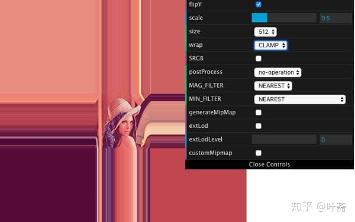
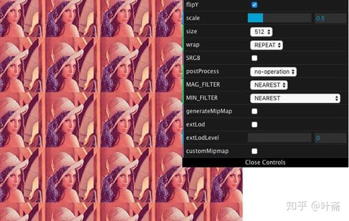

# GPUSampler：采样器

`GPUSampler` 采样器对象，对着色器中的纹理资源进行过滤或者编码。

``` web-idl
[Exposed=(Window, DedicatedWorker), SecureContext]
interface GPUSampler {
};
GPUSampler includes GPUObjectBase;
```

# 采样器的创建

通过 `device.createSampler()` 方法即可创建，这个方法一样需要一个对应类型为 `GPUSamplerDescriptor` 的参数对象。

``` web-idl
dictionary GPUSamplerDescriptor : GPUObjectDescriptorBase {
  GPUAddressMode addressModeU = "clamp-to-edge";
  GPUAddressMode addressModeV = "clamp-to-edge";
  GPUAddressMode addressModeW = "clamp-to-edge";
  GPUFilterMode magFilter = "nearest";
  GPUFilterMode minFilter = "nearest";
  GPUFilterMode mipmapFilter = "nearest";
  float lodMinClamp = 0;
  float lodMaxClamp = 32;
  GPUCompareFunction compare;
  [Clamp] unsigned short maxAnisotropy = 1;
};
```

其中，

- 参数 `addressModeU`、`addressModeV`、`addressModeW` 是 `GPUAddressMode` 枚举类型的，默认值均为 `"clamp-to-edge"`，意义是纹理宽度、高度、深度三个方向上的填充模式，详见下文 [GPUAddressMode](#GPUAddressMode) 的解释；
- 参数 `magFilter`、`minFilter` 和 `mipmapFilter` 是 `GPUFilterMode` 枚举类型的，默认值均为 `"nearest"`。分别表示放大、缩小时的采样方式，以及 mipmap（多级纹理） 切换等级时的采样方式，详见下文关于 [GPUFilterMode](#GPUFilterMode) 的解释；
- 参数 `lodMinClamp`、`lodMaxClamp` 指定细节层次的最大和最小级别，默认分别为 0、32，应该是对应的 Mipmap；
- 参数 `compare` 类型是 `GPUCompareFunction`，如果指定这个参数，该采样器将变成一个具有指定比较功能的比较采样器；
- 参数 `maxAnisotropy` 默认值是 1，表示采样器能用到的最大各向异性值，大多数对这个的实现是 1 到 16。各向异性有关概念见文末参考资料部分。

## GPUAddressMode

``` web-idl
enum GPUAddressMode {
  "clamp-to-edge",
  "repeat",
  "mirror-repeat"
};
```

这个其实就是填充方式，有兴趣的朋友可以自己设置一下 Windows 的壁纸。

`clamp-to-edge` 是超出原纹理外的像元，仍使用纹理边缘那一圈纹素，这里借用网友博客的图（WebGL实现）：



`"repeat"` 即纹理坐标超界（0~1）后仍在纹理上循环取值，所谓的“平铺式的重复纹理”，仍借助网友的博客图（WebGL 实现，双向都为 repeat）：



`"mirror-repeat"` 即超界后再倒回去继续对称取值，所谓的“镜像对称式的重复纹理”，这里便不再补充图片。

> 译者注：Clamp 这个单词，在名词上是钳子，动词或形容词词性上大致可以理解为“截取”、“切断”，即“得在什么什么范围内”。


## GPUFilterMode

``` web-idl
enum GPUFilterMode {
  "nearest",
  "linear"
};
```

即放大缩小滤波器，指定纹理放大或缩小时如何采样。

`"nearest"` 是近邻采样算法，使用原纹理上映射后距离像素中心最近的那个像素的颜色值，作为新像素的值。

`"linear"` 是线性采样算法，使用距离新像素中心最近的四个像素的颜色值的加权平均，作为新像素的值，但是计算会多些。

> 译者注：在过滤模式的选择上，就没有 WebGL 那么多了，WebGL 多达 6 种


## GPUCompareFunction

``` web-idl
enum GPUCompareFunction {
  "never",
  "less",
  "equal",
  "less-equal",
  "greater",
  "not-equal",
  "greater-equal",
  "always"
};
```

`GPUCompareFunction` 指定比较型采样器的种类。如果在着色器种用到了比较型采样器，一个输入值将被和采样的纹理值进行比对，比如 0.0f 表示通过，1.0f 表示没通过，比对的结果将用于过滤操作。

- `"never"` 表示比较永远不通过
- `"less"` 表示输入值 < 采样值就通过
- `"equal"` 表示输入值 = 采样值则通过
- `"less-equal"` 表示输入值 ≤ 采样值则通过
- `"greater"` 表示输入值 > 采样值则通过
- `"not-equal"` 表示输入值 ≠ 采样值时通过
- `"greater-equal"` 表示输入值 ≥ 采样值时通过
- `"always"` 表示总是通过

> 译者注：水平比较低，不知道有比对功能的采样器用于什么阶段，有什么用途，猜测与模板测试有关

## 采样器创建条件

下列条件完全满足时才能成功创建采样器：

- 设备对象可用；
- descriptor.lodMinClamp ≥ 0
- descriptor.lodMaxClamp ≥ lodMinClamp
- descriptor.maxAnisotropy ≥ 1
  - 若 descriptor.maxAnisotropy > 1，magFilter、minFilter、mipmapFilter 必须是 "linear"

否则会产生 GPUValidationError，并返回一个不可用的 GPUSampler 对象。

# 代码举例

采样器一般不会很复杂，但是想深入研究纹理方面的知识，还是很有意思的，参考资料只是抛砖引玉，需要对里面的知识进行系统性学习。

``` js
// 创建一个完全默认值的采样器
const sampler = device.createSampler()

// 创建一个放大缩小滤波算法为 “线性采样” 的采样器
const sampler2 = device.createSampler({
  magFilter: "linear",
  minFilter: "linear",
})
```


# 参考资料

- [各向异性过滤 - 简书](https://www.jianshu.com/p/43c73622d488)
- [各向异性滤波简单介绍 - 博客园](https://www.cnblogs.com/yxysuanfa/p/6888831.html)
- [WebGL1 Ext_texture_filter_anisotropic - MDN](https://developer.mozilla.org/en-US/docs/Web/API/EXT_texture_filter_anisotropic)
- [WebGL 纹理映射（如何在WebGL 中使用纹理贴图）- 掘金](https://juejin.cn/post/6844904149704769543)
- [WebGL 纹理详解 - 知乎](https://zhuanlan.zhihu.com/p/68894334)
- [OpenGL 纹理详解 - GithubIO](https://hello-david.github.io/archives/2f24deed.html)


# 译者注

这部分涉及纹理和渲染的技术，需要广搜资料学习，这是我所欠缺的。

其中 `GPUAddressMode` 和 `GPUFilterMode` 在 WebGL 中是有一样的定义的，分别为

`WebGLRenderingContext.REPEAT`、`WebGLRenderingContext.CLAMP_TO_EDGE`、`WebGLRenderingContext.MIRRORED_REPEAT`、`WebGLRenderingContext.NEAREST`、`WebGLRenderingContext.LINEAR`，类似概念就可以通过既有资料复习。
