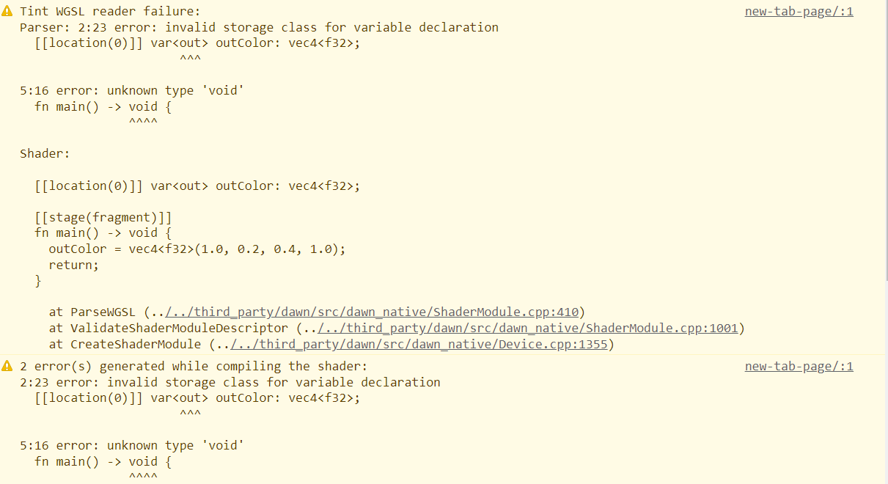
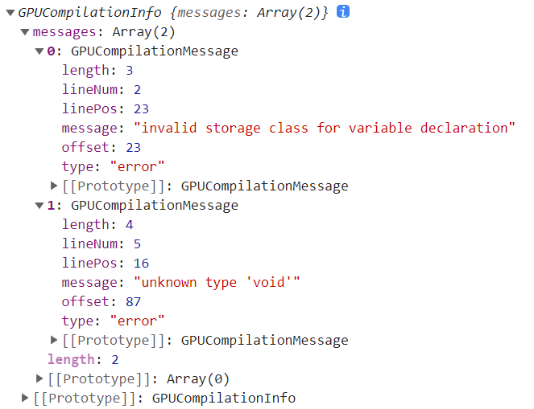

对应文档中的 https://www.w3.org/TR/webgpu/#shader-modules

关于着色器模块的创建，与 WebGL 中的 Shader 有改进，提供了编译信息。

# GPUShaderModule 接口

这个接口是可以序列化的，意味着可以传递其引用进行多线程编程。

它是不可变对象（只读），所以不存在冲突的问题。

``` web-idl
[Exposed=(Window, DedicatedWorker), SecureContext]
interface GPUShaderModule {
	Promise<GPUCompilationInfo> compilationInfo();
};
GPUShaderModule includes GPUObjectBase;
```


## 创建

创建一个 GPUShaderModule，需要调用 `device.createShaderModule` 方法。

此方法接受一个 `GPUShaderModuleDescriptor` 接口类型的对象，它不能为空对象，也不能不传递。

``` web-idl
dictionary GPUShaderModuleDescriptor : GPUObjectDescriptorBase {
  required USVString code;
  object sourceMap;
};
```

如果传递了 `sourceMap`，即可使用一些工具来调试。这个是可选的。

例子：

``` js
const vsModule = device.createShaderModule({
  code: `
  struct PositionColorInput {
    [[location(0)]] in_position_2d: vec2<f32>;
    [[location(1)]] in_color_rgba: vec4<f32>;
  };

  struct PositionColorOutput {
    [[builtin(position)]] coords_output: vec4<f32>;
    [[location(0)]] color_output: vec4<f32>;
  };

  // 可以写注释

  [[stage(vertex)]]
  fn main(input: PositionColorInput) 
    -> PositionColorOutput {
    var output: PositionColorOutput;
    output.color_output = input.in_color_rgba;
    output.coords_output = vec4<f32>(input.in_position_2d, 0.0, 1.0);
    return output;
  }
  `
})

const fsModule = device.createShaderModule({
  code: `
	[[stage(fragment)]]
  fn main([[location(0)]] in_color: vec4<f32>) 
    -> [[location(0)]] vec4<f32> {
    return in_color;
  }`,
})
```


## 获取编译信息

``` web-idl
enum GPUCompilationMessageType {
  "error",
  "warning",
  "info"
};

[Exposed=(Window, DedicatedWorker), Serializable, SecureContext]
interface GPUCompilationMessage {
  readonly attribute DOMString message;
  readonly attribute GPUCompilationMessageType type;
  readonly attribute unsigned long long lineNum;
  readonly attribute unsigned long long linePos;
  readonly attribute unsigned long long offset;
  readonly attribute unsigned long long length;
};

[Exposed=(Window, DedicatedWorker), Serializable, SecureContext]
interface GPUCompilationInfo {
  readonly attribute FrozenArray<GPUCompilationMessage> messages;
};
```

编译信息是由 `GPUShaderModule` 在编译着色器代码时生成的编译日志，包括信息、警告、错误。

开发者可以通过调用 `shaderModule.compilationInfo()` 并 await 其 resolve 值查看编译信息对象。

编译信息对象实现自接口 `GPUCompilationInfo`，它包括了字符串消息 `message`、编译信息类型 `type`、着色器代码行数 `lineNum`、着色器代码行哪个字符 `linePos`、着色器代码中的位置 `offset` 以及代码单元个数 `length` 几个属性。

注意，一般比较常用 `lineNum` 和 `linePos`，比较符合代码编辑器里的行和列。

### 举例：

给一段旧版本的错误 WGSL 代码：

``` js
const fsModule = device.createShaderModule({
  code: `
  [[location(0)]] var<out> outColor: vec4<f32>;

  [[stage(fragment)]]
  fn main() -> void {
    outColor = vec4<f32>(1.0, 0.2, 0.4, 1.0);
    return;
  }
	`,
})
```

编译时控制台会报错：



获取编译信息：


