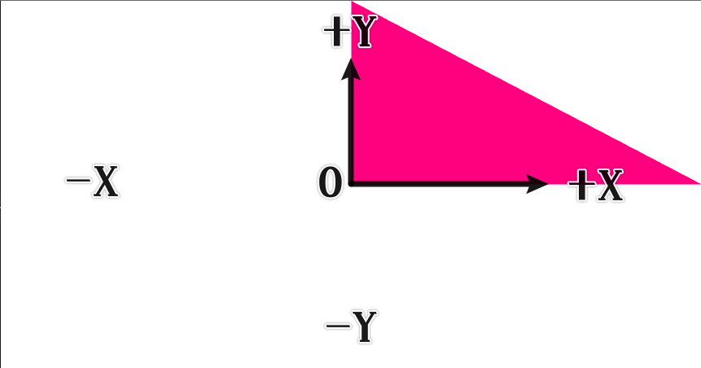

关于渲染管线的一些思考（glsl为例）


# 1 顶点着色器向下一步输出了什么

在顶点着色器中，向下一阶段输出的是一个坐标，想必大家都有写过入门三角形或者四边形的例子：

``` glsl
attribute vec4 a_pos;

void main() {
  gl_Position = a_pos;
}
```

就拿最简单的三角形为例吧，它的数值是这样的（逆时针序）：

``` js
const positions = [
  0, 0, 0, 0, // 点1
  0, 1, 0, 0, // 点2
  1, 0, 0, 0, // 点3
]
```

由三个位于 x、y、z 均在 `[-1, 1]` 范围内的一个立方空间的点：

- `(0, 0, 0)`
- `(0, 1, 0)`
- `(1, 0, 0)`

构成，结果大概看起来就这样：



而这个立方空间呢，就是众所周知的 **裁剪空间（Clip Space）**。

> 实际上，裁剪空间并不是 ±1 的立方体，而是 ±w，为了简化说明，跳过透视除法，下面会把这个坑填上。

回顾渲染管线，裁剪空间内的坐标就是相机视角下，经过挤压截头体，也就是著名的 **投影变换**，得到的坐标空间。

> 裁剪坐标(或投影坐标) = ProjectionMatrix · 眼坐标(或观察坐标)

这就有一个有趣的事情：

> 经过若干变换后，不在裁剪空间内的顶点，就不渲染。

这个最简单的例子中，直接把传入的顶点坐标输出给下一个阶段，也就是说顶点着色器没有处理任何顶点坐标变换，默认顶点着色器的输出结果就是裁剪空间内的坐标。

## 参考资料

https://zhuanlan.zhihu.com/p/65969162


# 2 片元着色器得到了什么

在片元着色器中你会得到一个片元坐标变量，即 `gl_FragCoord`，它的值域是：

- `x∈[0, canvas.width]`
- `y∈[0, canvas.height]`

也就是片元着色器得到的输入并不是顶点着色器的输出。

片元着色器中的片元坐标位于 **屏幕坐标** 上，也就是你那块 `canvas` 定义的长宽范围。


# 3 顶点着色器~片元着色器之间发生了什么

顶点着色器结束后，坐标系统到了 **裁剪空间**（或者叫 **投影空间**）；

片元着色器接收到的片元坐标，是 **屏幕空间**（或者叫 **屏幕坐标系**）

在此期间，发生了 ClipSpace → (GPU 计算，干掉 ±w 之外的顶点) → **透视除法** →  **NDC Space** → **视口变换** ~ ScreenSpace


https://zhuanlan.zhihu.com/p/115028420 这篇里面讲到，是 NDC 要求


参考资料：

> 在透视除法前用 w 做 clip 而不是NDC用 [-1, 1] 是有原因的，甚至很多书上讲的都不对。以 GL 为例，透视除法之后相机后面的顶点会被变换到 (f+n)/(f-n) 之后，如果有一个三角形比较大，一个顶点落到相机之后，透视除法会让三角形的其中一个顶点变换到远裁面之后，这个时候是没办法正确做剪裁的。