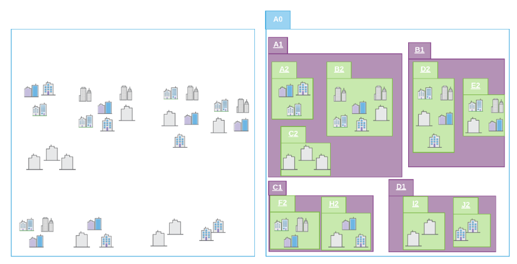
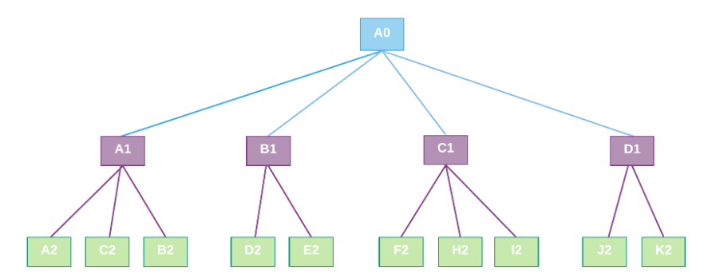

[TOC]

# 1 简介

# 2 i3s的结构

## 2.1 树结构

为了实现高性能的3d渲染，数据要被分组成`节点(Node)`。

分组的过程，就是递归创建树解构。四叉树、R树都支持。

一个节点的空间范围框，是由它的所有子节点构成的，这样就有了层级结构。

`空间范围框(Bounding Volume, 意译)`，有两种定义法：`Minimum Bounding Sphere, MBS(最小范围球体)`、`Oriented Bounding Box, OBB(定向范围长方体)`。

官方推荐 `OBB` 来实现每个节点的边界框。点云格式仅支持OBB.

为了实现原始数据的可伸缩性，也即LOD，父级节点包含了子节点的简化形式。

### 2.1.1 节点（Nodes）

i3s把数据按树解构拆分，每一份叫一个节点。每个节点的所有资源都在其空间范围框内。

每个节点都有一个id，使得客户端能有效定位、加载节点资源。

#### ① 要素（Feature）

`要素(Feature)`，表示一个真实世界的对象，它位于节点中，节点是要素的容器。例如，点云类型的i3s中的点，3D对象类型的i3s中的建筑物。

要素有一个`object-ID`，（笔者注：和gdb里的二维要素差不多）。

一个要素可以包括的数据有：几何二进制数据、属性数据等。

#### ② 顶点资源（Node resources）

##### A 几何数据

##### B 属性数据

##### C 纹理

##### 补充：1.6以及更早版本的节点资源

### 2.1.2 顶点索引页（Node Page）

## 2.2 统计信息

## 2.3 坐标系统

## 2.4 高程模型

# 3 i3s服务和数据文件

## 3.1 i3s服务

## 3.2 数据文件——slpk

### ① 社区版本1.7的slpk结构

### ② 社区版本1.6的slpk结构