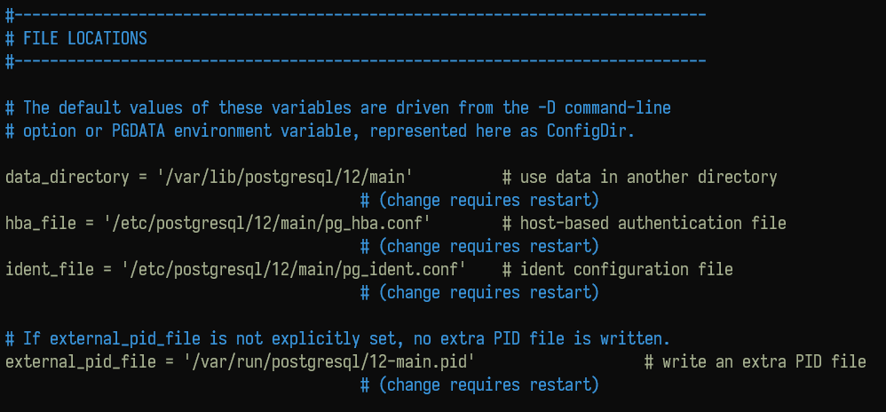

# 教程资料

[如何在 Ubuntu 上安装和配置 PostgreSQL](https://linux.cn/article-11480-1.html)

# 预备工作

先升级一下apt源

``` BASH
sudo apt update
```

然后显示一下apt仓库里能用什么版本的postgresql

``` BASH
apt show postgresql
```

或

``` BASH
apt-cache search postgresql
```


# apt安装

``` BASH
sudo apt install postgresql-12 postgresql-contrib
```

其中，`postgresql-contrib` 推荐安装

其中，postgresql 也可以忽略 `-12` 后缀安装最新版

# apt安装postgis

和上面步骤一样，可以先 search 或  show 一下：

``` BASH
apt show postgis
```

# 修改密码

## 修改linux的postgres用户的密码

postgresql 会创建一个 linux 账户：postgres，修改它的密码：

``` BASH
sudo passwd postgres
```

## 登录postgres账户修改数据库账户的登录密码

``` SHELL
onsummer@CDCI:~$: sudo -u postgres
postgres@CDCI:/usr/bin$ psql
postgres=# alter user postgres with password 'postgres';
ALTER ROLE
postgres=# \q
postgres@CDCI:/usr/bin$ exit
onsummer@CDCI:~$ 
```

# * 在外部登录管理数据库

``` BASH
sudo -u postgres <操作>
```

例如，登录数据库

``` BASH
sudo -u postgres psql ...
```

# 配置文件

``` BASH
whereis postgresql
```

显示：

``` BASH
postgresql: /usr/lib/postgresql /etc/postgresql /usr/share/postgresql
```

如果是apt安装的，那么进入：

``` BASH
cd /etc/postgresql/<你的pg版本号，例如12>/main
```

列出文件：

``` BASH
ls
```

则：

``` 
conf.d  environment  pg_ctl.conf  pg_hba.conf  pg_ident.conf  postgresql.conf  start.conf
```

## postgresql.conf

这个应该是主配置，列有：



下面还有 CONNECTIONS AND AUTHENTICATION 块，应该是连接和授权的配置，主要是改连接数、端口什么的