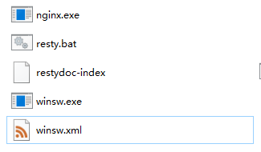
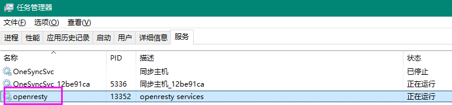

参考文档：https://www.cnblogs.com/Little-Wang/p/8514117.html


# Attention!!!

最好测试完再安装为Windows服务，否则会有一大堆的缓存问题导致不能生效。

winsw现在有 NET4 NET4.6 和 NETCORE31 的三种发布包，未来估计还有 NET5 的，原理都一样。


# 使用Winsw工具

https://github.com/kohsuke/winsw/releases，下载合适的exe即可

将此exe放到nginx.exe同级别的路径下。



下载到的exe可以改成其他名字，例如`winsw.exe`，但是配置文件的文件名要与exe名字一样。

``` XML
<!-- winsw.xml -->
<service>
  <id>openresty</id>
  <name>openresty services</name>
  <description>转发前端请求到agcloud-support</description>
  <executable>D:\WebServers\openresty-1.15.8.2-win64\nginx.exe</executable>
</service>
```

在命令行安装此winsw即可：

``` BASH
./winsw.exe install
```

之后即可在任务管理器或服务列表启动它了。



# 重启失败

端口被占用或conf文件有问题